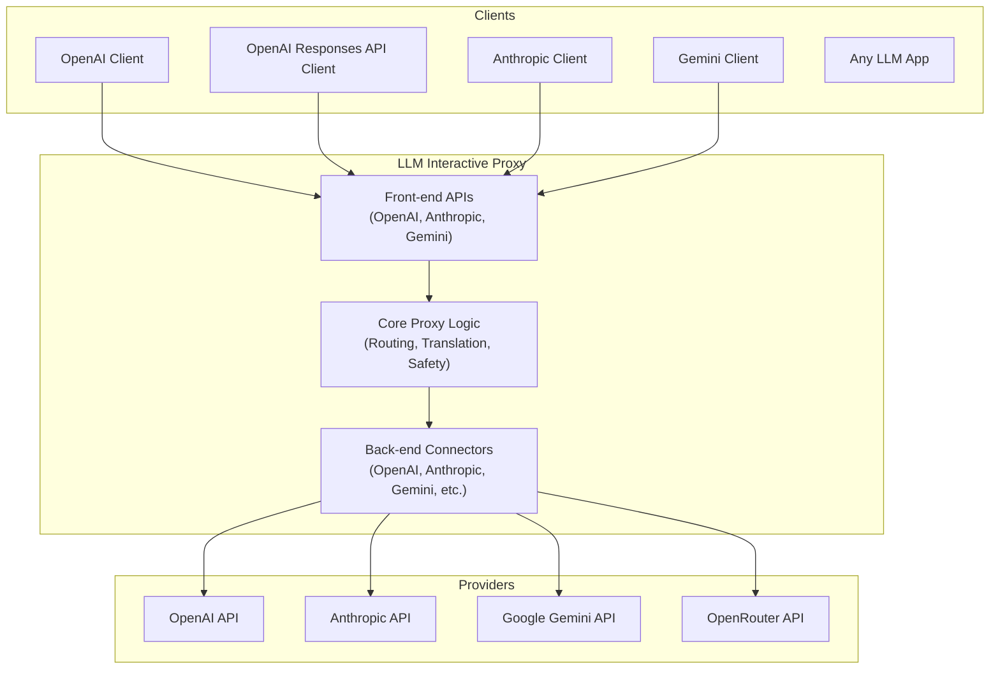

# LLM Interactive Proxy


[](https://codecov.io/gh/matdev83/llm-interactive-proxy)

[](LICENSE)

A swiss-army knife proxy for LLM-powered applications. Sits between any LLM-aware client (agent) and any backend, presenting multiple front-end APIs (OpenAI, Responses API, Anthropic, Gemini) while routing to your chosen provider. Translate requests, override models, rotate API keys, prevent leaks, inspect traffic, and execute chat-embedded commands—all from a single drop-in gateway.

## Architecture



## Key Features

- **Connect Any App to Any Model**: Route requests from any LLM client to any backend, even across protocols
- **Codebuff WebSocket Server**: Real-time AI communication via WebSocket with session management, streaming responses, and file context support - [Quick Start](docs/user_guide/features/codebuff-quick-start.md)
- **Usage Tracking & Statistics**: Comprehensive monitoring of token consumption, costs, performance metrics, and request patterns - [Feature Guide](docs/user_guide/features/usage-tracking.md)
- **Model Override**: Force applications to use your chosen model, regardless of hardcoded defaults
- **API Key Rotation**: Aggregate and auto-rotate API keys to maximize free-tier usage
- **Test Execution Reminder**: Automatically reminds agents to run tests before completing tasks (14+ languages)
- **LLM Assessment**: Detect conversation loops and stuck patterns with intelligent monitoring
- **Tool Access Control**: Fine-grained control over which tools LLMs can access
- **Dangerous Command Protection**: Block destructive git operations before they cause damage
- **File Access Sandboxing**: Restrict file operations to safe directories
- **Wire Capture & Debugging**: Inspect and analyze all traffic for debugging
- **Random Model Replacement**: Probabilistically swap models for session resilience and diversity - [Feature Guide](docs/user_guide/features/random-model-replacement.md)
- **Edit Precision Tuning**: Auto-adjust parameters when models struggle with precise edits
- **Angel Verification**: Real-time response verification with automatic correction
- **And 10+ more features** - See [User Guide](docs/user_guide/index.md) for complete list

## Access Modes

The proxy supports two operational modes to enforce appropriate security boundaries:

- **Single User Mode** (default): For local development. Allows OAuth connectors, optional authentication, localhost-only binding.
- **Multi User Mode**: For production/shared deployments. Blocks OAuth connectors, requires authentication for remote access, allows any IP binding.

### Quick Examples

```bash
# Single User Mode (default) - local development
./.venv/Scripts/python.exe -m src.core.cli

# Multi User Mode - production deployment
./.venv/Scripts/python.exe -m src.core.cli --multi-user-mode --host=0.0.0.0 --api-keys key1,key2
```

See [Access Modes User Guide](docs/user_guide/access-modes.md) for detailed documentation.

## Quick Start

### Installation

```bash
# Clone the repository
git clone https://github.com/matdev83/llm-interactive-proxy.git
cd llm-interactive-proxy

# Create virtual environment
python -m venv .venv
source .venv/Scripts/activate  # Windows: .venv\Scripts\activate

# Install dependencies
pip install -e .[dev]
```

### Basic Usage

```bash
# Start the proxy with OpenAI backend
export OPENAI_API_KEY="your-key-here"
python -m src.core.cli --default-backend openai:gpt-4o

# Or with custom configuration
python -m src.core.cli --config config/my_config.yaml
```

For detailed setup instructions, see [Quick Start Guide](docs/user_guide/quick-start.md).

## Documentation

- **[User Guide](docs/user_guide/index.md)** - Feature documentation, configuration, backends, debugging
- **[Development Guide](docs/development_guide/index.md)** - Architecture, building, testing, contributing
- **[Configuration Guide](docs/user_guide/configuration.md)** - Complete parameter reference
- **[CHANGELOG](CHANGELOG.md)** - Version history and updates
- **[CONTRIBUTING](CONTRIBUTING.md)** - Contribution guidelines

## Supported Front-end Interfaces

The proxy exposes multiple standard API surfaces, allowing you to use your favorite clients with any backend:

- **OpenAI Chat Completions** (`/v1/chat/completions`) - Compatible with OpenAI SDKs and most tools.
- **OpenAI Responses** (`/v1/responses`) - Optimized for structured output generation.
- **OpenAI Models** (`/v1/models`) - Unified model discovery across all backends.
- **[Anthropic Messages](docs/user_guide/backends/anthropic.md#using-anthropic-messages-api-directly)** (`/anthropic/v1/messages`) - Native support for Claude clients/SDKs.
- **Dedicated Anthropic Server** (`http://host:8001/v1/messages`) - Drop-in replacement for Anthropic API on a separate port (default: 8001).
- **Google Gemini v1beta** (`/v1beta/models`, `:generateContent`) - Native support for Gemini tools.

See [Front-End APIs Overview](docs/user_guide/backends/overview.md#front-end-apis) for more details.

## Supported Backends

- **[OpenAI](docs/user_guide/backends/openai.md)** (GPT-4, GPT-4o, o1)
- **[Anthropic](docs/user_guide/backends/anthropic.md)** (Claude 3.5 Sonnet, Opus, Haiku)
- **[Google Gemini](docs/user_guide/backends/gemini.md)** (API Key, OAuth, GCP, Vertex AI, Auto-OAuth)

- **[OpenRouter](docs/user_guide/backends/openrouter.md)** (Access to 100+ models)
- **[ZAI](docs/user_guide/backends/zai.md)** (Zhipu AI / GLM models)
- **[Qwen](docs/user_guide/backends/qwen.md)** (Alibaba Cloud Qwen models)
- **[MiniMax](docs/user_guide/backends/minimax.md)** (Hailuo AI reasoning models)
- **[InternLM](docs/user_guide/backends/internlm.md)** (InternLM AI models with API key rotation)
- **[ZenMux](docs/user_guide/backends/zenmux.md)** (Unified model aggregator)
- **[Cline](docs/user_guide/backends/cline.md)** (Specialized debugging backend)
- **[Hybrid](docs/user_guide/features/hybrid-backend.md)** (Virtual backend for two-phase reasoning)
- **[Antigravity](docs/user_guide/backends/antigravity-oauth.md)** (Internal debugging backends for Gemini/Claude)

See [Backends Overview](docs/user_guide/backends/overview.md) for full details and configuration.

## Support

- [GitHub Issues](https://github.com/matdev83/llm-interactive-proxy/issues) - Report bugs or request features
- [Discussions](https://github.com/matdev83/llm-interactive-proxy/discussions) - Ask questions and share ideas

## License

This project is licensed under the [GNU AGPL v3.0 or later](LICENSE).

## Development

```bash
# Run tests
python -m pytest

# Run linter
python -m ruff --fix check .

# Format code
python -m black .
```

See [Development Guide](docs/development_guide/index.md) for more details.
