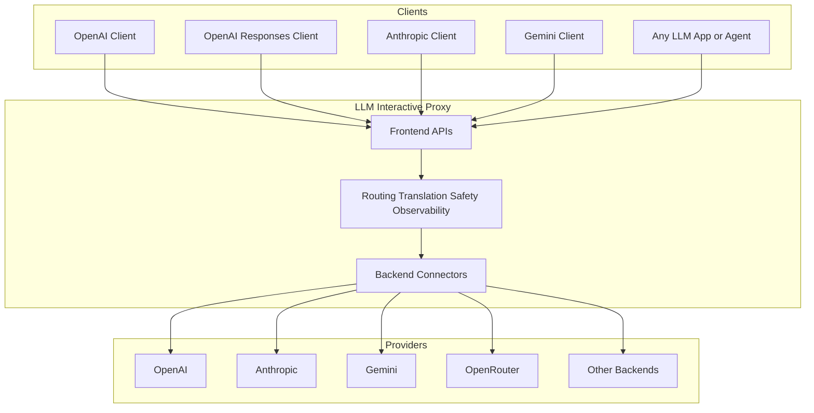

# LLM Interactive Proxy

[&cacheSeconds=300)](https://github.com/matdev83/llm-interactive-proxy/actions/workflows/ci.yml?query=branch%3Adev)
[](https://codecov.io/gh/matdev83/llm-interactive-proxy)


[](LICENSE)

Turn any compatible AI client into a safer, smarter, multi-provider agent platform.

`LLM Interactive Proxy` is a universal translation, routing, and control layer for modern AI clients. Point OpenAI-compatible apps, Anthropic tools, Gemini integrations, and agentic coding workflows at one local or shared endpoint, then gain routing, failover, built-in security, automated steering, session intelligence, observability, and cross-provider flexibility without rewriting your client.

If your current setup feels fragile, expensive, opaque, or locked to one vendor, this project is designed to change that.

It is a compatibility layer, a security layer, a traffic control plane, a debugging surface, and a workflow improver for serious agentic use.

- **Keep your existing clients** - Change the endpoint, not the app.
- **Mix providers freely** - Route across APIs, plans, OAuth accounts, model families, and protocol styles.
- **Control agents in production** - Add guardrails, rewrites, diagnostics, and policy at the proxy layer.
- **Debug with evidence** - Inspect exact wire traffic instead of guessing from symptoms.

| Without the proxy | With LLM Interactive Proxy |
| --- | --- |
| Each client is tied to one provider stack | One endpoint can serve many clients and many backend families |
| Provider switching often means code or config churn | Change routing instead of rewriting integrations |
| Agent safety is scattered across tools | Centralize redaction, tool controls, sandboxing, and command protection |
| Debugging depends on incomplete logs | Inspect exact wire traffic with captures and diagnostics |
| Token costs grow with long sessions | Use intelligent context compression and smarter routing to reduce spend |
| Protocol mismatch blocks experimentation | Use cross-protocol conversion to bridge Anthropic, OpenAI, Gemini, and more |

## Table Of Contents

- [Quick Start](#quick-start)
- [What Makes It Different](#what-makes-it-different)
- [Perfect For](#perfect-for)
- [Feature Highlights](#feature-highlights)
- [Core Advantages](#core-advantages)
- [Common Use Cases](#common-use-cases)
- [Supported Frontend Interfaces](#supported-frontend-interfaces)
- [Supported Backends](#supported-backends)
- [Access Modes](#access-modes)
- [Architecture](#architecture)
- [Documentation Map](#documentation-map)

## Why People Try It

- Use one client surface to reach many backends and protocols.
- Switch providers and models without refactoring your app or agent.
- Add guardrails, rewrites, automated steering, and tool controls around agent behavior.
- Capture and inspect exact traffic for debugging, audits, and regressions.
- Consolidate premium accounts, free tiers, OAuth flows, and API keys behind one endpoint.

## Feature Highlights

- **Built-in security layer** - Redact secrets and API keys automatically.
- **Cross-protocol conversion** - Let Anthropic-style and OpenAI-style clients work across backend families.
- **Intelligent context compression** - Reduce token usage and lower API fees.
- **Automated agent steering** - Nudge sessions back on track without patching every client.
- **Automated tool call repairs** - Fix malformed tool interactions before they break the workflow.
- **Live rewrite controls** - Rewrite system prompts, user prompts, or model replies in transit.
- **Loop detection and breaking** - Catch stuck behavior early and actively recover.
- **Multi-model multiplexing** - Route across models, accounts, and providers dynamically.
- **B2BUA session handling** - Go beyond simple proxying for complex agentic workflows.

## What Makes It Different

Most LLM proxies stop at basic compatibility. This one is built for real agent workflows: long sessions, tool use, routing logic, provider quirks, safety concerns, and debugging sessions where you need to know exactly what happened on the wire.

- **Cross-protocol conversion** - Connect agents speaking one API dialect to a different backend family, including Anthropic-style clients talking to OpenAI-based backends and other cross-API combinations.
- **Agent UX improvements** - Add loop detection and breaking, intelligent context compression to reduce API fees, reasoning controls, model switching, planning overrides, automated steering, and session features that directly improve coding-agent reliability.
- **Integrated safety controls** - Intercept tool calls, apply automated tool call repairs, block dangerous commands, sandbox file access, redact secrets and API keys automatically, and enforce per-client or shared policy boundaries.
- **Deep observability** - Record byte-precise CBOR captures, inspect requests and responses, track usage, and understand routing decisions instead of guessing.
- **Wide connectivity and multiplexing** - Expose OpenAI, Anthropic, and Gemini-compatible frontends while supporting a growing backend catalog, multi-model multiplexing patterns, and optional OAuth-based connectors.

## Not A Simple Proxy

This project is not just a thin request forwarder. It also includes B2BUA-style session handling for complex agentic workflows.

Back-to-back user agent behavior matters when you need stronger session isolation, safer trust boundaries, continuity handling, or infrastructure that can actively improve how multi-step agent conversations are managed rather than merely passing bytes through.

## In One Sentence

Use the clients you already like, keep the accounts and providers you already pay for, and add the control plane that agentic workflows usually wish they had from day one.

## Try It If You Want To

- Keep using tools like OpenAI SDK clients, Claude-oriented workflows, or Gemini integrations while changing the backend underneath.
- Improve coding-agent UX with loop protection, context compression, reasoning controls, automated steering, and tooling-aware QoL features.
- Add security and policy controls without patching every client independently.
- Compare providers, reduce costs, or use fallback routing without maintaining separate integrations.
- Capture exact request and response data for incident analysis, regression debugging, and auditability.
- Rewrite system prompts, user prompts, or remote model replies on the fly to adapt behavior without modifying the client.

## Perfect For

- **OpenAI SDK apps and internal tools** that want routing, safety, and backend flexibility without changing their client surface.
- **Claude-oriented coding workflows** that want Anthropic-style behavior while gaining access to OpenAI-compatible or other backend families through cross-protocol conversion.
- **Gemini integrations and mixed-agent stacks** that need one control plane across multiple protocols and accounts.
- **Coding agents and automation pipelines** that benefit from loop breaking, automated steering, tool call repair, and stronger observability.
- **Teams running shared LLM infrastructure** that need policy enforcement, secret redaction, diagnostics, and session isolation in front of provider traffic.

## Quick Start

### 1. Clone and install

```bash
git clone https://github.com/matdev83/llm-interactive-proxy.git
cd llm-interactive-proxy
python -m venv .venv

# Windows
.venv\Scripts\activate

# Linux/macOS
source .venv/bin/activate

python -m pip install -e .[dev]
```

If you want OAuth-oriented optional connectors, install the `oauth` extra:

```bash
python -m pip install -e .[dev,oauth]
```

### 2. Export at least one provider credential

```bash
# Example: OpenAI
export OPENAI_API_KEY="your-key-here"
```

### 3. Start the proxy

```bash
python -m src.core.cli --default-backend openai:gpt-4o
```

The proxy listens on `http://localhost:8000` by default.

### 4. Point your client at the proxy instead of the vendor

```python
from openai import OpenAI

client = OpenAI(
    base_url="http://localhost:8000/v1",
    api_key="dummy-key",
)

response = client.chat.completions.create(
    model="gpt-4o",
    messages=[{"role": "user", "content": "Hello!"}],
)

print(response.choices[0].message.content)
```

That is the core idea: keep your client code, swap the endpoint, and let the proxy handle routing, translation, policy, and visibility.

From there, you can layer in safer tool execution, richer observability, smarter routing, and provider-specific features without changing how your application talks to the model.

See the full [Quick Start Guide](docs/user_guide/quick-start.md) for additional setup, auth, and backend examples.

## Why Teams Keep It

### Replace vendor lock-in with optionality

Use one stable entry point while changing the backend behind it. Try a new provider, switch to a cheaper model, fall back during outages, or split traffic across accounts without changing the calling tool.

### Make agentic workflows less brittle

Add loop breaking, reasoning controls, planning-phase overrides, model replacement, prompt rewrites, automated steering, automated tool call repairs, and coding-focused quality-of-life features that reduce wasted iterations.

### Add guardrails without forking your clients

Protect local development and shared environments with dangerous-command protection, tool access control, sandboxing, built-in secret and API-key redaction, key isolation, session boundaries, and authentication controls.

### Debug what actually happened

When an agent misbehaves, a provider returns something odd, or a translation edge case appears, inspect precise wire captures and telemetry instead of reconstructing the failure from logs alone.

### Change behavior without changing the client

Rewrite system prompts, user prompts, or remote LLM replies on the fly, repair malformed tool calls automatically, and adapt requests or responses as they pass through the proxy.

## Core Advantages

### Universal connectivity

- **Multiple frontend APIs** - Serve OpenAI Chat Completions, OpenAI Responses, Anthropic Messages, and Gemini-compatible surfaces.
- **Backend freedom** - Route to OpenAI, Anthropic, Gemini, OpenRouter, ZAI, Qwen, MiniMax, InternLM, ZenMux, Kimi, Hybrid, and additional connectors.
- **Cross-API translation layer** - Bridge client and provider mismatches so tools can keep speaking their preferred protocol, including Anthropic-to-OpenAI and other cross-protocol conversions.
- **WebSocket support** - Use low-latency transport for Responses API workflows that benefit from interactive tool-heavy sessions.
- **Multi-model multiplexing** - Spread work across multiple models, accounts, or routing strategies instead of binding one workflow to one provider path.

### Better UX for coding and agent workflows

- **Loop detection and breaking** - Detect repetitive or stuck behavior before it burns time and tokens, then actively steer sessions away from failure patterns.
- **Intelligent context compression** - Shrink prompt footprint while preserving useful context to reduce API fees and improve efficiency.
- **Quality verifier** - Let a secondary model review when the primary model drifts or underperforms.
- **Dynamic model controls** - Switch models, route one-off requests, multiplex across models, or apply planning and reasoning strategies mid-session.
- **Developer QoL features** - Improve behavior around pytest output, Windows command quirks, session handling, and related agent ergonomics.
- **Automated agent steering** - Apply behavioral guidance at the proxy layer so agents stay aligned without needing every client to implement the same logic.
- **Automated tool call repairs** - Correct or adapt malformed tool interactions before they derail a workflow.

### Security and policy built in

- **Dangerous command protection** - Block harmful operations such as destructive git usage.
- **Tool access control** - Restrict which tools an LLM can invoke.
- **File sandboxing** - Limit file access to safe directories.
- **Built-in security layer** - Automatically redact secrets and API keys in prompts and related flows.
- **Credential isolation** - Keep provider keys inside the proxy instead of distributing them to every client.
- **Access modes** - Use single-user defaults for local development or multi-user controls for shared deployments.

### Observability and resilience

- **Byte-precise CBOR wire capture** - Preserve exact request and response traffic for auditing, replay, and troubleshooting.
- **Usage tracking** - Measure tokens, costs, and request behavior.
- **Routing diagnostics** - Inspect backend availability, preference sets, and eligibility decisions.
- **Failure handling** - Retry and fail over across providers and backend instances.
- **Health-aware routing** - Combine diagnostics and backend health to keep sessions moving.

## Common Use Cases

- **One local endpoint for many AI tools** - Point coding agents, scripts, and SDK clients at one proxy and swap providers behind the scenes.
- **Safer coding-agent execution** - Add command filtering, sandboxing, and tool restrictions before letting agents touch your machine or repository.
- **Subscription consolidation** - Centralize premium plans, free tiers, OAuth-backed accounts, and API-key providers in one place.
- **Cross-provider experimentation** - Compare providers without rewriting integrations for each API surface.
- **Cross-protocol compatibility bridging** - Let agents that speak Anthropic-style or OpenAI-style APIs work across backend families that were not designed for them.
- **Live prompt and response rewriting** - Adjust system prompts, user prompts, or model replies in transit.
- **Production control plane** - Put policy, routing, telemetry, and auth in front of shared LLM traffic.
- **Reproducible debugging** - Keep captures and diagnostics for hard-to-reproduce agent failures.

## Supported Frontend Interfaces

The proxy exposes standard API surfaces so existing clients can often work with little or no code changes.

- **OpenAI Chat Completions** - `/v1/chat/completions`
- **OpenAI Responses** - `/v1/responses`
- **OpenAI Models** - `/v1/models`
- **Anthropic Messages** - `/anthropic/v1/messages`
- **Dedicated Anthropic server** - `http://host:8001/v1/messages`
- **Google Gemini v1beta** - `/v1beta/models` and `:generateContent`
- **Diagnostics endpoint** - `/v1/diagnostics`
- **Backend reactivation endpoint** - `/v1/diagnostics/backends/{backend_instance}/reactivate`

See [Frontend API documentation](docs/user_guide/frontends/overview.md) for protocol details and compatibility notes.

## Supported Backends

The backend catalog keeps growing. Current documented backends include:

- [OpenAI](docs/user_guide/backends/openai.md)
- [Anthropic](docs/user_guide/backends/anthropic.md)
- [Google Gemini](docs/user_guide/backends/gemini.md)
- [OpenRouter](docs/user_guide/backends/openrouter.md)
- [ZAI (Zhipu AI)](docs/user_guide/backends/zai.md)
- [Alibaba Qwen](docs/user_guide/backends/qwen.md)
- [MiniMax](docs/user_guide/backends/minimax.md)
- [InternLM](docs/user_guide/backends/internlm.md)
- [ZenMux](docs/user_guide/backends/zenmux.md)
- [Moonshot AI / Kimi Code](docs/user_guide/backends/kimi-code.md)
- [Hybrid backend](docs/user_guide/features/hybrid-backend.md)
- [Cline](docs/user_guide/backends/cline.md)
- [Antigravity OAuth](docs/user_guide/backends/antigravity-oauth.md)

See the full [Backends Overview](docs/user_guide/backends/overview.md) for configuration and provider-specific notes.

## Routing Selector Semantics

- `backend:model` selects an explicit backend family.
- `backend-instance:model` such as `openai.1:gpt-4o` targets a concrete backend instance.
- `model` and `vendor/model` are model-only selectors.
- `vendor/model:variant` remains model-only unless `:` appears before the first `/`.
- URI-style parameters in selectors such as `model?temperature=0.5` are parsed and propagated through routing metadata.
- Explicit-backend configuration and command surfaces such as `--static-route`, replacement targets, and one-off routing require strict `backend:model` format.

## Access Modes

The proxy supports two operational modes with different security assumptions:

- **Single User Mode** - Default local-development mode with localhost-first behavior and support for OAuth connectors.
- **Multi User Mode** - Shared or production mode with stronger authentication expectations and tighter connector rules.

Quick examples:

```bash
# Single User Mode
python -m src.core.cli

# Multi User Mode
python -m src.core.cli --multi-user-mode --host=0.0.0.0 --api-keys key1,key2
```

See [Access Modes](docs/user_guide/access-modes.md) for the security model and deployment guidance.

## Architecture



The proxy sits between the client and the provider, which is exactly why it can translate protocols, enforce policy, capture traffic, and route requests without forcing your app to change its calling pattern.

## Documentation Map

- **[Quick Start](docs/user_guide/quick-start.md)** - Get running fast
- **[User Guide](docs/user_guide/index.md)** - End-user documentation and feature catalog
- **[Configuration Guide](docs/user_guide/configuration.md)** - Flags, config, and operational settings
- **[Frontend Overview](docs/user_guide/frontends/overview.md)** - Choose the right API surface
- **[Backends Overview](docs/user_guide/backends/overview.md)** - Provider setup and switching
- **[Security Docs](docs/user_guide/security/authentication.md)** - Authentication and key-handling guidance
- **[Development Guide](docs/development_guide/index.md)** - Architecture, local development, testing, and contributing
- **[CHANGELOG](CHANGELOG.md)** - Release history
- **[CONTRIBUTING](CONTRIBUTING.md)** - Contribution guidelines

## Development

```bash
# Run the test suite
python -m pytest

# Lint and auto-fix
python -m ruff check --fix .

# Format
python -m black .

# Validate unified outbound routing compliance
python dev/scripts/check_routing_unification_compliance.py
```

See the [Development Guide](docs/development_guide/index.md) for the architecture and contribution workflow.

## Support

- [GitHub Issues](https://github.com/matdev83/llm-interactive-proxy/issues) for bugs and feature requests
- [GitHub Discussions](https://github.com/matdev83/llm-interactive-proxy/discussions) for questions, ideas, and showcase threads

## License

This project is licensed under the [GNU AGPL v3.0 or later](LICENSE).
