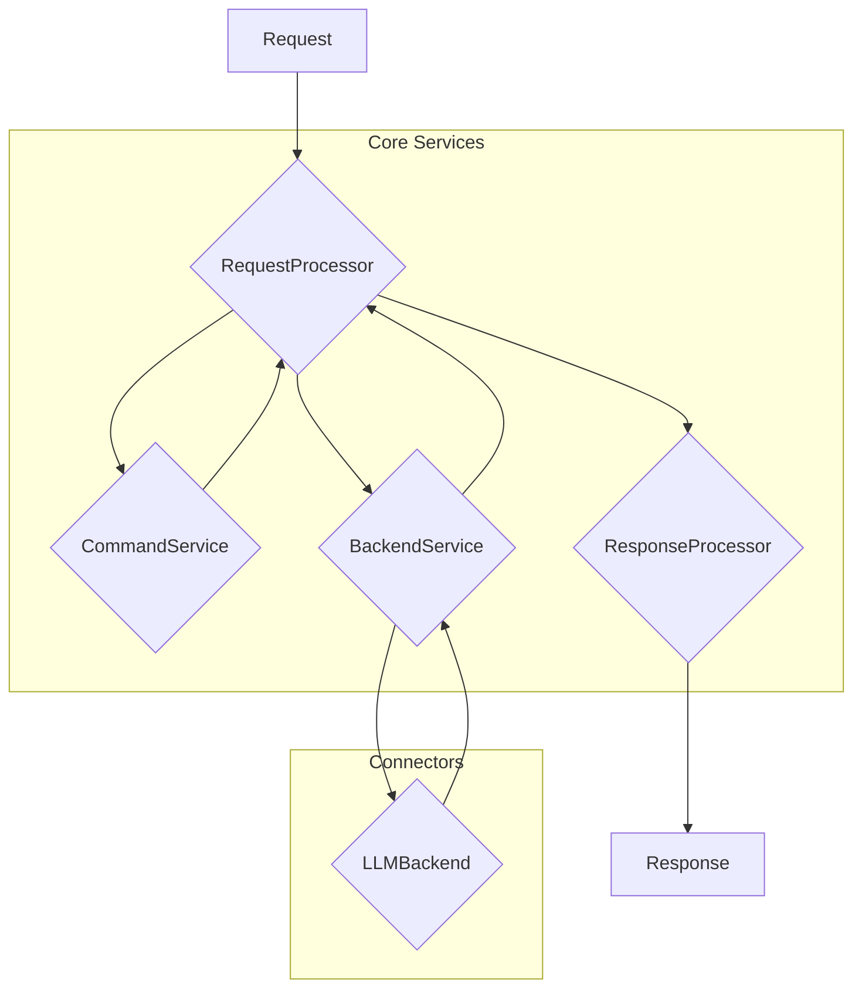
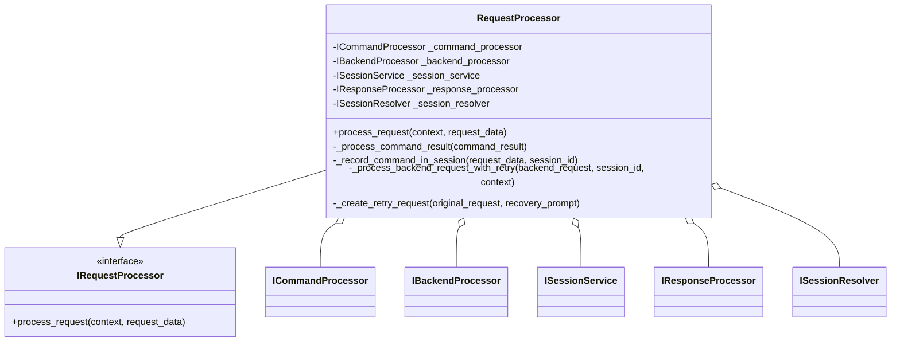
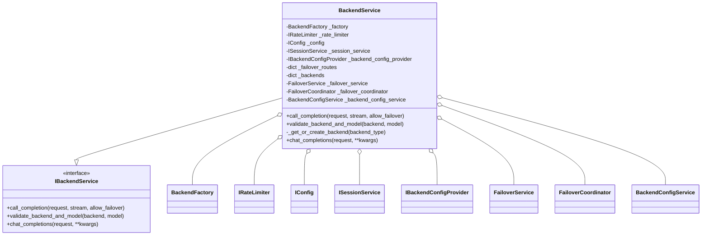
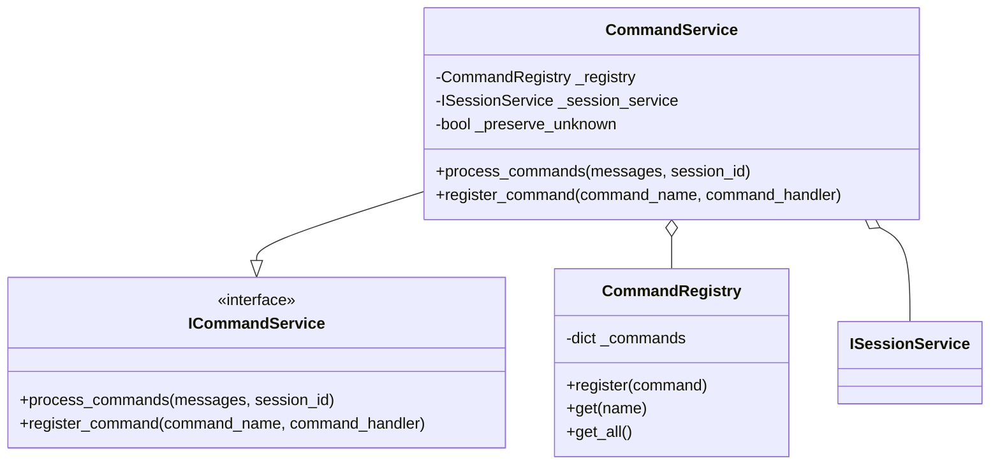
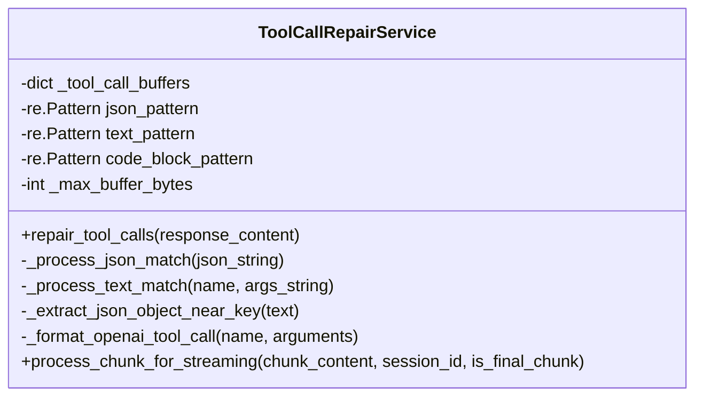
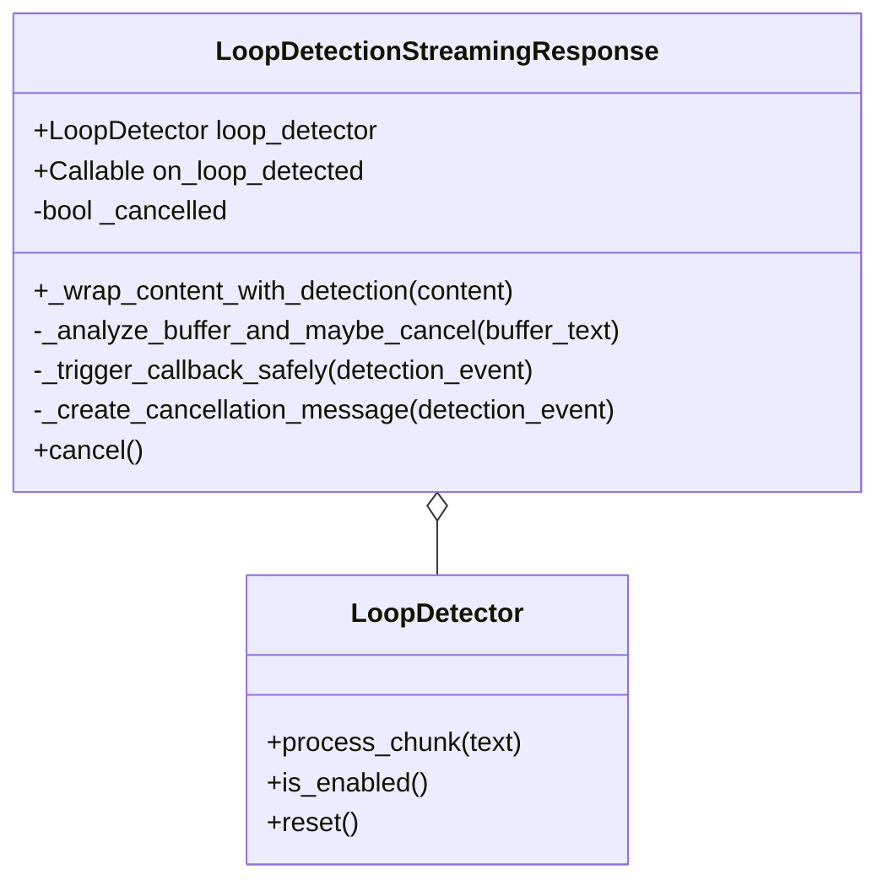

# Architectural Analysis

This document outlines the architectural analysis of the interactive LLM proxy, focusing on the most complex modules identified by `xenon` and `radon`.

## High-Level Service Interaction

This diagram illustrates the high-level interaction between the key services involved in processing a request.

## Detailed Service Diagrams

### 1. Request Processor Service

The `RequestProcessor` is responsible for orchestrating the entire request lifecycle. It coordinates between the `CommandService`, `BackendService`, and `ResponseProcessor`.

### 2. Backend Service

The `BackendService` is responsible for managing interactions with the various LLM backends, including failover and rate limiting.

### 3. Command Service

The `CommandService` is responsible for parsing and executing commands embedded in user messages.

### 4. Tool Call Repair Service

The `ToolCallRepairService` is responsible for detecting and repairing tool calls embedded in LLM responses.

### 5. Loop Detection Streaming

The `LoopDetectionStreamingResponse` and `wrap_streaming_content_with_loop_detection` function are responsible for detecting and handling loops in streaming responses.

## Architectural Problems and Recommendations

Based on the complexity analysis and a review of the code, the following architectural problems have been identified.

### 1. High Complexity and Low Cohesion in Core Services

- **Problem**: The `RequestProcessor`, `BackendService`, and `CommandService` classes have high cyclomatic complexity and are responsible for too many tasks, violating the Single Responsibility Principle (SRP).
  - The `RequestProcessor.process_request` method is a long and complex method that handles command processing, backend requests, and session management.
  - The `BackendService.call_completion` method is overly complex, with deeply nested logic for failover and backend selection.
  - The `CommandService.process_commands` method has complex logic for parsing and executing commands.
- **Recommendation**:
  - **Refactor `RequestProcessor`**: Decompose the `process_request` method into smaller, more focused methods. Introduce a dedicated `RequestOrchestrator` to manage the overall request lifecycle, delegating to specialized services for command processing, backend interaction, and response formatting.
  - **Simplify `BackendService`**: Extract the failover logic into a separate `FailoverStrategy` class. Use the Strategy pattern to allow for different failover behaviors.
  - **Refactor `CommandService`**: Separate command parsing from execution. Create a `CommandParser` to extract command information and a `CommandExecutor` to run the commands.

### 2. Violation of Dependency Inversion Principle (DIP)

- **Problem**: High-level modules like `RequestProcessor` and `BackendService` directly depend on concrete implementations rather than abstractions. For example, `RequestProcessor` depends on the concrete `DefaultSessionResolver`.
- **Recommendation**:
  - **Use Dependency Injection**: Consistently use dependency injection to provide dependencies to services. All services should depend on interfaces (abstract base classes) rather than concrete implementations. This will improve testability and make the system more modular.
  - **Introduce a DI Container**: Use a dependency injection container (like `dependency-injector`, which is already a dependency) to manage the lifecycle of services and their dependencies.

### 3. Lack of Clear Separation of Concerns in Streaming and Repair Logic

- **Problem**: The `ToolCallRepairService` and `loop_detection.streaming` modules mix concerns of data transformation, streaming logic, and business rules.
  - The `ToolCallRepairService.process_chunk_for_streaming` method contains complex logic for buffering and parsing streaming data.
  - The `wrap_streaming_content_with_loop_detection` function in `loop_detection.streaming` is a long and complex function that handles both loop detection and streaming response generation.
- **Recommendation**:
  - **Create a Streaming Pipeline**: Implement a streaming pipeline using the Pipe and Filter pattern. Each stage in the pipeline would be responsible for a single transformation (e.g., tool call repair, loop detection, response formatting). This will make the streaming logic more modular and easier to maintain.
  - **Separate Repair and Detection Logic**: The `ToolCallRepairService` should only be responsible for repairing tool calls. The loop detection logic should be in a separate `LoopDetectionService`.

### 4. Inconsistent Error Handling

- **Problem**: Error handling is inconsistent across the application. Some services raise custom exceptions, while others handle exceptions with broad `try...except` blocks.
- **Recommendation**:
  - **Standardize Exception Handling**: Define a clear hierarchy of custom exceptions for the application. Use a global exception handler (e.g., a FastAPI middleware) to catch unhandled exceptions and return a consistent error response.

### 5. Potential for Code Duplication

- **Problem**: There is evidence of duplicated logic, particularly in the failover and retry mechanisms within `BackendService` and `RequestProcessor`.
- **Recommendation**:
  - **Centralize Retry and Failover Logic**: Create a generic `RetryStrategy` and `FailoverStrategy` that can be configured and reused across different services. This will reduce code duplication and make the retry and failover logic more consistent.

## Refactoring Plan

Based on the architectural problems identified, the following refactoring plan is proposed.

### Phase 1: Core Services Refactoring

1.  **Create `IRequestOrchestrator` and `RequestOrchestrator`**:
    *   Define the `IRequestOrchestrator` interface with a single `process_request` method.
    *   Implement `RequestOrchestrator` to coordinate the request lifecycle, delegating to other services.
2.  **Refactor `RequestProcessor`**:
    *   Delegate the core orchestration logic to the new `RequestOrchestrator`.
    *   The `RequestProcessor` will be responsible for adapting the incoming request to the orchestrator's input and adapting the orchestrator's output to the final response.
3.  **Create `IFailoverStrategy` and Concrete Implementations**:
    *   Define an `IFailoverStrategy` interface with a `get_failover_plan` method.
    *   Create a `DefaultFailoverStrategy` that encapsulates the current failover logic.
4.  **Refactor `BackendService`**:
    *   Inject an `IFailoverStrategy` into the `BackendService`.
    *   Delegate failover decisions to the failover strategy.
5.  **Create `ICommandParser` and `ICommandExecutor`**:
    *   Define an `ICommandParser` interface to extract command information from messages.
    - Define an `ICommandExecutor` interface to execute a parsed command.
6.  **Refactor `CommandService`**:
    *   Use the `ICommandParser` to parse commands.
    *   Use the `ICommandExecutor` to execute commands.

### Phase 2: Streaming and Repair Logic Refactoring

1.  **Define a Streaming Pipeline**:
    *   Create a `StreamingPipeline` class that takes a list of `IStreamingFilter`s.
    *   Each filter will be a stage in the pipeline (e.g., `ToolCallRepairFilter`, `LoopDetectionFilter`).
2.  **Create `ToolCallRepairFilter`**:
    *   Extract the tool call repair logic from `ToolCallRepairService` into a dedicated filter.
3.  **Create `LoopDetectionFilter`**:
    *   Extract the loop detection logic from `loop_detection.streaming` into a dedicated filter.
4.  **Update `ResponseProcessor`**:
    *   Use the `StreamingPipeline` to process streaming responses.

### Phase 3: Dependency Injection and Error Handling

1.  **Configure DI Container**:
    *   Set up a `dependency-injector` container to manage the lifecycle of all services.
    *   Update the application entry point to use the DI container to create the root services.
2.  **Standardize Exceptions**:
    *   Define a base `AppException` and a hierarchy of specific exceptions (e.g., `ValidationException`, `BackendServiceException`).
    *   Refactor the codebase to use the new exception hierarchy.
- **Implement Global Exception Handler**:
    *   Add a FastAPI middleware to catch all unhandled exceptions and return a standardized error response.

## Risk Analysis and Mitigation

This refactoring is a significant undertaking and carries the following risks:

- **Risk 1: Destabilizing the Codebase**: The proposed changes touch several core components of the application. There is a risk of introducing subtle bugs that could destabilize the entire system.
  - **Mitigation**:
    - **Incremental Refactoring**: The refactoring will be done in small, incremental steps, as outlined in the phased plan. Each step will be followed by a thorough testing phase.
    - **Comprehensive Testing**: We will leverage the existing test suite and add new tests to cover the refactored code. No changes will be merged without passing all tests.
    - **Feature Flags**: For larger changes, we can use feature flags to enable or disable the new code paths, allowing for a gradual rollout and easy rollback if issues are found.

- **Risk 2: Widespread Test Failures**: Given the scope of the changes, it is likely that a large number of tests will fail after the initial refactoring.
  - **Mitigation**:
    - **Dedicated Test-Fixing Phase**: After each refactoring phase, there will be a dedicated phase for fixing the tests.
    - **Focus on Unit Tests First**: We will start by fixing the unit tests for the refactored components, and then move on to integration tests.
    - **Parallel Refactoring of Tests**: As we refactor the application code, we will also refactor the tests to align with the new architecture.

- **Risk 3: Time and Effort Estimation**: The refactoring may take longer than anticipated, which could impact the delivery of new features.
  - **Mitigation**:
    - **Prioritize High-Impact Refactoring**: We will prioritize the refactoring of the most complex and problematic areas of the codebase first, to get the most benefit early on.
    - **Time-boxed Sprints**: The refactoring work will be broken down into smaller, time-boxed sprints to ensure steady progress and allow for re-evaluation of the plan.

## Expected Gains vs. Risks

The expected gains from this refactoring effort are significant and, in my assessment, outweigh the risks.

- **Improved Maintainability**: The proposed changes will make the codebase more modular, easier to understand, and easier to maintain. This will reduce the time it takes to add new features and fix bugs in the future.
- **Increased Testability**: The new architecture will be more testable, which will lead to a more robust and reliable application.
- **Better Adherence to SOLID Principles**: The refactoring will address several violations of SOLID principles, leading to a more flexible and extensible design.
- **Reduced Complexity**: The complexity of the core services will be significantly reduced, making them easier to reason about and less prone to errors.

While the risks are real, the proposed mitigation strategies, combined with a disciplined and incremental approach, will help to minimize them. The long-term benefits of a more maintainable and robust codebase will far outweigh the short-term costs and risks of the refactoring effort.

I am now ready to present my findings. Is this plan acceptable?