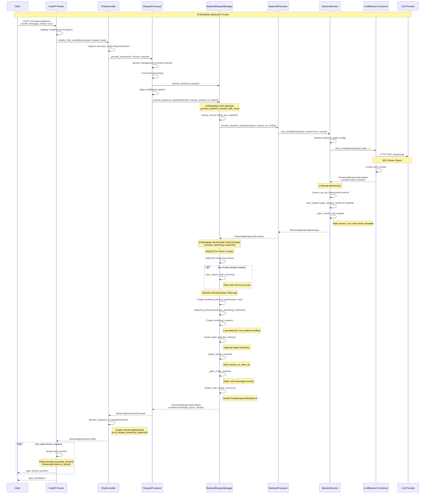
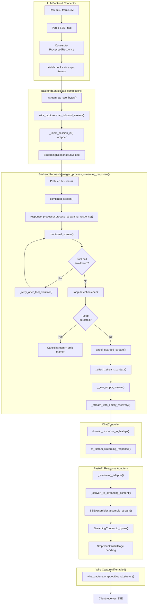
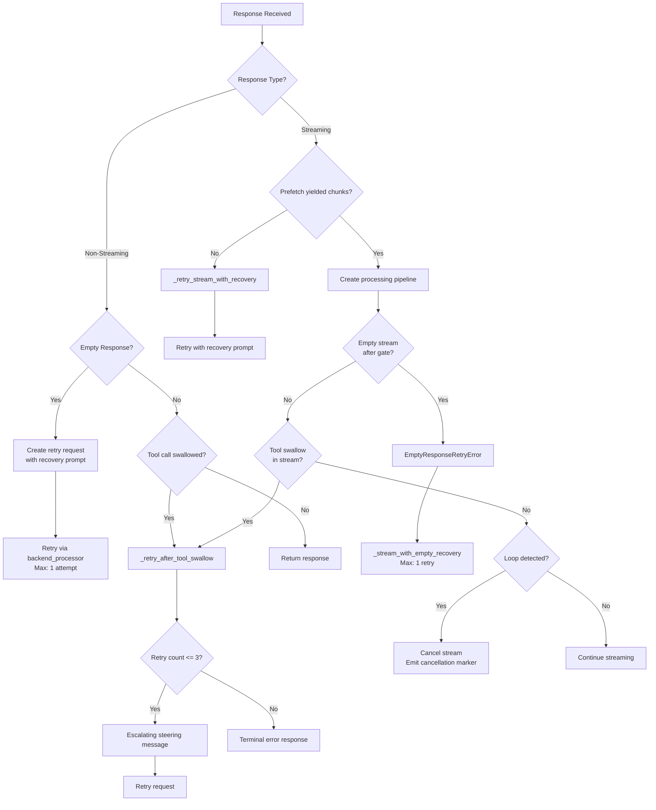

```mermaid
sequenceDiagram
    participant Client
    participant FastAPI as FastAPI Router
    participant CC as ChatController
    participant RP as RequestProcessor
    participant BRM as BackendRequestManager
    participant BP as BackendProcessor
    participant BS as BackendService
    participant Connector as LLMBackend Connector
    participant LLM as LLM Provider

    Note over Client,LLM: NON-STREAMING REQUEST FLOW

    %% === INBOUND PATH ===
    Client->>FastAPI: POST /v1/chat/completions<br/>{model, messages, stream: false}
    FastAPI->>FastAPI: Validate ChatRequest (Pydantic)
    FastAPI->>CC: handle_chat_completion(request, request_data)

    Note over CC: CONTROLLER INITIALIZATION
    CC->>CC: Capture raw_body_bytes for wire debugging
    CC->>CC: fastapi_to_domain_request_context(request)
    Note right of CC: Creates RequestContext from FastAPI Request<br/>Attaches domain_request & raw_body

    CC->>CC: Wire capture inbound request (if enabled)
    CC->>RP: process_request(ctx, domain_request)

    %% === REQUEST PROCESSOR ===
    Note over RP: SESSION MANAGEMENT
    RP->>RP: resolve_session_id(context)
    RP->>RP: get_session(session_id)
    RP->>RP: update_session_agent(session, agent)
    RP->>RP: detect_client_os(request_data)
    RP->>RP: detect_vtc_client (VTC mode)
    RP->>RP: populate allowed_tools in registry

    Note over RP: PROJECT & CONTEXT
    RP->>RP: maybe_resolve_project_directory()
    RP->>RP: context_injector.maybe_inject_context()
    RP->>RP: memory_capture.capture_request()

    Note over RP: COMMAND PROCESSING
    RP->>RP: _handle_command_processing()
    alt Command executed with no messages
        RP->>RP: response_manager.process_command_result()
        RP-->>CC: ResponseEnvelope (command result)
    end

    Note over RP: MODEL REPLACEMENT
    RP->>RP: replacement_service.should_replace()
    RP->>RP: get_effective_backend_model()

    %% === BACKEND REQUEST PREPARATION ===
    RP->>BRM: prepare_backend_request(request_data, command_result)

    Note over BRM: REQUEST PREPARATION
    BRM->>BRM: Process modified_messages from commands
    BRM->>BRM: Append command_results as tool messages
    BRM->>BRM: Apply history compaction (if enabled)
    BRM-->>RP: ChatRequest (prepared)

    %% === MIDDLEWARE PIPELINE ===
    Note over RP: MIDDLEWARE PIPELINE
    RP->>RP: Enforce per-model context window limits
    RP->>RP: Apply RedactionMiddleware (API keys, commands)
    RP->>RP: Apply EditPrecisionTuningMiddleware
    RP->>RP: Apply ToolAccessPolicyService filtering

    RP->>BRM: process_backend_request(backend_request, session_id, context)

    %% === BACKEND REQUEST MANAGER - PROCESS ===
    Note over BRM: DEDUPLICATION CHECK
    BRM->>BRM: dedup_service.check_and_register()

    BRM->>BP: process_backend_request(request, session_id, context)

    %% === BACKEND PROCESSOR ===
    BP->>BP: get_session(session_id)
    BP->>BP: Extract raw_prompt for tracking
    BP->>BP: Merge failover_routes from session/app
    BP->>BS: call_completion(request, stream=false, context)

    %% === BACKEND SERVICE ===
    Note over BS: BACKEND RESOLUTION
    BS->>BS: _resolve_backend_and_model(request)
    BS->>BS: _apply_model_aliases(model)
    BS->>BS: _synchronize_request_with_target()

    Note over BS: AVAILABILITY CHECKS
    BS->>BS: Check resilience coordinator availability
    BS->>BS: Check rate limiter status
    BS->>BS: _get_or_create_backend(backend_type)
    BS->>BS: Check is_backend_functional()

    Note over BS: REQUEST TRANSFORMATION
    BS->>BS: _apply_reasoning_config(request, session)
    BS->>BS: backend_config_service.apply_backend_config()
    BS->>BS: _apply_uri_parameters()
    BS->>BS: Wire capture outbound request (if enabled)

    BS->>Connector: chat_completions(request_data, messages, model, identity)

    %% === CONNECTOR TO LLM ===
    Connector->>Connector: Transform to provider format
    Connector->>LLM: HTTP POST (provider-specific API)
    LLM-->>Connector: JSON Response
    Connector->>Connector: Transform to domain format
    Connector-->>BS: ResponseEnvelope

    %% === RESPONSE PATH ===
    BS->>BS: Wire capture inbound response (if enabled)
    BS->>BS: resilience.record_success()
    BS-->>BP: ResponseEnvelope

    BP->>BP: Record SessionInteraction
    BP-->>BRM: ResponseEnvelope

    %% === BACKEND REQUEST MANAGER - RESPONSE PROCESSING ===
    Note over BRM: RESPONSE MIDDLEWARE
    BRM->>BRM: response_processor.process_response()
    BRM->>BRM: Check for empty response
    alt Empty response detected
        BRM->>BRM: Create retry request with recovery prompt
        BRM->>BP: process_backend_request(retry_request)
        Note right of BRM: Single retry attempt
    end

    BRM->>BRM: Apply StructuredOutputMiddleware (if schema)

    BRM->>BRM: Check for tool_call_swallowed
    alt Swallowed tool call (dangerous command)
        BRM->>BRM: _retry_after_tool_swallow()
        Note right of BRM: Escalating steering messages<br/>Max 3 retries, then terminal error
    end

    BRM-->>RP: ResponseEnvelope

    RP->>RP: Update session history
    RP->>RP: Update conversation fingerprint
    RP-->>CC: ResponseEnvelope

    %% === CONTROLLER RESPONSE CONVERSION ===
    CC->>CC: _ensure_openai_chat_schema(content)
    Note right of CC: Ensures tool_calls structure<br/>Applies reasoning aliases
    CC->>CC: domain_response_to_fastapi(response)
    CC-->>FastAPI: JSONResponse
    FastAPI-->>Client: HTTP 200 JSON Response
```

# Request Flow Architecture Analysis

This document provides a detailed analysis of the streaming and non-streaming request flows in the LLM Interactive Proxy application, including Mermaid diagrams that visualize both flows.

## Table of Contents

- [Overview](#overview)
- [Layered Architecture](#layered-architecture)
- [Key Domain Types](#key-domain-types)
- [Non-Streaming Request Flow](#non-streaming-request-flow)
- [Streaming Request Flow](#streaming-request-flow)
- [Streaming Pipeline Detail](#streaming-pipeline-detail)
- [Key Decision Points](#key-decision-points)
- [Data Transformation Points](#data-transformation-points)
- [Retry Decision Tree](#retry-decision-tree)
- [Middleware Execution Order](#middleware-execution-order)
- [Key Files Reference](#key-files-reference)
- [Wire Capture Integration](#wire-capture-integration)
- [Async Boundaries](#async-boundaries)
- [Summary](#summary)
- [Appendix: Response Processor Middleware](#appendix-response-processor-middleware)

---

## Overview

The LLM Interactive Proxy is a middleware that sits between AI coding assistants (Claude Code, Cline, Factory Droid) and LLM backend providers (OpenAI, Anthropic, Gemini, etc.). It provides:

- **Traffic routing** with model aliasing and failover
- **Session management** for multi-turn conversations
- **Command processing** for interactive proxy commands
- **Byte-precise CBOR wire captures** for debugging
- **Response middleware** including loop detection, tool call handling, and empty response recovery

---

## Layered Architecture

```text
LAYER 1: FRONT-END INTERFACES (FastAPI Routers)
  ├── OpenAI-compatible: /v1/chat/completions
  ├── Anthropic-compatible: /anthropic/v1/messages
  └── Responses API: /v1/responses

LAYER 2: CONTROLLERS (src/core/app/controllers/)
  ├── ChatController       → chat_controller.py
  ├── AnthropicController  → anthropic_controller.py
  └── ResponsesController  → responses_controller.py

LAYER 3: REQUEST PROCESSOR (src/core/services/)
  └── RequestProcessor     → request_processor_service.py
      ├── Session management
      ├── Command processing
      └── Middleware pipeline orchestration

LAYER 4: BACKEND REQUEST MANAGER (src/core/services/)
  └── BackendRequestManager → backend_request_manager_service.py
      ├── Request preparation
      ├── Streaming/non-streaming split
      └── Retry logic (empty response, tool swallow)

LAYER 5: BACKEND PROCESSOR (src/core/services/)
  └── BackendProcessor     → backend_processor.py
      ├── Session interaction recording
      └── Delegation to BackendService

LAYER 6: BACKEND SERVICE (src/core/services/)
  └── BackendService       → backend_service.py
      ├── Backend resolution
      ├── Rate limiting & resilience
      ├── Failover coordination
      └── Wire capture

LAYER 7: CONNECTORS (src/connectors/)
  └── LLMBackend (base.py)
      ├── OpenAI connector
      ├── Anthropic connector
      ├── Gemini connector (OAuth, CLI-ACP, etc.)
      └── Other provider connectors
```

---

## Key Domain Types

### Request Types

```text
ChatRequest (src/core/domain/chat.py)
├── model: str              # Requested model (e.g., "gpt-4", "gemini:gemini-2.5-pro")
├── messages: list[ChatMessage]
├── stream: bool | None     # Streaming flag
├── temperature: float | None
├── max_tokens: int | None
├── tools: list[Tool] | None
├── tool_choice: str | dict | None
├── session_id: str | None  # Session identifier
├── extra_body: dict | None # Extended parameters
└── ... other parameters

RequestContext (src/core/domain/request_context.py)
├── headers: RequestHeaders       # Immutable header wrapper
├── cookies: RequestCookies       # Immutable cookie wrapper
├── state: Any                    # FastAPI request state
├── app_state: Any                # Application state reference
├── client_host: str | None       # Client IP address
├── session_id: str | None        # Resolved session identifier
├── request_id: str | None        # Unique request identifier
├── agent: str | None             # Detected agent (cline, factory-droid, etc.)
├── original_request: Any         # Reference to original FastAPI request
├── processing_context: ProcessingContext | None
└── Methods:
    ├── get_header(key, default)  # Retrieve header value
    ├── get_cookie(key, default)  # Retrieve cookie value
    ├── ensure_processing_context() # Create ProcessingContext if None
    └── requires_usage_recalculation() # Check if proxy modified content

ProcessingContext (src/core/domain/request_context.py)
├── values: dict[str, Any]        # Shared context values (client_os, etc.)
├── modification_tracker: ContentModificationTracker
│   ├── inbound_modified: bool    # True if request was modified
│   ├── outbound_modified: bool   # True if response was modified
│   ├── inbound_modification_reasons: list[str]
│   ├── outbound_modification_reasons: list[str]
│   └── Token tracking for usage recalculation
└── Methods:
    ├── update(data: Mapping)     # Merge values into context
    ├── mark_inbound_modified()   # Flag request modification
    └── mark_outbound_modified()  # Flag response modification
```

### Response Types

```text
ResponseEnvelope (src/core/domain/responses.py)
├── content: Any            # Response content (dict, string, bytes)
├── headers: dict | None    # Response headers
├── status_code: int        # HTTP status (default 200)
├── media_type: str         # "application/json"
├── usage: dict | None      # Token usage data
└── metadata: dict | None   # Additional metadata (tool_calls, reasoning, etc.)

StreamingResponseEnvelope (src/core/domain/responses.py)
├── content: AsyncIterator[ProcessedResponse] | None
├── media_type: str         # "text/event-stream"
├── headers: dict | None
├── status_code: int        # HTTP status (default 200)
├── cancel_callback: Callable | None  # Stream cancellation hook
└── metadata: dict | None
```

### ProcessedResponse (src/core/interfaces/response_processor_interface.py)

```text
ProcessedResponse
├── content: Any            # Chunk content (string, dict, bytes)
├── metadata: dict | None   # Chunk metadata (tool_calls, finish_reason, etc.)
└── usage: dict | None      # Usage data (for final chunks)
```

### Streaming Types (src/core/ports/streaming_contracts.py)

```text
StreamingContent
├── content: str | dict | bytes  # May contain StopChunkWithUsage
├── metadata: dict[str, Any]     # Provider, stream_id, finish_reason, etc.
├── is_done: bool                # Stream completion flag
├── is_empty: bool | None        # Empty content detection (computed if None)
├── stream_id: str | None        # Stream correlation ID
├── is_cancellation: bool        # Loop cancellation flag
├── usage: dict | None           # Usage data
└── raw_data: Any | None         # Original raw data for debugging

StopChunkWithUsage (dict subclass)
├── Prevents accidental str() conversion (raises UsageChunkLeakError)
├── Prevents direct json.dumps() serialization
├── Contains final usage data at top level (not in delta.content)
├── Methods:
│   ├── to_plain_dict() → dict    # Safe conversion for serialization
│   ├── allow_stringify() → self  # Temporarily allow str() (for debugging)
│   └── safe_json_dumps(obj)      # Static helper for JSON serialization
└── Must be serialized via StreamingContent.to_bytes()

SentinelManager
├── DONE_MARKER = "[DONE]"        # Standard SSE termination marker
├── create_done_chunk()           # Creates StreamingContent with is_done=True
├── is_done_marker(chunk)         # Checks if chunk signals stream end
└── format_sse_done() → bytes     # Returns b"data: [DONE]\n\n"

SSEAssembler (src/core/ports/sse_assembler.py)
├── Implements IStreamAssembler interface
├── Converts StreamingContent → SSE-formatted bytes
├── Handles StopChunkWithUsage properly via to_bytes()
├── Ensures [DONE] marker is always emitted (even on errors)
├── Tracks metrics: chunks_sent, sentinels_emitted
└── Yields control to event loop with asyncio.sleep(0)
```

---

## Non-Streaming Request Flow

### Sequence Diagram



---

## Streaming Request Flow

### Sequence Diagram



---

## Streaming Pipeline Detail

### Internal Stream Processing Stack



### Tool Call Buffering in Streaming

When streaming responses contain XML-style tool calls (e.g., `<write_file>...</write_file>`), the proxy buffers incomplete tags to prevent:
- Partial tag names from being emitted
- Arguments being split across chunks

```text
StreamContextRegistry (global singleton)
├── get_tool_call_buffer(stream_key) → ToolCallBuffer
│   ├── allowed_tools: list[str] | None  # From request tools
│   └── tracked_tags: set[str]           # Observed XML tags
├── get_fragment(stream_key, buffer_key) → str
├── set_fragment(stream_key, buffer_key, value)
└── clear_fragment(stream_key, buffer_key)

Buffering Flow:
1. _update_tracked_tags() - Scan for new <tag_name> patterns
2. _get_target_tags() - Build ordered list of tags to buffer
3. _apply_tag_buffer() - Split complete vs incomplete tag segments
4. _flush_pending_tool_blocks() - Emit buffered content on stream end
```

### Stream Processing Stages

| Stage | Location | Responsibility |
|-------|----------|----------------|
| 1. Raw SSE | Connector | Parse provider's SSE format |
| 2. ProcessedResponse | Connector | Normalize to domain type |
| 3. Byte encoding | BackendService | Convert to SSE bytes via `_stream_as_sse_bytes()` |
| 4. Wire capture (in) | BackendService | Capture inbound stream for debugging |
| 5. Session injection | BackendService | Add session_id to chunk metadata |
| 6. Combined stream | BRM | Merge prefetched chunk + rest of stream |
| 7. Response processor | BRM | Apply middleware (ToolCallReactor, etc.) |
| 8. Monitored stream | BRM | Loop detection + tool swallow handling |
| 9. Angel guard | BRM | Optional AI verification of responses |
| 10. Context attach | BRM | Inject session_id, client_os into metadata |
| 11. Empty gate | BRM | Buffer until meaningful content detected |
| 12. Recovery wrap | BRM | Handle EmptyResponseRetryError |
| 13. StreamingContent | Response Adapter | Convert ProcessedResponse → StreamingContent |
| 14. Tool buffering | Response Adapter | Buffer incomplete XML tool blocks |
| 15. SSE assembly | SSEAssembler | Convert StreamingContent → SSE bytes |
| 16. Wire capture (out) | Response Adapter | Capture outbound stream for debugging |

---

## Key Decision Points

### 1. Streaming vs Non-Streaming Split

**Location:** `BackendRequestManager._process_backend_request_with_retry()` (lines ~379-560)

```text
IF isinstance(backend_response, ResponseEnvelope)
   AND NOT backend_request.stream
   AND backend_response.content is not None:
    → NON-STREAMING PATH
    → Process through response_processor.process_response()
    → Apply StructuredOutputMiddleware (if response_schema in context)
    → Check for tool_call_swallowed metadata
    → If swallowed: _retry_after_tool_swallow() with escalating messages
    → Return ResponseEnvelope

ELSE IF backend_request.stream:
    IF isinstance(backend_response, StreamingResponseEnvelope):
        → STREAMING PATH
        → Call _process_streaming_response()
        → Return StreamingResponseEnvelope with processed iterator
    ELSE:
        → Log warning (unexpected response type for streaming request)
        → Return response as-is (fallback)
```

### 2. Command-Only Path vs Backend Call

**Location:** `RequestProcessor.process_request()` (lines ~264-277)

```text
# Special Cline agent handling (needs tool_calls response format)
IF session.agent == "cline" AND command_result.command_executed:
    → record_command_in_session()
    → Return response_manager.process_command_result()

# General command-only path
IF command_result.command_executed AND modified_messages is empty:
    → Skip backend call entirely
    → record_command_in_session()
    → Return response_manager.process_command_result()
ELSE:
    → Continue to backend call path
```

### 3. Retry Decision Points



### Retry Constants

```text
Empty Response:
  - _MAX_EMPTY_STREAM_RETRIES = 1
  - _STREAM_RECOVERY_PROMPT = "The previous response was empty, please try again."
  - Applied to both streaming and non-streaming paths

Dangerous Command (Tool Swallow):
  - _MAX_DANGEROUS_COMMAND_RETRIES = 3
  - _DANGEROUS_RETRY_KEY = "_dangerous_command_retry_count" (tracked in extra_body)
  - Escalating messages (_DANGEROUS_STEERING_MESSAGES tuple):
    1. "[Proxy Security Notice - First Warning]" - Standard steering
    2. "[Proxy Security Notice - SECOND WARNING]" - Stronger warning with consequences
    3. "[Proxy Security Notice - FINAL WARNING]" - Terminal threat
  - 4th attempt: _DANGEROUS_TERMINAL_ERROR returned to client
  - Terminal response includes: dangerous_command_limit_exceeded, session_terminated flags
  - Both streaming and non-streaming use identical logic for parity
```

---

## Data Transformation Points

### Inbound (Client → LLM)


### Outbound (LLM → Client)


---

## Retry Decision Tree

```text
EMPTY RESPONSE (non-streaming):
├── Detected by: response_processor.process_response()
├── Trigger: Raises EmptyResponseRetryError
├── Handler: BRM._process_backend_request_with_retry()
├── Action: Create retry_request with recovery prompt
├── Retry limit: 1 attempt
└── On failure: Return whatever backend returns

EMPTY STREAM (streaming):
├── Detected by: _gate_empty_stream() buffering
├── Trigger: Raises EmptyResponseRetryError when stream ends empty
├── Handler: _stream_with_empty_recovery()
├── Action: Retry via backend_processor with recovery prompt
├── Retry limit: _MAX_EMPTY_STREAM_RETRIES (1)
└── On failure: BackendError raised

TOOL CALL SWALLOWED (dangerous command blocked):
├── Detected by: metadata["tool_call_swallowed"]
├── Handler: BRM._retry_after_tool_swallow()
├── Strategy: Escalating steering messages
│   ├── Retry 1: Standard proxy security notice
│   ├── Retry 2: SECOND WARNING with consequences
│   └── Retry 3: FINAL WARNING before termination
├── Hard limit: _MAX_DANGEROUS_COMMAND_RETRIES (3)
├── 4th attempt: Terminal error response
└── Both streaming and non-streaming use same logic

LOOP DETECTION (streaming only):
├── Detected by: HybridLoopDetector in monitored_stream()
├── Trigger: Repetitive pattern detected
├── Action: Cancel stream, emit cancellation marker
├── Marker format: {"finish_reason": "cancelled", "loop_detected": true}
└── No retry - terminates stream
```

---

## Middleware Execution Order

### Request Path (Inbound)

```text
1. FastAPI Validation
   └── Pydantic model validation (ChatRequest)

2. ChatController.handle_chat_completion()
   ├── Capture raw body bytes for debugging
   ├── Create RequestContext from FastAPI Request
   ├── Wire capture inbound request (if enabled)
   └── Special handling: ZAI non-streaming → Anthropic controller path

3. RequestProcessor.process_request()
   ├── Session Management:
   │   ├── resolve_session_id() - Via cookie, header, or request body
   │   ├── get_session() - Retrieve or create session
   │   ├── update_session_agent() - Detect agent from request
   │   └── _detect_client_os() - Extract OS from messages
   │
   ├── VTC Detection:
   │   └── detect_vtc_client() - Enable Virtual Tool Calling mode
   │
   ├── Project Resolution:
   │   └── maybe_resolve_project_directory() - Auto-detect project
   │
   ├── Context Injection:
   │   └── ContextInjectionMiddleware.maybe_inject_context()
   │
   ├── Memory Capture:
   │   └── MemoryCaptureMiddleware.capture_request()
   │
   └── Command Processing:
       └── _handle_command_processing() - Execute proxy commands

4. BackendRequestManager.prepare_backend_request()
   ├── Process modified_messages from commands
   ├── Append command_results as tool messages
   └── History compaction (if token threshold exceeded)

5. RequestProcessor Middleware Pipeline
   ├── Context window enforcement (max_input_tokens, context_window)
   ├── RedactionMiddleware (API keys, command prefixes)
   ├── EditPrecisionTuningMiddleware (temperature, top_p, top_k)
   └── ToolAccessPolicyService (filter tool definitions)

6. BackendRequestManager.process_backend_request()
   └── dedup_service.check_and_register() - Prevent duplicate requests

7. BackendProcessor.process_backend_request()
   ├── Merge failover_routes from session + app state
   └── Delegate to BackendService

8. BackendService.call_completion()
   ├── _resolve_backend_and_model() - Parse model string
   ├── _apply_model_aliases() - Apply regex rewrite rules
   ├── Availability checks:
   │   ├── Resilience coordinator (circuit breaker)
   │   └── Rate limiter
   ├── _get_or_create_backend() - Get connector instance
   ├── _apply_reasoning_config() - Apply session reasoning settings
   ├── backend_config_service.apply_backend_config() - Backend-specific settings
   ├── _apply_uri_parameters() - Apply temperature, top_p, etc.
   └── Wire capture outbound request (if enabled)

9. LLMBackend Connector
   └── Provider-specific transformation and HTTP call
```

### Response Path (Outbound)

#### Non-Streaming

```text
1. LLMBackend Connector
   └── Parse provider response → ResponseEnvelope

2. BackendService
   ├── Wire capture inbound response (if enabled)
   └── resilience.record_success() - Update circuit breaker

3. BackendProcessor
   └── session.add_interaction() - Record for history

4. BackendRequestManager._process_backend_request_with_retry()
   ├── response_processor.process_response()
   │   ├── EmptyResponseMiddleware - Detect empty responses
   │   └── ToolCallReactorMiddleware - Detect dangerous commands
   │
   ├── Empty Response Handling:
   │   └── Raise EmptyResponseRetryError → Retry with recovery prompt
   │
   ├── StructuredOutputMiddleware (if response_schema in context):
   │   └── Validate response against JSON schema
   │
   └── Tool Swallow Detection:
       └── _retry_after_tool_swallow() - Escalating retry logic

5. RequestProcessor
   ├── update_session_history() - Add request/response to session
   ├── update_session_fingerprint() - Update conversation hash
   └── replacement_service.complete_turn() - Update model replacement state

6. ChatController
   ├── _ensure_openai_chat_schema()
   │   ├── Handle tool_calls in metadata
   │   ├── Convert Anthropic format → OpenAI format
   │   └── Apply reasoning aliases (reasoning_content → reasoning)
   └── domain_response_to_fastapi()

7. Response Adapters (to_fastapi_response)
   ├── _normalize_content() - Pydantic model_dump, dataclass asdict
   ├── _inject_reasoning_metadata() - Add reasoning to choices
   ├── _ensure_usage() - Calculate/validate usage tokens
   ├── _apply_usage_headers() - x-usage-* headers
   ├── _sanitize_json_content() - Remove coroutines, mocks
   ├── _sanitize_headers() - Remove hop-by-hop headers
   ├── _maybe_capture_outbound_response() - Wire capture (if enabled)
   └── JSONResponse creation
```

#### Streaming

```text
1. LLMBackend Connector
   └── Create async iterator of ProcessedResponse chunks

2. BackendService.call_completion()
   ├── _stream_as_sse_bytes() - Convert to SSE format
   ├── wire_capture.wrap_inbound_stream() (if enabled)
   └── _inject_session_id() - Add session_id to chunk metadata

3. BackendRequestManager._process_streaming_response()
   ├── Prefetch first chunk (detect empty streams early)
   │
   ├── combined_stream() - Merge prefetched + rest
   │
   ├── response_processor.process_streaming_response()
   │   ├── ToolCallReactorMiddleware - Per-chunk processing
   │   └── Other registered streaming middleware
   │
   ├── monitored_stream():
   │   ├── Loop detection via HybridLoopDetector
   │   ├── Tool swallow detection → _retry_after_tool_swallow()
   │   └── Emit cancellation marker on loop detection
   │
   ├── angel_guarded_stream() [if angel_model configured]:
   │   ├── Buffer entire stream
   │   ├── Call Angel model for verification
   │   └── Optionally request correction
   │
   ├── _attach_stream_context() - Inject session_id, client_os
   │
   ├── _gate_empty_stream() - Buffer until meaningful content
   │
   └── _stream_with_empty_recovery() - Handle EmptyResponseRetryError

4. ChatController
   └── domain_response_to_fastapi()

5. Response Adapters (to_fastapi_streaming_response)
   ├── _streaming_adapter():
   │   ├── _ensure_async_iterator() - Handle sync/async sources
   │   ├── _extract_payload_and_metadata() - ProcessedResponse handling
   │   └── _decode_sse_payload() - Parse data: prefixed lines
   │
   ├── _convert_to_streaming_content():
   │   ├── Decode SSE payloads
   │   ├── Merge metadata from payload
   │   ├── _sanitize_multiline_tool_blocks() - Buffer XML tags
   │   ├── _inject_reasoning_metadata()
   │   ├── Accumulate text for usage calculation
   │   └── Create StreamingContent instances
   │
   ├── SSEAssembler.assemble_stream():
   │   ├── Skip empty chunks (except done markers)
   │   ├── Call StreamingContent.to_bytes()
   │   ├── Handle StopChunkWithUsage properly
   │   ├── Track metrics (chunks_sent, sentinels)
   │   └── Ensure [DONE] marker emitted
   │
   └── wire_capture.wrap_outbound_stream() (if enabled)
```

---

## Key Files Reference

| Priority | File | Purpose |
|----------|------|---------|
| CRITICAL | `src/core/app/controllers/chat_controller.py` | Entry point, OpenAI schema conversion |
| CRITICAL | `src/core/services/request_processor_service.py` | Main orchestration, middleware pipeline |
| CRITICAL | `src/core/services/backend_request_manager_service.py` | Streaming/non-streaming split, retry logic |
| CRITICAL | `src/core/services/backend_service.py` | Backend resolution, stream wrapping, failover |
| CRITICAL | `src/core/ports/streaming_contracts.py` | StreamingContent, StopChunkWithUsage, SSE serialization |
| CRITICAL | `src/core/ports/sse_assembler.py` | SSEAssembler, final stream-to-bytes conversion |
| IMPORTANT | `src/core/services/backend_processor.py` | Session interaction recording, failover route merging |
| IMPORTANT | `src/connectors/base.py` | LLMBackend interface |
| IMPORTANT | `src/core/domain/responses.py` | ResponseEnvelope, StreamingResponseEnvelope |
| IMPORTANT | `src/core/transport/fastapi/response_adapters.py` | FastAPI conversion, tool block buffering |
| IMPORTANT | `src/core/interfaces/response_processor_interface.py` | ProcessedResponse, IResponseProcessor |
| REFERENCE | `src/core/domain/chat.py` | ChatRequest, ChatResponse models |
| REFERENCE | `src/core/domain/request_context.py` | RequestContext, ProcessingContext |
| REFERENCE | `src/core/services/streaming/stream_context_registry.py` | Global tool call buffer registry |

---

## Wire Capture Integration

Wire capture is an optional debugging feature that records all traffic in CBOR format.

### Capture Points

```text
INBOUND CAPTURES:
1. ChatController.handle_chat_completion()
   └── capture_inbound_request(context, session_id, request_payload, raw_body)

2. BackendService.call_completion() [internal]
   └── capture_outbound_request() - Request being sent to backend

OUTBOUND CAPTURES:
1. BackendService.call_completion() [streaming]
   └── wrap_inbound_stream() - Wraps backend response stream

2. to_fastapi_response() [non-streaming]
   └── capture_outbound_response() - Final response to client

3. to_fastapi_streaming_response() [streaming]
   └── wrap_outbound_stream() - Wraps final client stream
```

### Capture File Location

```text
var/wire_captures_cbor/
├── {timestamp}_{session_id}_{type}.cbor
└── Use scripts/inspect_cbor_capture.py to decode
```

---

## Async Boundaries

The entire request flow is asynchronous. Key async boundaries:

1. **Controller Entry** - `async def handle_chat_completion()`
2. **Request Processing** - `async def process_request()`
3. **Backend Request** - `async def process_backend_request()`
4. **Backend Call** - `async def call_completion()`
5. **Connector Call** - `async def chat_completions()`
6. **Streaming Iteration** - `async for chunk in stream`

All async iterators properly support:
- `GeneratorExit` handling for client disconnection
- `aclose()` for cleanup
- `asyncio.sleep(0)` for event loop yielding during streaming

---

## Summary

The LLM Interactive Proxy implements a sophisticated request flow with:

1. **Layered architecture** separating concerns (controllers, services, connectors)
2. **Transport-agnostic domain types** (ResponseEnvelope, StreamingResponseEnvelope)
3. **Comprehensive middleware pipeline** for security and optimization
4. **Robust retry mechanisms** for empty responses and blocked commands
5. **Streaming-specific processing** with loop detection and empty stream recovery
6. **Wire capture integration** for debugging and compliance

### Key Design Decisions

| Decision | Rationale |
|----------|-----------|
| StopChunkWithUsage protection | Prevents usage data from leaking into delta.content via accidental str() |
| Tool call buffering | Ensures XML-style tool blocks aren't split across SSE chunks |
| Prefetch first chunk | Enables early empty stream detection before committing to streaming path |
| ProcessingContext modification tracking | Allows accurate usage recalculation when proxy modifies content |
| Escalating dangerous command retries | Balances safety (limit retries) with giving LLM chances to comply |
| Session-scoped failover routes | Prevents interactive command changes from leaking across requests |

### Common Debugging Scenarios

| Symptom | Investigation |
|---------|---------------|
| Missing usage in response | Check if StopChunkWithUsage is being converted to string |
| Merged words in stream | Verify whitespace chunks aren't being dropped |
| Empty response returned | Check _gate_empty_stream() and EmptyResponseRetryError |
| Tool call not executed | Check tool_call_swallowed metadata and reactor retry logs |
| Loop detection triggered | Check HybridLoopDetector thresholds and pattern analysis |

---

## Appendix: Response Processor Middleware

The response processor applies middleware to both streaming and non-streaming responses.

### Registered Middleware (by priority)

```text
IResponseMiddleware Interface:
├── process(response, session_id, context, is_streaming, stop_event)
└── priority: int (higher runs first)

IResponseFeature Interface (enforces streaming/non-streaming parity):
├── process_streaming(chunk, session_id, context)
├── process_non_streaming(response, session_id, context)
└── process() - Template method that delegates to correct path

Common Middleware:
├── EmptyResponseMiddleware - Detects and raises EmptyResponseRetryError
├── ToolCallReactorMiddleware - Blocks dangerous commands, adds steering
├── StructuredOutputMiddleware - Validates against JSON schema
└── Custom middleware via response_processor.register_middleware()
```

