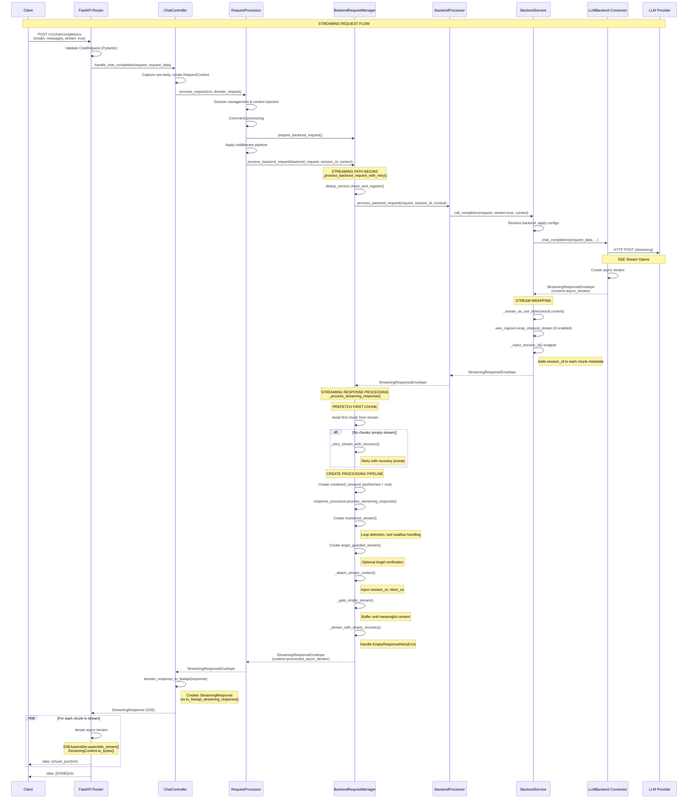
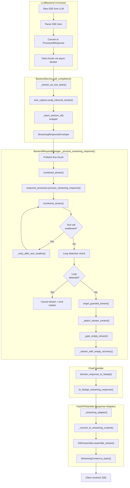
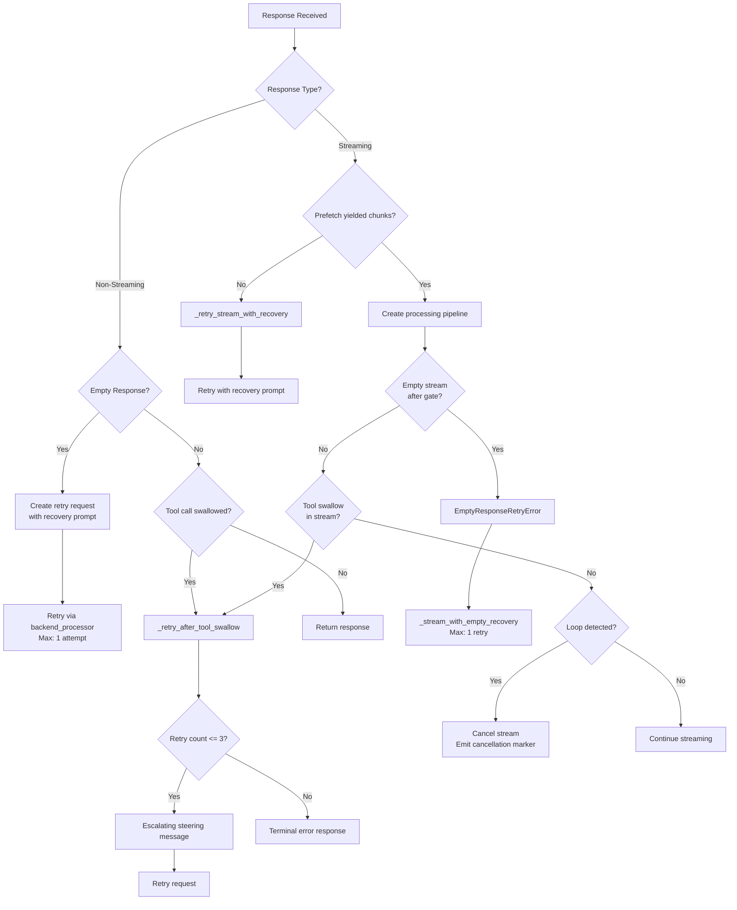

```mermaid
sequenceDiagram
    participant Client
    participant FastAPI as FastAPI Router
    participant CC as ChatController
    participant RP as RequestProcessor
    participant BRM as BackendRequestManager
    participant BP as BackendProcessor
    participant BS as BackendService
    participant Connector as LLMBackend Connector
    participant LLM as LLM Provider

    Note over Client,LLM: NON-STREAMING REQUEST FLOW

    %% === INBOUND PATH ===
    Client->>FastAPI: POST /v1/chat/completions<br/>{model, messages, stream: false}
    FastAPI->>FastAPI: Validate ChatRequest (Pydantic)
    FastAPI->>CC: handle_chat_completion(request, request_data)

    Note over CC: CONTROLLER INITIALIZATION
    CC->>CC: Capture raw_body_bytes for wire debugging
    CC->>CC: fastapi_to_domain_request_context(request)
    Note right of CC: Creates RequestContext from FastAPI Request<br/>Attaches domain_request & raw_body

    CC->>CC: Wire capture inbound request (if enabled)
    CC->>RP: process_request(ctx, domain_request)

    %% === REQUEST PROCESSOR ===
    Note over RP: SESSION MANAGEMENT
    RP->>RP: resolve_session_id(context)
    RP->>RP: get_session(session_id)
    RP->>RP: update_session_agent(session, agent)
    RP->>RP: detect_client_os(request_data)
    RP->>RP: detect_vtc_client (VTC mode)
    RP->>RP: populate allowed_tools in registry

    Note over RP: PROJECT & CONTEXT
    RP->>RP: maybe_resolve_project_directory()
    RP->>RP: context_injector.maybe_inject_context()
    RP->>RP: memory_capture.capture_request()

    Note over RP: COMMAND PROCESSING
    RP->>RP: _handle_command_processing()
    alt Command executed with no messages
        RP->>RP: response_manager.process_command_result()
        RP-->>CC: ResponseEnvelope (command result)
    end

    Note over RP: MODEL REPLACEMENT
    RP->>RP: replacement_service.should_replace()
    RP->>RP: get_effective_backend_model()

    %% === BACKEND REQUEST PREPARATION ===
    RP->>BRM: prepare_backend_request(request_data, command_result)

    Note over BRM: REQUEST PREPARATION
    BRM->>BRM: Process modified_messages from commands
    BRM->>BRM: Append command_results as tool messages
    BRM->>BRM: Apply history compaction (if enabled)
    BRM-->>RP: ChatRequest (prepared)

    %% === MIDDLEWARE PIPELINE ===
    Note over RP: MIDDLEWARE PIPELINE
    RP->>RP: Enforce per-model context window limits
    RP->>RP: Apply RedactionMiddleware (API keys, commands)
    RP->>RP: Apply EditPrecisionTuningMiddleware
    RP->>RP: Apply ToolAccessPolicyService filtering

    RP->>BRM: process_backend_request(backend_request, session_id, context)

    %% === BACKEND REQUEST MANAGER - PROCESS ===
    Note over BRM: DEDUPLICATION CHECK
    BRM->>BRM: dedup_service.check_and_register()

    BRM->>BP: process_backend_request(request, session_id, context)

    %% === BACKEND PROCESSOR ===
    BP->>BP: get_session(session_id)
    BP->>BP: Extract raw_prompt for tracking
    BP->>BP: Merge failover_routes from session/app
    BP->>BS: call_completion(request, stream=false, context)

    %% === BACKEND SERVICE ===
    Note over BS: BACKEND RESOLUTION
    BS->>BS: _resolve_backend_and_model(request)
    BS->>BS: _apply_model_aliases(model)
    BS->>BS: _synchronize_request_with_target()

    Note over BS: AVAILABILITY CHECKS
    BS->>BS: Check resilience coordinator availability
    BS->>BS: Check rate limiter status
    BS->>BS: _get_or_create_backend(backend_type)
    BS->>BS: Check is_backend_functional()

    Note over BS: REQUEST TRANSFORMATION
    BS->>BS: _apply_reasoning_config(request, session)
    BS->>BS: backend_config_service.apply_backend_config()
    BS->>BS: _apply_uri_parameters()
    BS->>BS: Wire capture outbound request (if enabled)

    BS->>Connector: chat_completions(request_data, messages, model, identity)

    %% === CONNECTOR TO LLM ===
    Connector->>Connector: Transform to provider format
    Connector->>LLM: HTTP POST (provider-specific API)
    LLM-->>Connector: JSON Response
    Connector->>Connector: Transform to domain format
    Connector-->>BS: ResponseEnvelope

    %% === RESPONSE PATH ===
    BS->>BS: Wire capture inbound response (if enabled)
    BS->>BS: resilience.record_success()
    BS-->>BP: ResponseEnvelope

    BP->>BP: Record SessionInteraction
    BP-->>BRM: ResponseEnvelope

    %% === BACKEND REQUEST MANAGER - RESPONSE PROCESSING ===
    Note over BRM: RESPONSE MIDDLEWARE
    BRM->>BRM: response_processor.process_response()
    BRM->>BRM: Check for empty response
    alt Empty response detected
        BRM->>BRM: Create retry request with recovery prompt
        BRM->>BP: process_backend_request(retry_request)
        Note right of BRM: Single retry attempt
    end

    BRM->>BRM: Apply StructuredOutputMiddleware (if schema)

    BRM->>BRM: Check for tool_call_swallowed
    alt Swallowed tool call (dangerous command)
        BRM->>BRM: _retry_after_tool_swallow()
        Note right of BRM: Escalating steering messages<br/>Max 3 retries, then terminal error
    end

    BRM-->>RP: ResponseEnvelope

    RP->>RP: Update session history
    RP->>RP: Update conversation fingerprint
    RP-->>CC: ResponseEnvelope

    %% === CONTROLLER RESPONSE CONVERSION ===
    CC->>CC: _ensure_openai_chat_schema(content)
    Note right of CC: Ensures tool_calls structure<br/>Applies reasoning aliases
    CC->>CC: domain_response_to_fastapi(response)
    CC-->>FastAPI: JSONResponse
    FastAPI-->>Client: HTTP 200 JSON Response
```

# Request Flow Architecture Analysis

This document provides a detailed analysis of the streaming and non-streaming request flows in the LLM Interactive Proxy application, including Mermaid diagrams that visualize both flows.

## Table of Contents

- [Overview](#overview)
- [Layered Architecture](#layered-architecture)
- [Key Domain Types](#key-domain-types)
- [Non-Streaming Request Flow](#non-streaming-request-flow)
- [Streaming Request Flow](#streaming-request-flow)
- [Streaming Pipeline Detail](#streaming-pipeline-detail)
- [Key Decision Points](#key-decision-points)
- [Data Transformation Points](#data-transformation-points)
- [Retry Decision Tree](#retry-decision-tree)
- [Middleware Execution Order](#middleware-execution-order)

---

## Overview

The LLM Interactive Proxy is a middleware that sits between AI coding assistants (Claude Code, Cline, Factory Droid) and LLM backend providers (OpenAI, Anthropic, Gemini, etc.). It provides:

- **Traffic routing** with model aliasing and failover
- **Session management** for multi-turn conversations
- **Command processing** for interactive proxy commands
- **Byte-precise CBOR wire captures** for debugging
- **Response middleware** including loop detection, tool call handling, and empty response recovery

---

## Layered Architecture

```text
LAYER 1: FRONT-END INTERFACES (FastAPI Routers)
  ├── OpenAI-compatible: /v1/chat/completions
  ├── Anthropic-compatible: /anthropic/v1/messages
  └── Responses API: /v1/responses

LAYER 2: CONTROLLERS (src/core/app/controllers/)
  ├── ChatController       → chat_controller.py
  ├── AnthropicController  → anthropic_controller.py
  └── ResponsesController  → responses_controller.py

LAYER 3: REQUEST PROCESSOR (src/core/services/)
  └── RequestProcessor     → request_processor_service.py
      ├── Session management
      ├── Command processing
      └── Middleware pipeline orchestration

LAYER 4: BACKEND REQUEST MANAGER (src/core/services/)
  └── BackendRequestManager → backend_request_manager_service.py
      ├── Request preparation
      ├── Streaming/non-streaming split
      └── Retry logic (empty response, tool swallow)

LAYER 5: BACKEND PROCESSOR (src/core/services/)
  └── BackendProcessor     → backend_processor.py
      ├── Session interaction recording
      └── Delegation to BackendService

LAYER 6: BACKEND SERVICE (src/core/services/)
  └── BackendService       → backend_service.py
      ├── Backend resolution
      ├── Rate limiting & resilience
      ├── Failover coordination
      └── Wire capture

LAYER 7: CONNECTORS (src/connectors/)
  └── LLMBackend (base.py)
      ├── OpenAI connector
      ├── Anthropic connector
      ├── Gemini connector (OAuth, CLI-ACP, etc.)
      └── Other provider connectors
```

---

## Key Domain Types

### Request Types

```text
ChatRequest (src/core/domain/chat.py)
├── model: str              # Requested model (e.g., "gpt-4", "gemini:gemini-2.5-pro")
├── messages: list[ChatMessage]
├── stream: bool | None     # Streaming flag
├── temperature: float | None
├── max_tokens: int | None
├── tools: list[Tool] | None
├── tool_choice: str | dict | None
├── session_id: str | None  # Session identifier
├── extra_body: dict | None # Extended parameters
└── ... other parameters

RequestContext (src/core/domain/request_context.py)
├── headers: RequestHeaders
├── cookies: RequestCookies
├── state: Any              # FastAPI request state
├── app_state: Any          # Application state reference
├── client_host: str | None
├── session_id: str | None
├── request_id: str | None
├── agent: str | None       # Detected agent (cline, factory-droid, etc.)
├── original_request: Any   # Reference to original FastAPI request
└── processing_context: ProcessingContext | None
```

### Response Types

```text
ResponseEnvelope (src/core/domain/responses.py)
├── content: Any            # Response content (dict, string, bytes)
├── headers: dict | None    # Response headers
├── status_code: int        # HTTP status (default 200)
├── media_type: str         # "application/json"
├── usage: dict | None      # Token usage data
└── metadata: dict | None   # Additional metadata (tool_calls, reasoning, etc.)

StreamingResponseEnvelope (src/core/domain/responses.py)
├── content: AsyncIterator[ProcessedResponse] | None
├── media_type: str         # "text/event-stream"
├── headers: dict | None
├── status_code: int        # HTTP status (default 200)
├── cancel_callback: Callable | None  # Stream cancellation hook
└── metadata: dict | None
```

### Streaming Types (src/core/ports/streaming_contracts.py)

```text
ProcessedResponse
├── content: Any            # Chunk content
├── metadata: dict | None   # Chunk metadata
└── usage: dict | None      # Usage data (for final chunks)

StreamingContent
├── content: str | dict | bytes
├── metadata: dict[str, Any]
├── is_done: bool           # Stream completion flag
├── is_empty: bool | None   # Empty content detection
├── stream_id: str | None   # Stream correlation ID
├── is_cancellation: bool   # Loop cancellation flag
├── usage: dict | None      # Usage data
└── raw_data: Any | None    # Original raw data

StopChunkWithUsage (dict subclass)
├── Prevents accidental stringification
├── Contains final usage data
└── Must be serialized via to_bytes() or dict()
```

---

## Non-Streaming Request Flow

### Sequence Diagram



---

## Streaming Request Flow

### Sequence Diagram



---

## Streaming Pipeline Detail

### Internal Stream Processing Stack



### Stream Processing Stages

| Stage | Location | Responsibility |
|-------|----------|----------------|
| 1. Raw SSE | Connector | Parse provider's SSE format |
| 2. ProcessedResponse | Connector | Normalize to domain type |
| 3. Byte encoding | BackendService | Convert to SSE bytes |
| 4. Wire capture | BackendService | Capture for debugging |
| 5. Session injection | BackendService | Add session_id to metadata |
| 6. Combined stream | BRM | Merge prefetched + rest |
| 7. Response processor | BRM | Apply middleware pipeline |
| 8. Monitored stream | BRM | Loop detection, tool swallow |
| 9. Angel guard | BRM | Optional verification |
| 10. Context attach | BRM | Add session_id, client_os |
| 11. Empty gate | BRM | Buffer until meaningful |
| 12. Recovery wrap | BRM | Handle empty retry |
| 13. SSE assembly | Response Adapter | Final SSE formatting |

---

## Key Decision Points

### 1. Streaming vs Non-Streaming Split

**Location:** `BackendRequestManager._process_backend_request_with_retry()` (lines ~392-549)

```text
IF isinstance(backend_response, ResponseEnvelope)
   AND NOT backend_request.stream
   AND backend_response.content is not None:
    → NON-STREAMING PATH
    → Process through response_processor.process_response()
    → Apply StructuredOutputMiddleware
    → Check for tool_call_swallowed
    → Return ResponseEnvelope

ELSE IF backend_request.stream:
    IF isinstance(backend_response, StreamingResponseEnvelope):
        → STREAMING PATH
        → Call _process_streaming_response()
        → Return StreamingResponseEnvelope with processed iterator
    ELSE:
        → Log warning (unexpected response type)
        → Return as-is
```

### 2. Command-Only Path vs Backend Call

**Location:** `RequestProcessor.process_request()` (lines ~263-276)

```text
IF command_result.command_executed AND modified_messages is empty:
    → Skip backend call entirely
    → Return response_manager.process_command_result()
ELSE:
    → Continue to backend call path
```

### 3. Retry Decision Points



### Retry Constants

```text
Empty Response:
  - _MAX_EMPTY_STREAM_RETRIES = 1
  - Recovery prompt: "The previous response was empty, please try again."

Dangerous Command (Tool Swallow):
  - _MAX_DANGEROUS_COMMAND_RETRIES = 3
  - Escalating messages:
    1. First Warning (standard steering)
    2. SECOND WARNING (stronger, lists consequences)
    3. FINAL WARNING (terminal threat)
  - 4th attempt: Terminal error returned to client
```

---

## Data Transformation Points

### Inbound (Client → LLM)


### Outbound (LLM → Client)


---

## Retry Decision Tree

```text
EMPTY RESPONSE (non-streaming):
├── Detected by: response_processor.process_response()
├── Trigger: Raises EmptyResponseRetryError
├── Handler: BRM._process_backend_request_with_retry()
├── Action: Create retry_request with recovery prompt
├── Retry limit: 1 attempt
└── On failure: Return whatever backend returns

EMPTY STREAM (streaming):
├── Detected by: _gate_empty_stream() buffering
├── Trigger: Raises EmptyResponseRetryError when stream ends empty
├── Handler: _stream_with_empty_recovery()
├── Action: Retry via backend_processor with recovery prompt
├── Retry limit: _MAX_EMPTY_STREAM_RETRIES (1)
└── On failure: BackendError raised

TOOL CALL SWALLOWED (dangerous command blocked):
├── Detected by: metadata["tool_call_swallowed"]
├── Handler: BRM._retry_after_tool_swallow()
├── Strategy: Escalating steering messages
│   ├── Retry 1: Standard proxy security notice
│   ├── Retry 2: SECOND WARNING with consequences
│   └── Retry 3: FINAL WARNING before termination
├── Hard limit: _MAX_DANGEROUS_COMMAND_RETRIES (3)
├── 4th attempt: Terminal error response
└── Both streaming and non-streaming use same logic

LOOP DETECTION (streaming only):
├── Detected by: HybridLoopDetector in monitored_stream()
├── Trigger: Repetitive pattern detected
├── Action: Cancel stream, emit cancellation marker
├── Marker format: {"finish_reason": "cancelled", "loop_detected": true}
└── No retry - terminates stream
```

---

## Middleware Execution Order

### Request Path (Inbound)

```text
1. FastAPI Validation (Pydantic)
2. ChatController
   └── Wire capture inbound request
3. RequestProcessor
   ├── Session management
   ├── Context injection (memory)
   └── Command processing
4. BackendRequestManager.prepare_backend_request()
   ├── Message modification from commands
   └── History compaction
5. RequestProcessor Middleware Pipeline
   ├── Context window enforcement
   ├── RedactionMiddleware
   ├── EditPrecisionTuningMiddleware
   └── ToolAccessPolicyService
6. BackendRequestManager.process_backend_request()
   └── Deduplication check
7. BackendProcessor
8. BackendService
   ├── Backend resolution
   ├── Model aliases
   ├── Reasoning config
   ├── Backend-specific config
   ├── URI parameters
   └── Wire capture outbound request
9. Connector (provider-specific transformation)
```

### Response Path (Outbound)

#### Non-Streaming

```text
1. Connector (response parsing)
2. BackendService
   ├── Wire capture inbound response
   └── Resilience recording
3. BackendProcessor
   └── Session interaction recording
4. BackendRequestManager
   ├── response_processor.process_response()
   │   └── Empty response detection
   ├── StructuredOutputMiddleware (if schema)
   └── Tool swallow detection/retry
5. RequestProcessor
   ├── Session history update
   └── Fingerprint update
6. ChatController
   ├── _ensure_openai_chat_schema()
   └── domain_response_to_fastapi()
7. Response Adapters
   ├── Content normalization
   ├── Usage calculation
   └── Header sanitization
```

#### Streaming

```text
1. Connector (async iterator creation)
2. BackendService
   ├── _stream_as_sse_bytes()
   ├── Wire capture wrap_inbound_stream()
   └── _inject_session_id()
3. BackendRequestManager._process_streaming_response()
   ├── Prefetch first chunk
   ├── combined_stream()
   ├── response_processor.process_streaming_response()
   ├── monitored_stream()
   │   ├── Loop detection
   │   └── Tool swallow handling
   ├── angel_guarded_stream() [optional]
   ├── _attach_stream_context()
   ├── _gate_empty_stream()
   └── _stream_with_empty_recovery()
4. ChatController
   └── domain_response_to_fastapi()
5. Response Adapters
   └── to_fastapi_streaming_response()
       ├── _streaming_adapter()
       ├── _convert_to_streaming_content()
       ├── SSEAssembler.assemble_stream()
       └── StreamingContent.to_bytes()
```

---

## Key Files Reference

| Priority | File | Purpose |
|----------|------|---------|
| CRITICAL | `src/core/app/controllers/chat_controller.py` | Entry point, response schema conversion |
| CRITICAL | `src/core/services/request_processor_service.py` | Main orchestration, middleware pipeline |
| CRITICAL | `src/core/services/backend_request_manager_service.py` | Streaming/non-streaming split, retry logic |
| CRITICAL | `src/core/services/backend_service.py` | Backend resolution, stream wrapping |
| CRITICAL | `src/core/ports/streaming_contracts.py` | SSE serialization, StopChunkWithUsage |
| IMPORTANT | `src/core/services/backend_processor.py` | Session interaction recording |
| IMPORTANT | `src/connectors/base.py` | LLMBackend interface |
| IMPORTANT | `src/core/domain/responses.py` | ResponseEnvelope types |
| IMPORTANT | `src/core/transport/fastapi/response_adapters.py` | FastAPI conversion |
| REFERENCE | `src/core/domain/chat.py` | ChatRequest model |
| REFERENCE | `src/core/domain/request_context.py` | RequestContext model |

---

## Async Boundaries

The entire request flow is asynchronous. Key async boundaries:

1. **Controller Entry** - `async def handle_chat_completion()`
2. **Request Processing** - `async def process_request()`
3. **Backend Request** - `async def process_backend_request()`
4. **Backend Call** - `async def call_completion()`
5. **Connector Call** - `async def chat_completions()`
6. **Streaming Iteration** - `async for chunk in stream`

All async iterators properly support:
- `GeneratorExit` handling for client disconnection
- `aclose()` for cleanup
- `asyncio.sleep(0)` for event loop yielding during streaming

---

## Summary

The LLM Interactive Proxy implements a sophisticated request flow with:

1. **Layered architecture** separating concerns (controllers, services, connectors)
2. **Transport-agnostic domain types** (ResponseEnvelope, StreamingResponseEnvelope)
3. **Comprehensive middleware pipeline** for security and optimization
4. **Robust retry mechanisms** for empty responses and blocked commands
5. **Streaming-specific processing** with loop detection and empty stream recovery
6. **Wire capture integration** for debugging and compliance

