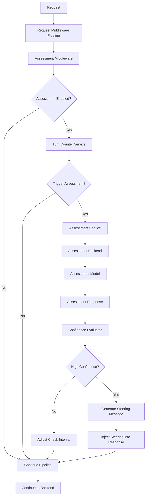

# Architecture: LLM-Based Conversation Assessment System

## Overview

This document outlines the architecture for implementing an LLM-based conversation assessment system in the llm-interactive-proxy, replicating the functionality found in Google's `gemini-cli` project.

## Reference Implementation

**Source**: `dev/thrdparty/gemini-cli/packages/core/src/services/loopDetectionService.ts`

Key components to study:
- `LoopDetectionService` class (main service)
- `turnStarted()` method (trigger logic)
- `checkForLoopWithLLM()` method (assessment execution)
- `LOOP_DETECTION_SYSTEM_PROMPT` constant (assessment prompt)
- Configuration constants (`LLM_CHECK_AFTER_TURNS`, intervals, etc.)

## High-Level Architecture



## Component Architecture

### 1. Assessment Middleware (`AssessmentMiddleware`)

**Location**: `src/core/app/middleware/assessment_middleware.py`

```python
class AssessmentMiddleware:
    """
    Middleware that monitors conversation turns and triggers LLM-based assessment
    when unproductive patterns might be present.
    """
    
    def __init__(self, 
                 assessment_service: IAssessmentService,
                 turn_counter_service: ITurnCounterService,
                 config: AssessmentConfig):
        pass
    
    async def process(self, request: ChatRequest) -> ChatRequest:
        # 1. Check if assessment is enabled
        # 2. Increment turn counter
        # 3. Check if assessment should be triggered
        # 4. If yes, perform assessment
        # 5. Handle assessment results (steering, interval adjustment)
        pass
```

### 2. Assessment Service (`AssessmentService`)

**Location**: `src/core/services/assessment_service.py`

```python
class AssessmentService:
    """
    Core service responsible for performing LLM-based conversation assessment.
    Replicates the logic from gemini-cli's LoopDetectionService.
    """
    
    async def assess_conversation(self, 
                                  history: List[ChatMessage], 
                                  session_id: str) -> AssessmentResult:
        # 1. Prepare assessment request
        # 2. Call assessment model
        # 3. Parse and validate response
        # 4. Return structured result
        pass
    
    def should_trigger_assessment(self, 
                                  turn_count: int, 
                                  last_check_turn: int,
                                  check_interval: int) -> bool:
        # Replicate gemini-cli trigger logic
        pass
```

### 3. Turn Counter Service (`TurnCounterService`)

**Location**: `src/core/services/turn_counter_service.py`

```python
class TurnCounterService:
    """
    Manages turn counting and assessment timing for each session.
    Maintains state similar to gemini-cli's turn tracking.
    """
    
    def increment_turn(self, session_id: str) -> int:
        pass
    
    def get_turn_count(self, session_id: str) -> int:
        pass
    
    def update_last_check_turn(self, session_id: str, turn: int):
        pass
    
    def get_check_interval(self, session_id: str) -> int:
        pass
    
    def adjust_check_interval(self, session_id: str, confidence: float):
        # Dynamic interval adjustment based on confidence
        pass
```

### 4. Assessment Configuration (`AssessmentConfig`)

**Location**: `src/core/domain/configuration/assessment_config.py`

```python
@dataclass
class AssessmentConfig:
    """Configuration for LLM assessment system, mirroring gemini-cli constants."""
    
    enabled: bool = False
    turn_threshold: int = 30  # LLM_CHECK_AFTER_TURNS
    confidence_threshold: float = 0.9
    history_window: int = 20  # LLM_LOOP_CHECK_HISTORY_COUNT
    min_interval: int = 5     # MIN_LLM_CHECK_INTERVAL
    max_interval: int = 15    # MAX_LLM_CHECK_INTERVAL
    default_interval: int = 3 # DEFAULT_LLM_CHECK_INTERVAL
    backend: str = ""
    model: str = ""
    
    @classmethod
    def from_app_config(cls, app_config: Config) -> 'AssessmentConfig':
        pass
```

### 5. Assessment Backend Service (`AssessmentBackendService`)

**Location**: `src/core/services/assessment_backend_service.py`

```python
class AssessmentBackendService:
    """
    Handles communication with the assessment model backend.
    Abstracts backend-specific details for assessment requests.
    """
    
    async def perform_assessment(self, 
                                 messages: List[ChatMessage],
                                 prompt_id: str) -> Dict[str, Any]:
        # 1. Format messages for assessment backend
        # 2. Create assessment request with system prompt
        # 3. Call backend with structured output schema
        # 4. Return parsed JSON response
        pass
```

## Data Models

### Assessment Result

```python
@dataclass
class AssessmentResult:
    """Result of conversation assessment, matching gemini-cli response format."""
    
    reasoning: str
    confidence: float
    is_unproductive: bool
    session_id: str
    turn_count: int
    timestamp: datetime
    
    @property
    def should_intervene(self) -> bool:
        return self.confidence > self.confidence_threshold
```

### Session Assessment State

```python
@dataclass
class SessionAssessmentState:
    """Per-session state for assessment tracking."""
    
    session_id: str
    turn_count: int = 0
    last_check_turn: int = 0
    current_check_interval: int = 3
    disabled_for_session: bool = False
    assessment_history: List[AssessmentResult] = field(default_factory=list)
```

## Integration Points

### 1. Middleware Pipeline Integration

**File**: `src/core/app/middleware_config.py`

```python
def configure_assessment_middleware(app_config: Config) -> List[Middleware]:
    if not app_config.assessment.enabled:
        return []
    
    return [
        AssessmentMiddleware(
            assessment_service=container.get(IAssessmentService),
            turn_counter_service=container.get(ITurnCounterService),
            config=app_config.assessment
        )
    ]
```

### 2. Dependency Injection

**File**: `src/core/di/services.py`

```python
def register_assessment_services(container: Container, config: Config):
    if config.assessment.enabled:
        container.register(ITurnCounterService, TurnCounterService)
        container.register(IAssessmentService, AssessmentService)
        container.register(IAssessmentBackendService, AssessmentBackendService)
```

### 3. Configuration Loading

**File**: `src/core/config/app_config.py`

```python
class Config:
    assessment: AssessmentConfig = field(default_factory=AssessmentConfig)
    
    @classmethod
    def load_assessment_config(cls, cli_args, env_vars, yaml_config):
        # Precedence: CLI > ENV > YAML > defaults
        pass
```

## Assessment Prompt System

### System Prompt Template

**File**: `src/core/services/assessment_prompts.py`

```python
ASSESSMENT_SYSTEM_PROMPT = """
You are a sophisticated AI diagnostic agent specializing in identifying when a conversational AI is stuck in an unproductive state. Your task is to analyze the provided conversation history and determine if the assistant has ceased to make meaningful progress.

An unproductive state is characterized by one or more of the following patterns over the last 5 or more assistant turns:

1. **Repetitive Actions**: The assistant repeats the same tool calls or conversational responses multiple times. This includes simple loops (e.g., tool_A, tool_A, tool_A) and alternating patterns (e.g., tool_A, tool_B, tool_A, tool_B).

2. **Cognitive Loop**: The assistant seems unable to determine the next logical step. It might express confusion, repeatedly ask the same questions, or generate responses that don't logically follow from the previous turns.

3. **Lack of Progress**: The conversation continues but without meaningful advancement toward the stated goal or task completion.

Crucially, differentiate between a true unproductive state and legitimate, incremental progress. For example, a series of similar tool calls that make small, distinct changes (like adding docstrings to functions one by one) is considered forward progress and is NOT a loop.

Respond in JSON format with:
- reasoning: Your analysis of the conversation state
- confidence: A number between 0.0 and 1.0 representing your confidence that the conversation is unproductive
"""

ASSESSMENT_TASK_PROMPT = """
Please analyze the conversation history to determine the possibility that the conversation is stuck in a repetitive, non-productive state. Provide your response in the requested JSON format.
"""
```

### Response Schema

```python
ASSESSMENT_RESPONSE_SCHEMA = {
    "type": "object",
    "properties": {
        "reasoning": {
            "type": "string",
            "description": "Your reasoning on if the conversation is looping without forward progress."
        },
        "confidence": {
            "type": "number",
            "description": "A number between 0.0 and 1.0 representing your confidence that the conversation is in an unproductive state."
        }
    },
    "required": ["reasoning", "confidence"]
}
```

## State Management

### Session State Repository

**File**: `src/core/repositories/assessment_repository.py`

```python
class AssessmentRepository:
    """Repository for managing assessment state across sessions."""
    
    def get_session_state(self, session_id: str) -> SessionAssessmentState:
        pass
    
    def update_session_state(self, state: SessionAssessmentState):
        pass
    
    def cleanup_expired_sessions(self, max_age: timedelta):
        pass
```

### In-Memory Implementation

```python
class InMemoryAssessmentRepository(AssessmentRepository):
    """In-memory implementation with TTL cleanup."""
    
    def __init__(self, cleanup_interval: int = 3600):
        self._states: Dict[str, SessionAssessmentState] = {}
        self._last_cleanup = time.time()
        self._cleanup_interval = cleanup_interval
```

## Error Handling & Resilience

### Circuit Breaker Pattern

```python
class AssessmentCircuitBreaker:
    """Circuit breaker for assessment service failures."""
    
    def __init__(self, failure_threshold: int = 5, timeout: int = 60):
        self.failure_count = 0
        self.failure_threshold = failure_threshold
        self.timeout = timeout
        self.last_failure_time = 0
        self.state = "CLOSED"  # CLOSED, OPEN, HALF_OPEN
    
    async def call(self, func: Callable) -> Any:
        if self.state == "OPEN":
            if time.time() - self.last_failure_time > self.timeout:
                self.state = "HALF_OPEN"
            else:
                raise CircuitBreakerOpenError()
        
        try:
            result = await func()
            if self.state == "HALF_OPEN":
                self.state = "CLOSED"
                self.failure_count = 0
            return result
        except Exception as e:
            self.failure_count += 1
            self.last_failure_time = time.time()
            if self.failure_count >= self.failure_threshold:
                self.state = "OPEN"
            raise
```

### Graceful Degradation

```python
class AssessmentService:
    async def assess_conversation_safe(self, 
                                       history: List[ChatMessage], 
                                       session_id: str) -> Optional[AssessmentResult]:
        try:
            return await self.circuit_breaker.call(
                lambda: self.assess_conversation(history, session_id)
            )
        except Exception as e:
            logger.warning(f"Assessment failed for session {session_id}: {e}")
            return None  # Graceful degradation
```

## Performance Considerations

### Async Assessment

```python
class AssessmentMiddleware:
    async def process(self, request: ChatRequest) -> ChatRequest:
        # Non-blocking assessment
        if self.should_assess(request.session_id):
            asyncio.create_task(self.perform_assessment_async(request))
        
        return request  # Don't block main flow
```

### Caching Strategy

```python
class AssessmentCache:
    """Cache assessment results to avoid redundant calls."""
    
    def __init__(self, ttl: int = 300):  # 5 minutes
        self._cache: Dict[str, Tuple[AssessmentResult, float]] = {}
        self._ttl = ttl
    
    def get(self, cache_key: str) -> Optional[AssessmentResult]:
        pass
    
    def set(self, cache_key: str, result: AssessmentResult):
        pass
    
    def _generate_cache_key(self, messages: List[ChatMessage]) -> str:
        # Hash recent message content for cache key
        pass
```

## Observability & Monitoring

### Metrics

```python
class AssessmentMetrics:
    """Metrics collection for assessment system."""
    
    def record_assessment_triggered(self, session_id: str):
        pass
    
    def record_assessment_completed(self, session_id: str, confidence: float, duration: float):
        pass
    
    def record_steering_intervention(self, session_id: str, confidence: float):
        pass
    
    def record_assessment_error(self, session_id: str, error_type: str):
        pass
```

### Logging

```python
class AssessmentLogger:
    """Structured logging for assessment decisions."""
    
    def log_assessment_result(self, result: AssessmentResult):
        logger.info(
            "Assessment completed",
            extra={
                "session_id": result.session_id,
                "confidence": result.confidence,
                "reasoning": result.reasoning,
                "is_unproductive": result.is_unproductive,
                "turn_count": result.turn_count
            }
        )
    
    def log_steering_intervention(self, session_id: str, reasoning: str):
        logger.warning(
            "Steering intervention triggered",
            extra={
                "session_id": session_id,
                "reasoning": reasoning
            }
        )
```

## Testing Strategy

### Unit Tests

```python
class TestAssessmentService:
    def test_should_trigger_assessment_after_threshold(self):
        # Test turn threshold logic
        pass
    
    def test_confidence_evaluation(self):
        # Test confidence threshold handling
        pass
    
    def test_interval_adjustment(self):
        # Test dynamic interval adjustment
        pass

class TestAssessmentMiddleware:
    def test_middleware_integration(self):
        # Test middleware pipeline integration
        pass
    
    def test_graceful_degradation(self):
        # Test error handling
        pass
```

### Integration Tests

```python
class TestAssessmentIntegration:
    def test_end_to_end_assessment(self):
        # Test complete assessment flow
        pass
    
    def test_multiple_backends(self):
        # Test assessment with different backends
        pass
    
    def test_configuration_loading(self):
        # Test configuration precedence
        pass
```

## Security Considerations

### Data Privacy

- Assessment requests must not log sensitive conversation content
- Assessment model access uses same authentication as main requests
- Session state cleanup prevents data retention beyond necessary periods

### Rate Limiting

- Assessment requests count against user quotas
- Separate rate limiting for assessment to prevent abuse
- Circuit breaker prevents assessment service overload

## Deployment Considerations

### Feature Flags

```python
class AssessmentFeatureFlags:
    """Feature flags for gradual rollout."""
    
    def is_enabled_for_session(self, session_id: str) -> bool:
        # Percentage-based rollout
        pass
    
    def is_enabled_for_backend(self, backend: str) -> bool:
        # Backend-specific enablement
        pass
```

### Configuration Validation

```python
class AssessmentConfigValidator:
    """Validates assessment configuration at startup."""
    
    def validate(self, config: AssessmentConfig) -> List[str]:
        errors = []
        
        if config.turn_threshold < 1:
            errors.append("turn_threshold must be >= 1")
        
        if not 0.0 <= config.confidence_threshold <= 1.0:
            errors.append("confidence_threshold must be between 0.0 and 1.0")
        
        # Validate backend/model combination
        if config.enabled and not config.backend:
            errors.append("backend must be specified when assessment is enabled")
        
        return errors
```

## Migration & Rollout Plan

### Phase 1: Core Infrastructure
- Implement basic assessment service and middleware
- Add configuration loading and validation
- Create unit tests and basic integration tests

### Phase 2: Assessment Logic
- Implement LLM-based assessment with gemini-cli prompt
- Add turn counting and trigger logic
- Implement confidence evaluation and interval adjustment

### Phase 3: Production Features
- Add observability, metrics, and logging
- Implement circuit breaker and error handling
- Add caching and performance optimizations

### Phase 4: Advanced Features
- Support multiple assessment backends
- Add custom assessment prompts
- Implement assessment result persistence

This architecture provides a solid foundation for replicating the gemini-cli assessment functionality while maintaining the design principles and patterns of the llm-interactive-proxy project.