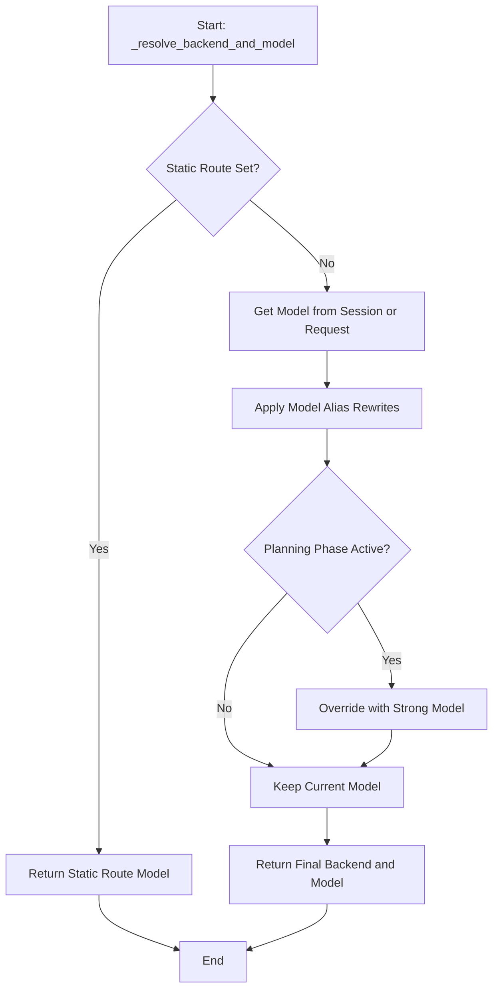

# Architecture Document: Model Name Rewrites

## 1. Overview

This document details the technical architecture for the "Model Name Rewrites" feature. The goal is to create a flexible, rule-based system for rewriting model names that integrates cleanly with the existing proxy architecture.

## 2. Component Design

### 2.1. Configuration Model

The configuration will be loaded into a new Pydantic model and added to the main `AppConfig`.

**`src/core/config/app_config.py`**

```python
from pydantic import BaseModel, Field
from typing import List, Optional, Dict

# ... other imports

class ModelAliasRule(BaseModel):
    """A rule for rewriting a model name."""
    pattern: str
    replacement: str

class AppConfig(BaseModel):
    # ... other config properties
    model_aliases: Optional[List[ModelAliasRule]] = Field(default_factory=list)

```

This structure is type-safe and ensures that the configuration from `config.yaml` is validated at startup.

### 2.2. Core Logic Integration

The core logic will reside in the `BackendService`, which is responsible for model and backend resolution.

**`src/core/services/backend_service.py`**

The `_resolve_backend_and_model` method will be modified to include the rewrite logic. A new private helper method, `_apply_model_aliases`, will be introduced to encapsulate the rewriting logic, promoting separation of concerns.

```python
# ... inside BackendService class

    def _apply_model_aliases(self, model: str) -> str:
        """Applies the first matching model alias rule to the model name."""
        if not self.config.model_aliases:
            return model

        for alias in self.config.model_aliases:
            if re.match(alias.pattern, model):
                new_model = re.sub(alias.pattern, alias.replacement, model)
                logger.info(f"Applied model alias: '{model}' -> '{new_model}'")
                return new_model
        
        return model

    async def _resolve_backend_and_model(
        self, session: Session, request_body: Dict[str, Any]
    ) -> Tuple[str, str]:
        # ... (existing logic for static_route)

        model = request_body.get("model") or session.model

        # 1. Apply model aliases
        model = self._apply_model_aliases(model)

        # 2. Apply planning phase logic
        if self.planning_phase_service.is_planning_phase(session):
            # ... (existing planning phase logic)
            
        # ... (rest of the method)
```

## 3. Data Flow and Order of Operations

The model resolution process follows a strict order of precedence to ensure predictable behavior. The new rewrite logic fits in as the second step.



**Explanation of Flow:**

1. **Static Route Check**: The `--static-route` CLI parameter is checked first. If set, it overrides all other logic and is returned immediately. This is the highest-priority override.
2. **Get Initial Model**: The model is retrieved from the incoming request body or the current session.
3. **Apply Model Aliases**: The `_apply_model_aliases` method is called. It iterates through the configured rules and applies the *first* one that matches the current model name.
4. **Planning Phase Check**: The `planning_phase` logic is applied next. If the session is in its planning phase, the (potentially rewritten) model name is overridden by the configured `strong_model`.
5. **Final Resolution**: The resulting model name is used to determine the final backend, and the `(backend, model)` tuple is returned.

## 4. Impact on Existing Features

- **`--static-route`**: Unaffected. It maintains the highest precedence.
- **`planning_phase`**: Works harmoniously. The model alias is applied first, and then the planning phase can override the *rewritten* model name. This allows for complex configurations, such as aliasing a general model name and then using a specific strong model for planning.
- **`--default-backend`**: Unaffected. It continues to serve as a fallback for when a backend cannot be inferred from the final model name.

This architecture ensures the "Model Name Rewrites" feature is a powerful and modular addition that enhances the proxy's flexibility without introducing conflicts or breaking changes.
