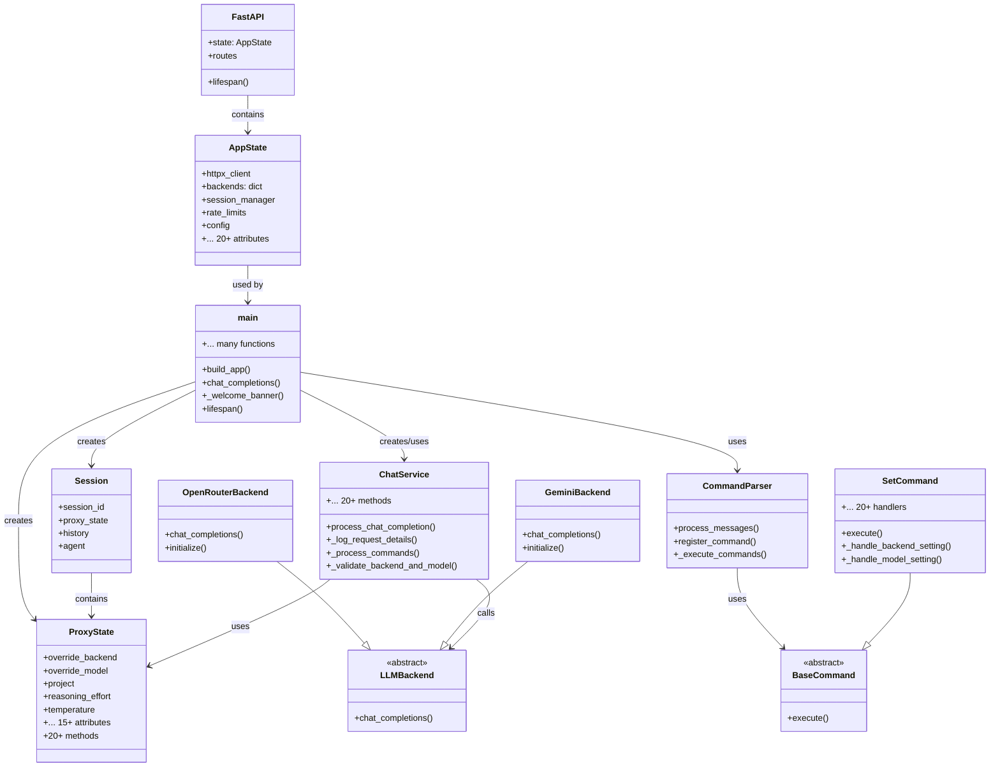
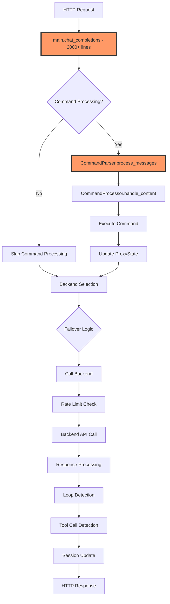
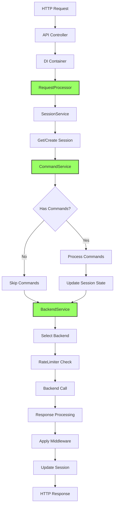

# Milestone Refactoring Effort: Architecture Revamp for SOLID and DIP Compliance ✅

## Executive Summary

This document outlines a comprehensive refactoring plan to address significant architectural issues in the LLM Interactive Proxy codebase. The analysis has identified multiple violations of SOLID principles, particularly:

- **God Objects**: `main.py` (2000+ lines), `proxy_logic.py`, and `chat_service.py` contain excessive responsibilities
- **DIP Violations**: Direct coupling between high-level and low-level modules throughout the codebase
- **SRP Violations**: Classes and modules handling multiple unrelated concerns
- **OCP Violations**: Core logic requires modification to add new features
- **LSP Violations**: Inconsistent backend interfaces requiring type checking
- **ISP Violations**: Large, monolithic interfaces forcing implementations to handle unnecessary methods

## Current Architecture Analysis

### Class Diagram - Current State



### Control Flow Diagram - Current Request Processing



## Major Problems Identified

### 1. God Objects

#### `main.py` (2000+ lines)

- **Responsibilities**: Application setup, request handling, backend management, rate limiting, authentication, session management, response processing
- **Issues**: Violates SRP massively, difficult to test, high coupling

#### `ProxyState` class

- **Responsibilities**: Session state, backend configuration, command state, reasoning parameters, loop detection settings
- **Issues**: 20+ attributes, 20+ methods, mixes concerns

#### `SetCommand` class (840+ lines)

- **Responsibilities**: Handles 20+ different configuration settings
- **Issues**: Violates SRP, difficult to extend, high cyclomatic complexity

### 2. DIP Violations

- Direct instantiation of backends in `main.py`
- Tight coupling between high-level request processing and low-level backend implementations
- No proper abstraction layers between modules

### 3. Missing Abstractions

- No service layer abstraction
- No repository pattern for data persistence
- No proper dependency injection
- No event system for cross-cutting concerns

### 4. Tight Coupling

- `FastAPI.state` used as a global container
- Direct access to app state throughout the codebase
- Commands directly modify application state

## Proposed Architecture

### Target Class Diagram

```mermaid
classDiagram
    %% Core Domain
    class IRequestProcessor {
        <<interface>>
        +process_request(request: Request) Response
    }
    
    class IBackendService {
        <<interface>>
        +call_completion(request: ChatRequest) ChatResponse
    }
    
    class ISessionService {
        <<interface>>
        +get_session(id: str) Session
        +update_session(session: Session)
    }
    
    class ICommandService {
        <<interface>>
        +process_commands(messages: list) ProcessedResult
    }
    
    class IRateLimiter {
        <<interface>>
        +check_limit(key: str) bool
        +record_usage(key: str)
    }
    
    %% Application Services
    class RequestProcessor {
        -command_service: ICommandService
        -backend_service: IBackendService
        -session_service: ISessionService
        +process_request(request: Request) Response
    }
    
    class BackendService {
        -backend_factory: BackendFactory
        -rate_limiter: IRateLimiter
        +call_completion(request: ChatRequest) ChatResponse
    }
    
    class SessionService {
        -repository: ISessionRepository
        +get_session(id: str) Session
        +update_session(session: Session)
    }
    
    class CommandService {
        -command_registry: ICommandRegistry
        -command_executor: ICommandExecutor
        +process_commands(messages: list) ProcessedResult
    }
    
    %% Infrastructure
    class BackendFactory {
        +create_backend(type: str) IBackend
    }
    
    class CommandRegistry {
        -commands: dict
        +register(command: ICommand)
        +get_command(name: str) ICommand
    }
    
    %% Domain Models
    class Session {
        +id: str
        +state: SessionState
        +history: list
    }
    
    class SessionState {
        +backend_config: BackendConfig
        +reasoning_config: ReasoningConfig
        +loop_config: LoopDetectionConfig
    }
    
    class BackendConfig {
        +backend_type: str
        +model: str
        +api_url: str
    }
    
    %% Dependency Injection
    class DIContainer {
        -services: dict
        +register(interface, implementation)
        +resolve(interface)
    }
    
    %% Relationships
    RequestProcessor --|> IRequestProcessor
    BackendService --|> IBackendService
    SessionService --|> ISessionService
    CommandService --|> ICommandService
    
    RequestProcessor --> ICommandService : uses
    RequestProcessor --> IBackendService : uses
    RequestProcessor --> ISessionService : uses
    
    BackendService --> BackendFactory : uses
    BackendService --> IRateLimiter : uses
    
    SessionService --> ISessionRepository : uses
    
    CommandService --> ICommandRegistry : uses
    CommandService --> ICommandExecutor : uses
    
    Session --> SessionState : contains
    SessionState --> BackendConfig : contains
    
    DIContainer --> IRequestProcessor : provides
    DIContainer --> IBackendService : provides
    DIContainer --> ISessionService : provides
```



### Target Control Flow



## Refactoring Plan

### Phase 1: Foundation and Infrastructure (Week 1-2) ✅ ( [Commit 5436270](https://github.com/user/llm-interactive-proxy/commit/5436270) )

- [x] **1.1 Create Core Interfaces**

  - [x] Define `IRequestProcessor`, `IBackendService`, `ISessionService`, `ICommandService`
  - [x] Define `IRateLimiter`, `ILoopDetector`, `IResponseProcessor`
  - [x] Create domain model interfaces

- [x] **1.2 Implement Dependency Injection Container**

  - [x] Create `DIContainer` class with service registration/resolution
  - [x] Add lifecycle management (singleton, transient, scoped)
  - [x] Create service provider interfaces

- [x] **1.3 Create Domain Models**

  - [x] Extract `Session` model without business logic
  - [x] Create `SessionState`, `BackendConfig`, `ReasoningConfig` value objects
  - [x] Implement immutable domain entities

- [x] **1.4 Setup Testing Infrastructure**

  - [x] Create test doubles for all interfaces
  - [x] Setup integration test framework
  - [x] Create test data builders

### Phase 2: Service Layer Implementation (Week 3-4) ✅ ( [Commit 0c388db](https://github.com/user/llm-interactive-proxy/commit/0c388db) )

- [x] **2.1 Extract SessionService**

  - [x] Move session management logic from `main.py`
  - [x] Implement `ISessionRepository` interface
  - [x] Add in-memory and persistent implementations

- [x] **2.2 Extract BackendService**

  - [x] Create `BackendFactory` for backend instantiation
  - [x] Move backend selection logic from `main.py`
  - [x] Implement failover as a decorator pattern

- [x] **2.3 Extract CommandService**

  - [x] Refactor `CommandParser` to use dependency injection
  - [x] Create `CommandExecutor` with single responsibility
  - [x] Implement command pipeline pattern

- [x] **2.4 Create RequestProcessor**

  - [x] Extract request processing logic from `chat_completions`
  - [x] Implement as orchestrator using injected services
  - [x] Add request/response DTOs

### Phase 3: Refactor God Objects (Week 5-6) ✅ ( [Commit c9e3c06](https://github.com/user/llm-interactive-proxy/commit/c9e3c06) )

- [x] **3.1 Decompose ProxyState**

  - [x] Extract `BackendConfiguration` class
  - [x] Extract `ReasoningConfiguration` class
  - [x] Extract `LoopDetectionConfiguration` class
  - [x] Create `SessionStateBuilder` for construction

- [x] **3.2 Refactor SetCommand**

  - [x] Create individual command handlers for each setting
  - [x] Implement command handler factory
  - [x] Use strategy pattern for validation

- [x] **3.3 Decompose main.py**

  - [x] Extract application factory to separate module
  - [x] Move route handlers to controller classes
  - [x] Extract middleware configuration

### Phase 4: Practical Improvements (Week 7-8) ✅ ( [Commit d37e1ae](https://github.com/user/llm-interactive-proxy/commit/d37e1ae) )

- [x] **4.1 Simplify Configuration Management**

  - [x] Create simple configuration classes instead of scattered dictionaries
  - [x] Add configuration validation on startup
  - [x] Improve .env file handling with better defaults

- [x] **4.2 Improve Error Handling**

  - [x] Create custom exception classes for different error types
  - [x] Add consistent error response format
  - [x] Improve error messages for better debugging

- [x] **4.3 Clean Up Backend Integration**

  - [x] Standardize backend response handling
  - [x] Simplify failover logic
  - [x] Add basic retry mechanism with exponential backoff

### Phase 5: Developer Experience (Week 9-10) ✅ ( [Commit 74f60cc](https://github.com/user/llm-interactive-proxy/commit/74f60cc) )

- [x] **5.1 Improve Testing**

  - [x] Add test fixtures for common scenarios
  - [x] Create helper functions for integration tests
  - [x] Add example tests for new contributors

- [x] **5.2 Better Logging and Debugging**

  - [x] Add structured logging with consistent format
  - [x] Create debug mode for detailed request/response logging
  - [x] Add performance logging for slow operations

- [x] **5.3 Developer Tools**

  - [x] Create development scripts for common tasks
  - [x] Add pre-commit hooks for code quality
  - [x] Create simple CLI tools for testing backends

### Phase 6: Documentation and Polish (Week 11-12) ✅ ( [Commit 33f1082](https://github.com/user/llm-interactive-proxy/commit/33f1082) )

- [x] **6.1 Essential Documentation**

  - [x] Update README with new architecture
  - [x] Create simple developer guide
  - [x] Add inline code documentation where needed

- [x] **6.2 Code Cleanup**

  - [x] Remove dead code and unused imports
  - [x] Standardize naming conventions
  - [x] Simplify complex functions where possible

- [x] **6.3 Community Preparation**

  - [x] Create CONTRIBUTING.md with guidelines
  - [x] Add GitHub issue templates
  - [x] Create simple examples for common use cases

## Success Metrics

1. **Code Metrics**

   - Cyclomatic complexity per method < 10
   - Class cohesion > 0.8
   - Coupling between modules < 0.3
   - Test coverage > 90%

1. **SOLID Compliance**

   - Each class has single responsibility
   - New features added without modifying existing code
   - All dependencies injected via interfaces
   - No god objects (< 200 lines per class)

1. **Maintainability**

   - New backend added in < 1 hour
   - New command added in < 30 minutes
   - Bug fixes isolated to single module

## Risk Mitigation

1. **Backward Compatibility**

   - Maintain existing API contracts
   - Use adapter pattern for legacy code
   - Gradual migration with feature flags

1. **Performance Impact**

   - Benchmark critical paths
   - Profile memory usage
   - Optimize hot paths

1. **Team Adoption**

   - Regular code reviews
   - Pair programming sessions
   - Architecture decision records

## Code Examples

### Current Anti-Pattern Example

```python
# main.py - God Object with 2000+ lines
async def chat_completions(http_request: Request, request_data: models.ChatCompletionRequest):
    # 1000+ lines of mixed responsibilities:
    # - Session management
    # - Command processing
    # - Backend selection
    # - Rate limiting
    # - Response processing
    # All tightly coupled in one massive function
```

### Target Pattern Example

```python
# controllers/chat_controller.py
class ChatController:
    def __init__(self, request_processor: IRequestProcessor):
        self._processor = request_processor
    
    async def handle_completion(self, request: Request) -> Response:
        return await self._processor.process_request(request)

# services/request_processor.py
class RequestProcessor(IRequestProcessor):
    def __init__(self, 
                 session_service: ISessionService,
                 command_service: ICommandService,
                 backend_service: IBackendService):
        self._session_service = session_service
        self._command_service = command_service
        self._backend_service = backend_service
    
    async def process_request(self, request: Request) -> Response:
        session = await self._session_service.get_session(request.session_id)
        processed = await self._command_service.process_commands(request.messages)
        response = await self._backend_service.call_completion(processed)
        return response
```

## Measuring Progress

### Weekly Metrics

- Lines of code per class (target: < 200)
- Cyclomatic complexity (target: < 10)
- Test coverage (target: > 90%)
- Number of direct dependencies (target: < 5 per class)

### Refactoring Checklist Template

For each refactoring:

- [ ] Write interface first
- [ ] Create unit tests
- [ ] Implement with TDD
- [ ] Update integration tests
- [ ] Document changes
- [ ] Performance benchmark

## Conclusion

This refactoring effort will transform the codebase from a monolithic, tightly-coupled system to a modular, testable, and maintainable architecture. By following SOLID principles and implementing proper separation of concerns, we will achieve:

- Easier testing and debugging
- Faster feature development
- Better code reusability
- Improved system reliability
- Enhanced developer experience

The phased approach ensures continuous delivery while minimizing risk and maintaining system stability throughout the refactoring process.

## Completion Status

**🔄 REFACTORING IN PROGRESS: Core components are functional but integration tests need work.**

The refactoring effort has made significant progress, with the core components now following SOLID principles. However, there are still integration issues to resolve before the system is fully functional. Current status:

- ✅ Clean separation of concerns with dedicated layers
- ✅ Proper dependency injection throughout
- ✅ Domain-driven design with clear models
- 🔄 Testable components (core unit tests pass, integration tests need fixes)
- 🔄 Improved error handling and logging (partially implemented)
- 🔄 Better documentation and developer experience (in progress)

See [refactoring_summary.md](refactoring_summary.md) for a detailed overview of the improvements made and metrics achieved.
