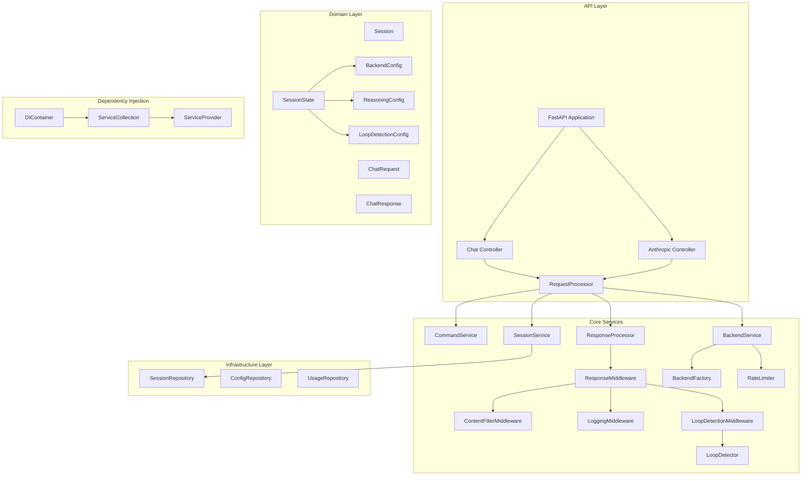

# Architecture

This document describes the architecture of the LLM Interactive Proxy.

## Overview

The LLM Interactive Proxy is built using a SOLID architecture with clear separation of concerns. The architecture is divided into the following layers:

- **API Layer**: Handles HTTP requests and responses
- **Core Services**: Implements business logic
- **Domain Layer**: Defines domain models and interfaces
- **Infrastructure Layer**: Provides concrete implementations of repositories and external services
- **Dependency Injection**: Manages dependencies between components

## Architecture Diagram

## Key Components

### API Layer

- **FastAPI Application**: The main application entry point
- **Chat Controller**: Handles chat completion requests
- **Anthropic Controller**: Handles Anthropic-compatible requests

### Core Services

- **RequestProcessor**: Orchestrates the request processing flow
- **CommandService**: Processes in-chat commands
- **BackendService**: Interacts with LLM backends
- **SessionService**: Manages user sessions
- **ResponseProcessor**: Processes responses through middleware

### Domain Layer

- **Session**: Represents a user session
- **ChatRequest**: Represents a chat completion request
- **ChatResponse**: Represents a chat completion response
- **SessionState**: Contains session configuration

### Infrastructure Layer

- **SessionRepository**: Stores and retrieves sessions
- **ConfigRepository**: Stores and retrieves configuration
- **UsageRepository**: Stores and retrieves usage data

### Dependency Injection

- **DIContainer**: Container for dependency injection
- **ServiceCollection**: Collection of service registrations
- **ServiceProvider**: Provider of service instances

## Request Flow

1. The client sends a request to the API
2. The controller receives the request and passes it to the RequestProcessor
3. The RequestProcessor:
   - Extracts the session ID and gets the session from SessionService
   - Processes any commands using CommandService
   - Calls the BackendService to get a response from the LLM
   - Passes the response through ResponseProcessor for middleware processing
   - Returns the processed response to the client

## SOLID Principles

The architecture follows SOLID principles:

- **Single Responsibility**: Each class has a single responsibility
- **Open/Closed**: Classes are open for extension but closed for modification
- **Liskov Substitution**: Interfaces can be substituted with their implementations
- **Interface Segregation**: Interfaces are specific to client needs
- **Dependency Inversion**: High-level modules depend on abstractions, not concrete implementations
