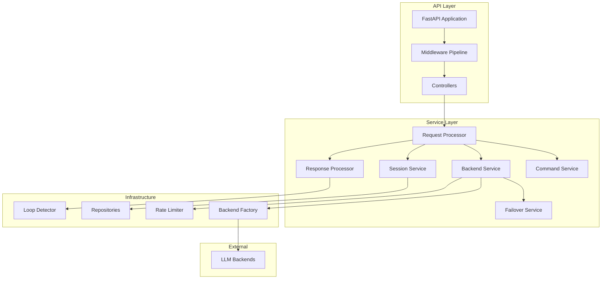

# LLM Interactive Proxy - Complete Architecture Guide

## Table of Contents

1. [System Overview](#system-overview)
2. [Architecture Principles](#architecture-principles)
3. [System Architecture](#system-architecture)
4. [Core Components](#core-components)
5. [Data Flow](#data-flow)
6. [Configuration Management](#configuration-management)
7. [API Endpoints](#api-endpoints)
8. [Testing Strategy](#testing-strategy)
9. [Deployment Guide](#deployment-guide)
10. [Development Guidelines](#development-guidelines)

## System Overview

The LLM Interactive Proxy is an advanced middleware service that provides a unified interface to multiple Large Language Model (LLM) backends. It acts as an intelligent proxy layer between client applications and various LLM providers, offering enhanced features beyond simple request forwarding.

### Key Features

- **Multi-Backend Support**: Seamlessly integrate with OpenAI, Anthropic, Google Gemini, OpenRouter, and custom backends
- **Intelligent Failover**: Automatic fallback to alternative models/backends on failure
- **Command Processing**: Interactive commands embedded in chat messages
- **Rate Limiting**: Protect backends and manage usage quotas
- **Session Management**: Maintain conversation state and context
- **Loop Detection**: Prevent infinite loops in agent interactions
- **Unified API**: OpenAI-compatible API for all backends

## Architecture Principles

### SOLID Principles

1. **Single Responsibility Principle (SRP)**
   - Each class has one reason to change
   - Example: `BackendService` only handles backend communication

2. **Open/Closed Principle (OCP)**
   - Open for extension, closed for modification
   - Example: New backends added without changing core service

3. **Liskov Substitution Principle (LSP)**
   - Derived classes substitutable for base classes
   - Example: All backend connectors implement `ILLMBackend`

4. **Interface Segregation Principle (ISP)**
   - Clients shouldn't depend on unused interfaces
   - Example: Separate interfaces for different service capabilities

5. **Dependency Inversion Principle (DIP)**
   - Depend on abstractions, not concretions
   - Example: Services depend on `IBackendService` interface

### Clean Architecture Layers

```
┌─────────────────────────────────┐
│     Presentation Layer          │  ← Controllers, API Routes
├─────────────────────────────────┤
│     Application Layer           │  ← Use Cases, Services
├─────────────────────────────────┤
│     Domain Layer                │  ← Entities, Business Logic
├─────────────────────────────────┤
│     Infrastructure Layer        │  ← Repositories, External Services
└─────────────────────────────────┘
```

## System Architecture

### High-Level Architecture

```
                    ┌─────────────────────────┐
                    │    Client Applications  │
                    │  (Cline, IDEs, CLIs)   │
                    └───────────┬─────────────┘
                                │ HTTPS
                    ┌───────────▼─────────────┐
                    │      Load Balancer      │
                    └───────────┬─────────────┘
                                │
                    ┌───────────▼─────────────┐
                    │   LLM Interactive Proxy │
                    │  ┌───────────────────┐  │
                    │  │   FastAPI App     │  │
                    │  ├───────────────────┤  │
                    │  │   Middleware      │  │
                    │  ├───────────────────┤  │
                    │  │   Controllers     │  │
                    │  ├───────────────────┤  │
                    │  │   Core Services   │  │
                    │  ├───────────────────┤  │
                    │  │   Repositories    │  │
                    │  └───────────────────┘  │
                    └───────────┬─────────────┘
                                │
        ┌───────────┬───────────┼───────────┬───────────┐
        │           │           │           │           │
    ┌───▼───┐   ┌───▼───┐   ┌───▼───┐   ┌───▼───┐   ┌───▼───┐
    │OpenAI │   │Anthropic│  │ Gemini │  │OpenRouter│ │  ZAI  │
    └───────┘   └─────────┘  └────────┘  └──────────┘ └───────┘
```

### Component Interaction Diagram



## Core Components

### Application Factory

The `ApplicationBuilder` creates and configures the FastAPI application using specialized configurators:

```python
class ApplicationBuilder:
    def __init__(self):
        self.service_configurator = ServiceConfigurator()
        self.middleware_configurator = MiddlewareConfigurator()
        self.route_configurator = RouteConfigurator()
    
    def build(self, config: AppConfig) -> FastAPI:
        # 1. Configure services with DI
        provider = self.service_configurator.configure_services(config)
        
        # 2. Create FastAPI app
        app = FastAPI(lifespan=self._create_lifespan(config))
        
        # 3. Configure middleware
        self.middleware_configurator.configure_middleware(app, config)
        
        # 4. Configure routes
        self.route_configurator.configure_routes(app, provider)
        
        return app
```

### Dependency Injection Container

Service registration and resolution:

```python
# Registration
services.add_singleton(ISessionService, SessionService)
services.add_singleton_factory(IBackendService, lambda p: BackendService(...))
services.add_scoped(IRequestContext, RequestContext)

# Resolution
backend_service = provider.get_required_service(IBackendService)
```

### Service Implementations

#### Backend Service

Manages communication with LLM backends:

```python
class BackendService(IBackendService):
    async def call_completion(
        self, 
        request: ChatRequest, 
        stream: bool = False
    ) -> ChatResponse | AsyncGenerator:
        # 1. Rate limiting check
        await self._check_rate_limit(request.backend_type)
        
        # 2. Get or create backend
        backend = await self._get_or_create_backend(request.backend_type)
        
        # 3. Prepare messages
        messages = self._prepare_messages(request.messages)
        
        # 4. Call backend
        try:
            response = await backend.chat_completions(request, messages)
        except Exception as e:
            # 5. Attempt failover
            response = await self._failover_service.attempt_failover(request)
        
        return response
```

#### Command Service

Processes interactive commands:

```python
class CommandService(ICommandService):
    def process_command(self, message: str, state: SessionState) -> CommandResult:
        # 1. Detect command
        if not message.startswith(self.command_prefix):
            return None
        
        # 2. Parse command
        command_name, args = self._parse_command(message)
        
        # 3. Find handler
        handler = self._registry.get_handler(command_name)
        
        # 4. Execute command
        return handler.execute(args, state)
```

### Controllers

#### Models Controller

```python
@router.get("/models")
async def list_models(
    request: Request,
    backend_service: IBackendService = Depends(get_backend_service)
):
    """List available models from all backends."""
    models = []
    
    # Get configuration
    config = request.app.state.app_config
    
    # Check each backend
    for backend_type, backend_config in config.backends:
        if backend_config and backend_config.api_key:
            try:
                backend = await backend_service._get_or_create_backend(backend_type)
                backend_models = backend.get_available_models()
                
                for model in backend_models:
                    models.append({
                        "id": f"{backend_type}:{model}",
                        "object": "model",
                        "owned_by": str(backend_type)
                    })
            except Exception as e:
                logger.warning(f"Failed to get models from {backend_type}: {e}")
    
    return {"object": "list", "data": models}
```

## Data Flow

### Standard Request Flow

```
1. Client Request
   ↓
2. Authentication Middleware (validate API key)
   ↓
3. Rate Limiting Middleware (check limits)
   ↓
4. Controller (route to handler)
   ↓
5. Request Processor (orchestrate processing)
   ↓
6. Command Service (check for commands)
   ↓
7. Backend Service (prepare and send to LLM)
   ↓
8. Backend Connector (communicate with external API)
   ↓
9. Response Processor (apply transformations)
   ↓
10. Response to Client
```

### Streaming Request Flow

```
1. Client initiates streaming request
   ↓
2. Backend returns async generator
   ↓
3. Response processor transforms chunks
   ↓
4. Server-Sent Events sent to client
   ↓
5. Client receives incremental updates
```

### Failover Flow

```
1. Primary backend attempt fails
   ↓
2. Failover service checks configuration
   ↓
3. Select next available backend
   ↓
4. Transform request for new backend
   ↓
5. Attempt with fallback backend
   ↓
6. Repeat until success or exhausted
```

## Configuration Management

### Configuration Structure

```yaml
app_config:
  environment: production
  
  auth:
    api_keys: ["key1", "key2"]
    disable_auth: false
    auth_token: "bearer-token"
  
  backends:
    default_backend: openai
    
    openai:
      api_key: ${OPENAI_API_KEY}
      api_url: https://api.openai.com/v1
      
    anthropic:
      api_key: ${ANTHROPIC_API_KEY}
      api_url: https://api.anthropic.com
      
    gemini:
      api_key: ${GEMINI_API_KEY}
      api_url: https://generativelanguage.googleapis.com
      
  logging:
    level: INFO
    format: json
    request_logging: true
    response_logging: false
    
  rate_limiting:
    default_limit: 60
    time_window: 60
    
  failover_routes:
    "gpt-4":
      attempts:
        - backend: openai
          model: gpt-4
        - backend: anthropic
          model: claude-3-opus
        - backend: openrouter
          model: gpt-4
```

### Environment Variables

```bash
# Backend API Keys
OPENAI_API_KEY=sk-...
ANTHROPIC_API_KEY=sk-ant-...
GEMINI_API_KEY=AIza...
OPENROUTER_API_KEY=sk-or-...

# Proxy Configuration
PROXY_API_KEYS=key1,key2,key3
DEFAULT_BACKEND=openai
DISABLE_AUTH=false

# Logging
LOG_LEVEL=INFO
LOG_FORMAT=json

# Rate Limiting
RATE_LIMIT=60
RATE_LIMIT_WINDOW=60
```

## API Endpoints

### Core Endpoints

| Endpoint | Method | Description |
|----------|--------|-------------|
| `/v1/chat/completions` | POST | OpenAI-compatible chat completions |
| `/v1/models` | GET | List available models |
| `/v1/messages` | POST | Anthropic-compatible messages |
| `/models` | GET | List available models (simplified) |
| `/health` | GET | Health check |
| `/ready` | GET | Readiness check |

### Request/Response Examples

#### Chat Completion Request

```json
POST /v1/chat/completions
{
  "model": "gpt-4",
  "messages": [
    {"role": "system", "content": "You are a helpful assistant"},
    {"role": "user", "content": "Hello!"}
  ],
  "stream": false,
  "temperature": 0.7
}
```

#### Models Response

```json
GET /v1/models
{
  "object": "list",
  "data": [
    {
      "id": "openai:gpt-4",
      "object": "model",
      "owned_by": "openai"
    },
    {
      "id": "anthropic:claude-3-opus",
      "object": "model",
      "owned_by": "anthropic"
    }
  ]
}
```

## Testing Strategy

### Test Pyramid

```
         /\
        /  \  E2E Tests (10%)
       /────\
      /      \  Integration Tests (30%)
     /────────\
    /          \  Unit Tests (60%)
   /────────────\
```

### Test Categories

#### Unit Tests
- Service logic tests
- Handler tests
- Utility function tests
- Domain model tests

#### Integration Tests
- API endpoint tests
- Middleware pipeline tests
- Service interaction tests
- Repository tests

#### E2E Tests
- Full request flow tests
- Backend integration tests
- Failover scenario tests
- Performance tests

### Test Examples

```python
# Unit Test
def test_backend_service_rate_limiting():
    service = BackendService(...)
    with pytest.raises(RateLimitExceededError):
        await service.call_completion(request)

# Integration Test
def test_models_endpoint():
    client = TestClient(app)
    response = client.get("/v1/models")
    assert response.status_code == 200
    assert "data" in response.json()

# E2E Test
def test_full_chat_completion_flow():
    client = TestClient(app)
    response = client.post("/v1/chat/completions", json={...})
    assert response.status_code == 200
    assert "choices" in response.json()
```

## Deployment Guide

### Docker Deployment

```dockerfile
# Dockerfile
FROM python:3.10-slim

WORKDIR /app

# Install dependencies
COPY requirements.txt .
RUN pip install --no-cache-dir -r requirements.txt

# Copy application
COPY src/ ./src/
COPY main.py .

# Run application
CMD ["uvicorn", "main:app", "--host", "0.0.0.0", "--port", "8000"]
```

### Docker Compose

```yaml
version: '3.8'

services:
  proxy:
    build: .
    ports:
      - "8000:8000"
    environment:
      - OPENAI_API_KEY=${OPENAI_API_KEY}
      - ANTHROPIC_API_KEY=${ANTHROPIC_API_KEY}
      - PROXY_API_KEYS=${PROXY_API_KEYS}
    volumes:
      - ./config:/app/config
    restart: unless-stopped
    
  redis:
    image: redis:alpine
    ports:
      - "6379:6379"
    restart: unless-stopped
```

### Kubernetes Deployment

```yaml
apiVersion: apps/v1
kind: Deployment
metadata:
  name: llm-proxy
spec:
  replicas: 3
  selector:
    matchLabels:
      app: llm-proxy
  template:
    metadata:
      labels:
        app: llm-proxy
    spec:
      containers:
      - name: proxy
        image: llm-proxy:latest
        ports:
        - containerPort: 8000
        env:
        - name: OPENAI_API_KEY
          valueFrom:
            secretKeyRef:
              name: llm-secrets
              key: openai-key
        resources:
          requests:
            memory: "256Mi"
            cpu: "250m"
          limits:
            memory: "512Mi"
            cpu: "500m"
```

## Development Guidelines

### Code Style

```python
# Follow PEP 8
# Use type hints
def process_request(
    request: ChatRequest,
    stream: bool = False
) -> ChatResponse | AsyncGenerator[str, None]:
    """Process a chat completion request.
    
    Args:
        request: The chat request to process
        stream: Whether to stream the response
        
    Returns:
        Chat response or async generator for streaming
    """
    ...
```

### Commit Message Format

```
type(scope): subject

body

footer
```

Examples:
- `feat(backend): add support for Gemini backend`
- `fix(auth): resolve API key validation issue`
- `docs(api): update endpoint documentation`

### Pull Request Process

1. Create feature branch: `git checkout -b feature/your-feature`
2. Write tests for new functionality
3. Ensure all tests pass: `pytest`
4. Update documentation
5. Submit PR with clear description
6. Address review comments
7. Merge after approval

### Development Setup

```bash
# Clone repository
git clone https://github.com/your-org/llm-interactive-proxy.git
cd llm-interactive-proxy

# Create virtual environment
python -m venv venv
source venv/bin/activate  # or venv\Scripts\activate on Windows

# Install dependencies
pip install -r requirements-dev.txt

# Run tests
pytest

# Start development server
uvicorn main:app --reload --port 8000
```

## Performance Optimization

### Caching Strategy

- Backend instances cached per type
- Model lists cached with 5-minute TTL
- Session data cached in memory
- Response caching for identical requests (optional)

### Connection Management

- HTTP client connection pooling
- Keep-alive connections to backends
- Graceful connection recycling
- Circuit breaker for failing backends

### Resource Limits

- Request size limits: 10MB
- Response streaming chunk size: 8KB
- Maximum concurrent requests: 100
- Request timeout: 300 seconds

## Security Considerations

### Authentication & Authorization

- API key validation
- Bearer token support
- Per-key rate limiting
- IP allowlisting (optional)

### Data Protection

- No persistent storage of messages
- Secure API key storage
- Request/response sanitization
- PII detection and masking (optional)

### Network Security

- HTTPS only in production
- Certificate pinning for backends
- Request signing (optional)
- Audit logging

## Monitoring & Observability

### Metrics

- Request count and latency
- Backend availability
- Rate limit violations
- Error rates by type
- Token usage tracking

### Logging

```python
# Structured logging
logger.info(
    "Request processed",
    extra={
        "request_id": request_id,
        "backend": backend_type,
        "model": model,
        "latency_ms": latency,
        "tokens_used": tokens,
    }
)
```

### Health Checks

```python
@router.get("/health")
async def health():
    """Basic health check."""
    return {"status": "healthy"}

@router.get("/ready")
async def ready(backend_service: IBackendService):
    """Readiness check with backend validation."""
    backends_ready = await backend_service.check_backends()
    return {
        "status": "ready" if backends_ready else "not_ready",
        "backends": backends_ready
    }
```

## Troubleshooting Guide

### Common Issues

| Issue | Cause | Solution |
|-------|-------|----------|
| 401 Unauthorized | Invalid API key | Check PROXY_API_KEYS configuration |
| 429 Too Many Requests | Rate limit exceeded | Increase rate limits or wait |
| 503 Service Unavailable | Backend connection failed | Check backend API keys and URLs |
| Streaming not working | Client doesn't support SSE | Use non-streaming mode |
| Commands not processing | Wrong command prefix | Check command configuration |

### Debug Mode

Enable debug logging:

```bash
export LOG_LEVEL=DEBUG
export REQUEST_LOGGING=true
export RESPONSE_LOGGING=true
```

### Performance Profiling

```python
# Enable profiling
import cProfile
import pstats

profiler = cProfile.Profile()
profiler.enable()

# ... application code ...

profiler.disable()
stats = pstats.Stats(profiler)
stats.sort_stats('cumulative')
stats.print_stats(10)
```

## Future Roadmap

### Version 2.0
- [ ] WebSocket support for real-time streaming
- [ ] Plugin system for custom commands
- [ ] Advanced caching with Redis
- [ ] Multi-tenant support

### Version 3.0
- [ ] Horizontal scaling with distributed state
- [ ] GraphQL API support
- [ ] Advanced analytics dashboard
- [ ] Auto-scaling based on load

## Contributing

We welcome contributions! Please see [CONTRIBUTING.md](CONTRIBUTING.md) for guidelines.

## License

This project is licensed under the MIT License. See [LICENSE](LICENSE) for details.

## Support

- Documentation: [https://docs.example.com](https://docs.example.com)
- Issues: [GitHub Issues](https://github.com/your-org/llm-interactive-proxy/issues)
- Discussions: [GitHub Discussions](https://github.com/your-org/llm-interactive-proxy/discussions)
- Email: support@example.com
