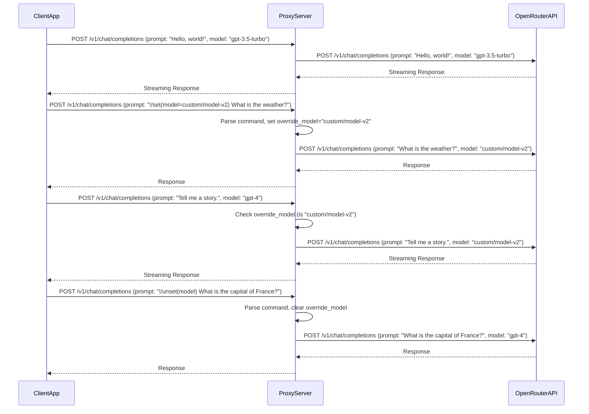

# llm-interactive-proxy: Intercepting Proxy for Dynamic Model Routing and More

## Project Goal

Create an intercepting proxy server for dynamic model routing, prompt/reply rewriting, and tool/custom app calling.

## Requirements

### Frontend Compatibility

*   **OpenAI API Standard**: The proxy must expose a standard, fully functional HTTP API with all methods implemented, compatible with OpenAI's API. Specifically, it should support the `/v1/chat/completions` endpoint, allowing any client capable of setting a custom OpenAI API endpoint URL to use it. This ensures broad compatibility with existing OpenAI-compatible clients and tools. Potential future compatibility with other endpoints like `/v1/models` is implied.

### Backend Integration and Modularity

The proxy is designed to integrate with various Large Language Model (LLM) APIs, providing a highly modular and extensible backend architecture with a clear separation of concerns.

*   **Backend Abstraction**: A core concept is the "backend," representing a specific LLM provider (e.g., OpenAI, OpenRouter, Google Gemini). The architecture must provide a robust abstraction that makes it easy to create and integrate new backends.
    *   Each backend is identified by a unique lowercase prefix (e.g., `openai:`, `openrouter:`, `gemini:`). This prefix, followed by a colon, serves as a separator when referring to models (e.g., `openrouter:gpt-4`).
    *   Each backend may require different client code for interacting with its remote LLM provider.
*   **Model Management**:
    *   Each backend can serve multiple models.
    *   Some models may be served by multiple backends (e.g., `gpt-4` might be available via both `openai:` and `openrouter:` backends).
    *   Models can have custom parameters (e.g., `temperature`, `sampling`, `reasoning effort`, `number of reasoning tokens`, `stop sequences`) that can be passed from the client to the remote LLM API.
*   **Extensibility**: The design allows for straightforward creation of new backend plugins for future LLM integrations, adhering to the established backend abstraction.

### Rate Limiting and Quota Management

To ensure fair usage and prevent abuse, the proxy will support comprehensive rate limiting and quota management. While the actual enforcement will be delegated to the `llm-accounting` Python package, the proxy's internal architecture must support these concepts:

*   **Tiered Rate Limits**: Limits can be set at multiple levels:
    *   **Per Backend**: Limits on the number of requests or tokens generated per unit of time (e.g., requests per minute, tokens per day) for an entire backend.
    *   **Per (Backend, Model) Combination**: More granular limits applied to specific models within a backend (e.g., completion tokens generated by `openrouter:gpt-4` per hour).
*   **Time Granularity**: Limits can be defined for different time windows (e.g., minute, hour, day).
*   **External Enforcement**: The proxy will integrate with `llm-accounting`'s quota service to enforce these limits, rather than implementing the limiting logic internally. This involves querying the quota service before forwarding requests to LLM backends and reacting to quota exhaustion signals.

### Core Functionality

*   **Dynamic Model Routing**:
    *   Clients specify a model in their requests.
    *   The proxy can override the requested model based on special commands.
    *   **Command `!/set(model=xxx/yyy)`**: Sets `xxx/yyy` as the override model for subsequent requests from that "session" (globally, for this simple proxy, unless explicit session management is added).
    *   **Command `!/unset(model)`**: Clears the active model override, restoring original routing behavior.
    *   **Model Sets**:
        *   Models can be grouped into model sets.
        *   Each set can contain multiple models as an ordered (by the user) list.
        *   Model sets are meant to provide a failover mechanism, so if one remote backend model generates an error (meant as no completion), request should automatically get forwarded to the next model from the set.
*   **Prompt/Reply Rewriting**:
    *   The framework should allow for general prompt/reply rewriting.
    *   Currently, the primary "rewriting" involves stripping proxy-specific commands from the prompt before forwarding to the LLM backend.
*   **Command Handling**:
    *   Commands are identified by starting with `!/`.
    *   They are parsed from the user's prompt.
    *   They modify the proxy's behavior.
    *   **Crucially, recognized proxy-specific commands are NOT sent to the LLM backend.**
*   **Multimodal Support**:
    *   The proxy must handle multimodal user prompts, including images, documents, custom files, sound, etc.
    *   These multimodal parts (typically base64 encoded data URIs for images in content arrays, as per OpenAI API message format) must be passed "as-is" to the remote OpenRouter API endpoint.
*   **Response Handling**:
    *   All responses from OpenRouter, including streaming responses and those containing streamed thinking/reasoning output, must be proxied back to the client as-is.

### Technical Requirements

*   **Language**: Python.
*   **Logging**: Use a standard Python logging framework (e.g., the built-in `logging` module).
*   **Debugging**: Generate verbose debug messages to the console to ease the development process. Debugging output should not be part of the HTTP output.
*   **Web Server Framework**: A web server framework like FastAPI or Flask will be needed to handle incoming HTTP requests. FastAPI is generally preferred for its async capabilities and Pydantic integration, which is well-suited for OpenAI-like APIs.
*   **HTTP Client Library**: An HTTP client library (like `httpx`) will be required to make asynchronous requests to OpenRouter, especially for handling streaming responses.
*   **Logic Components**:
    *   Logic to parse commands from user prompts.
    *   State management (even if simple/global for now) for the `override_model`.
    *   Careful handling of request/response bodies, particularly for streaming and multimodal content.
*   **Source File Structure**:
    *   **`docs/STRUCTURE.md`**: Provides a detailed breakdown of the project's file organization and the responsibilities of each core component, aiding in project onboarding and understanding.
    *   Files exceeding 250 lines of code should be structurally split into smaller, more manageable files.
    *   This splitting must ensure a uniform API design and proper encapsulation of the internal file structure, maintaining a clear and consistent interface for external modules.
*   **Programming Paradigm**: Object-Oriented Programming (OOP) should be used for structuring the codebase.
*   **Architectural Style**: An Event-Driven Architecture (EDA) should be employed where appropriate to handle asynchronous operations and decouple components.
*   **Modularity**: The design must facilitate easy addition of new commands, functions, or features exposed by the server without requiring major refactoring of existing code.
*   **Coupling**: Components should exhibit loose coupling to enhance flexibility, maintainability, and testability.
*   **Design Principles**: Adhere to DRY (Don't Repeat Yourself) and KISS (Keep It Simple, Stupid) principles throughout the development process.
*   **Code Documentation**: Every function, method, and class must include a short, clear description of its purpose and functionality.
*   **Testing Flexibility**: Tests should support both true remote/network I/O for integration testing and mocked I/O for unit testing, ensuring comprehensive test coverage.
*   **Network Binding**: By default, the proxy should bind only to the `127.0.0.1` (localhost) IP address to prevent unintended external network access.
*   **Streaming API Support**: The proxy must fully support streaming API capabilities for both the client-facing interface and the remote LLM API backend.
*   **Custom Model Parameters**: Support for passing custom model parameters/settings (e.g., `temperature`, `sampling`, `reasoning effort`, `number of allowed reasoning tokens`) from the client to the remote LLM API.
*   **Configurable Timeouts**: Implement configurable timeouts for all communications with remote LLM APIs to prevent indefinite waits and improve resilience.
*   **Modular LLM Backend Support**:
    *   Provide modular support for different LLM APIs/backends, including:
        *   OpenAI standard
        *   OpenRouter
        *   Google Gemini/AI Labs
    *   Ensure an easy way to create new backend plugins for future LLM integrations.
    ```mermaid
    graph TD
        A[Proxy Server] --> B{LLM Backend Router};
        B --> C1[OpenAI Backend Plugin];
        B --> C2[OpenRouter Backend Plugin];
        B --> C3[Google Gemini/AI Labs Backend Plugin];
        B --> C4[Custom Backend Plugin (Easy to Add)];

        C1 --> D1[OpenAI API];
        C2 --> D2[OpenRouter API];
        C3 --> D3[Google Gemini API];
        C4 --> D4[Other LLM API];

        subgraph LLM Backend Plugins
            C1
            C2
            C3
            C4
        end
    ```

## Key Functions to be Implemented

*   **Model Routing**: Implement robust model routing logic based on interactive commands sent by the user within their prompts.
*   **Google AI/Gemini API Key Failover**: Develop a mechanism for API key failover specifically for Google AI/Gemini backends to ensure continuous service in case of key limitations or issues.
    *   Support Google Gemini API calls.
    *   User can define one or more Gemini API keys in env vars named like this: `GAI_AUTH_TOKEN_<number>`, up to 10.
    *   If call to Gemini AI API fails with HTTP status: 429 Too Many Requests and response contains string 'You exceeded your current quota', that means user has reached quota of the free API. In such case our proxy needs either wait some time, defined in `retryDelay` field of the API JSON response. If the retryDelay is <= 10s we wait that retryDelay + 1s and re-try with the same auth token. If it is higher, we use the next available API key.
*   **Diff/File Edit Response Repair Module**: Implement a module designed to analyze LLM responses containing file edits or diffs. This module will leverage knowledge of local files to attempt to fix or refine the remote LLM's output 'on-the-fly' before it is forwarded to the calling client, addressing common LLM struggles with precise code generation.
    ```mermaid
    sequenceDiagram
        participant LLMBackend
        participant ProxyServer
        participant RepairModule
        participant ClientApp

        LLMBackend->>ProxyServer: LLM Response (potentially with diff/edit)
        ProxyServer->>RepairModule: Forward response for analysis
        RepairModule->>RepairModule: Analyze response for diff/edit patterns
        RepairModule->>RepairModule: Access local file knowledge (if needed)
        RepairModule-->>ProxyServer: Repaired/Refined Response
        ProxyServer-->>ClientApp: Final Response
    ```

## User Stories

Here are some key user stories for the proxy server:

```mermaid
graph TD
    A[User] --> B{Wants to use a specific LLM model};
    B --> C{Sends prompt to Proxy};
    C --> D{Proxy checks for !/set(model=...) command};
    D -- Yes --> E[Proxy overrides model for subsequent requests];
    D -- No --> F[Proxy uses model from client request];
    E --> G[Proxy forwards prompt to OpenRouter with overridden model];
    F --> G;
    G --> H[OpenRouter processes prompt];
    H --> I[OpenRouter sends response to Proxy];
    I --> J[Proxy forwards response to User];
```



## Architecture

This project will be developed as a modern Python application, utilizing a layered, modular design to ensure maintainability, scalability, and testability.

Whenever possible, Test-Driven Development (TDD) will be employed. This means that for any given function or feature, the agent implementing it **MUST** first write the tests that define its expected behavior. If there is any ambiguity or lack of clarity regarding the testing requirements or specific test cases, the agent **MUST** brief the user to obtain all necessary answers before proceeding with implementation.

The expected architectural flow is as follows:

```mermaid
graph LR
    A[Client Application] --> B(Our Proxy Server);
    B -- Checks for special commands (!/) --> C{Command Logic};
    C -- If command, modifies behavior --> B;
    B -- Otherwise, forwards prompt --> D[Remote LLM API (OpenRouter)];
    D -- Generates response (including streaming/media) --> B;
    B -- Forwards response --> A;

    subgraph Proxy Internal Components
        B -- Uses --> E[Web Server Framework (e.g., FastAPI)];
        B -- Uses --> F[HTTP Client Library (e.g., httpx)];
        B -- Manages --> G[Override Model State];
        B -- Handles --> H[Multimodal Content Parsing];
        B -- Utilizes --> I[Standard Python Logging];
    end
