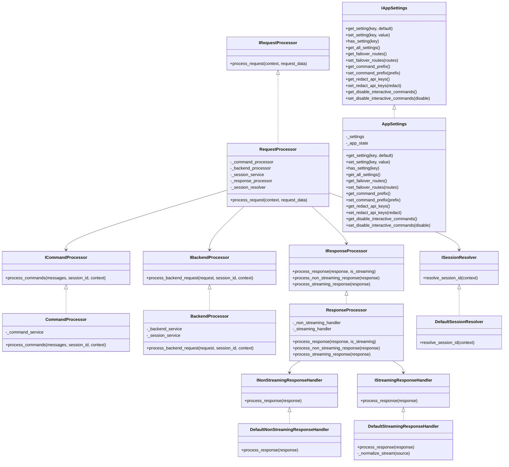
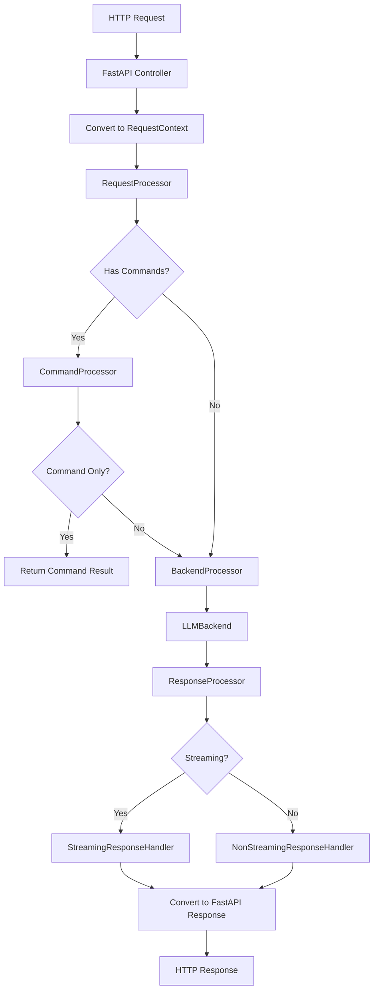

# New Architecture Guide

This document describes the new architecture of the LLM Interactive Proxy, which has been refactored to follow SOLID principles and dependency inversion.

## Overview

The new architecture is designed to decouple the core business logic from the web framework (FastAPI) and to provide a clear separation of concerns. It follows these key principles:

1. **Dependency Inversion**: High-level modules do not depend on low-level modules. Both depend on abstractions.
2. **Interface Segregation**: Clients should not be forced to depend on interfaces they do not use.
3. **Single Responsibility**: Each class has a single responsibility.
4. **Open/Closed**: Classes are open for extension but closed for modification.
5. **Liskov Substitution**: Derived classes can substitute their base classes.

## Architecture Layers

The architecture is organized into the following layers:

1. **Domain Layer**: Contains the core business logic and domain models.
2. **Service Layer**: Implements the business logic defined by the domain layer.
3. **Interface Layer**: Defines interfaces for the services.
4. **Transport Layer**: Handles communication with external systems (e.g., HTTP, CLI).
5. **Infrastructure Layer**: Provides implementations for external dependencies.

## Key Components

### Domain Models

Domain models are Pydantic models that represent the core business entities:

- `ChatRequest`: Represents a request for chat completion.
- `ChatResponse`: Represents a response from a chat completion.
- `ChatMessage`: Represents a message in a chat.
- `RequestContext`: Represents the context of a request, including headers, cookies, etc.
- `ResponseEnvelope`: Represents a non-streaming response.
- `StreamingResponseEnvelope`: Represents a streaming response.

### Interfaces

Interfaces define the contracts for services:

- `IRequestProcessor`: Processes requests.
- `ICommandProcessor`: Processes commands.
- `IBackendProcessor`: Processes backend requests.
- `IResponseProcessor`: Processes responses.
- `ISessionResolver`: Resolves session IDs.
- `IAppSettings`: Provides access to application settings.
- `INonStreamingResponseHandler`: Handles non-streaming responses.
- `IStreamingResponseHandler`: Handles streaming responses.

### Services

Services implement the interfaces:

- `RequestProcessor`: Orchestrates the request processing flow.
- `CommandProcessor`: Processes commands in messages.
- `BackendProcessor`: Processes backend requests.
- `ResponseProcessor`: Processes responses.
- `DefaultSessionResolver`: Resolves session IDs.
- `AppSettings`: Provides access to application settings.
- `DefaultNonStreamingResponseHandler`: Handles non-streaming responses.
- `DefaultStreamingResponseHandler`: Handles streaming responses.

### Transport Layer

The transport layer handles communication with external systems:

- `fastapi_to_domain_request_context`: Converts FastAPI requests to domain request contexts.
- `domain_response_to_fastapi`: Converts domain responses to FastAPI responses.
- `map_domain_exception_to_http_exception`: Maps domain exceptions to HTTP exceptions.

### Dependency Injection

The architecture uses a dependency injection container to manage dependencies:

- `ServiceCollection`: Registers services.
- `ServiceProvider`: Resolves services.

## Request Flow

1. A request is received by a FastAPI controller.
2. The controller converts the request to a domain request context.
3. The controller calls the request processor.
4. The request processor orchestrates the request processing flow:
   a. The command processor processes any commands in the request.
   b. The backend processor processes the request through the appropriate backend.
   c. The response processor processes the response.
5. The controller converts the domain response to a FastAPI response.
6. The controller returns the response.

## Exception Handling

Exceptions are handled at the domain level and then mapped to HTTP exceptions at the transport layer:

1. Domain services throw domain-specific exceptions.
2. Controllers catch these exceptions and map them to HTTP exceptions.
3. FastAPI handles the HTTP exceptions.

## Streaming

Streaming responses are handled through a unified interface:

1. The `StreamingResponseEnvelope` represents a streaming response.
2. The `IStreamingResponseHandler` interface defines the contract for handling streaming responses.
3. The `DefaultStreamingResponseHandler` implements this interface.
4. The `ResponseProcessor` uses the streaming handler to process streaming responses.

## Command Processing

Commands are processed through a dedicated command processor:

1. The `ICommandProcessor` interface defines the contract for processing commands.
2. The `CommandProcessor` implements this interface.
3. The `RequestProcessor` uses the command processor to process commands.

## Backend Processing

Backend requests are processed through a dedicated backend processor:

1. The `IBackendProcessor` interface defines the contract for processing backend requests.
2. The `BackendProcessor` implements this interface.
3. The `RequestProcessor` uses the backend processor to process backend requests.

## Application Settings

Application settings are accessed through a dedicated service:

1. The `IAppSettings` interface defines the contract for accessing application settings.
2. The `AppSettings` implements this interface.
3. Services use the app settings service to access application settings.

## Class Diagram

## Control Flow Diagram

## Benefits of the New Architecture

1. **Testability**: The architecture is designed to be easily testable. Each component can be tested in isolation.
2. **Maintainability**: The architecture is designed to be maintainable. Each component has a single responsibility.
3. **Extensibility**: The architecture is designed to be extensible. New components can be added without modifying existing ones.
4. **Reusability**: The architecture is designed to be reusable. Components can be reused in different contexts.
5. **Flexibility**: The architecture is designed to be flexible. Components can be replaced with different implementations.

## Migration Guide

To migrate from the old architecture to the new architecture:

1. Use `RequestContext` instead of `fastapi.Request` in your controllers.
2. Use `ResponseEnvelope` and `StreamingResponseEnvelope` instead of `fastapi.Response` and `fastapi.StreamingResponse` in your backends.
3. Use domain-specific exceptions instead of `HTTPException` in your backends.
4. Use the transport adapters to convert between domain and transport models.
5. Use dependency injection to manage dependencies.

## Conclusion

The new architecture provides a solid foundation for the LLM Interactive Proxy. It follows SOLID principles and dependency inversion, making it more maintainable, testable, and extensible. It also provides a clear separation of concerns, making it easier to understand and modify.
