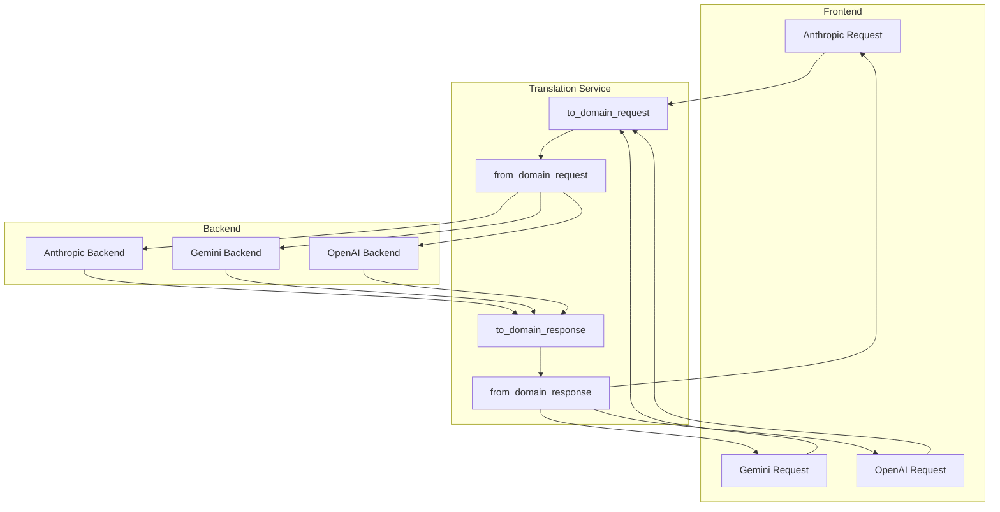

# ADR 001: Centralized Translation Service

## Status

Proposed

## Context

The current implementation of the cross-API translation layer is decentralized and incomplete. The core issue is that the functions for converting Anthropic and Gemini requests are placeholders, and the conversion logic is scattered across multiple files. This has led to a number of issues, including:

*   Inconsistent and unreliable translations
*   Difficulty in adding new backends and frontends
*   Lack of a unified strategy for handling streaming and multimodal data

## Decision

To address these issues, we will create a new centralized translation service. This service will be responsible for all cross-API conversions, ensuring a consistent and reliable translation layer. The new service will be designed with the following principles in mind:

*   **Centralized:** All translation logic will be located in a single, dedicated service.
*   **Bidirectional:** The service will be able to translate data in both directions (e.g., from Anthropic to the domain model, and from the domain model to Anthropic).
*   **Extensible:** The service will be designed to make it easy to add new backends and frontends in the future.

The following Mermaid diagram illustrates the proposed data flow:

## Consequences

The new centralized translation service will provide a number of benefits, including:

*   **Improved reliability:** The new service will be more reliable than the current implementation, as all translation logic will be located in a single, well-tested service.
*   **Improved extensibility:** The new service will make it easier to add new backends and frontends in the future, as all translation logic will be located in a single, well-defined service.
*   **Improved maintainability:** The new service will be easier to maintain than the current implementation, as all translation logic will be located in a single, well-organized service.