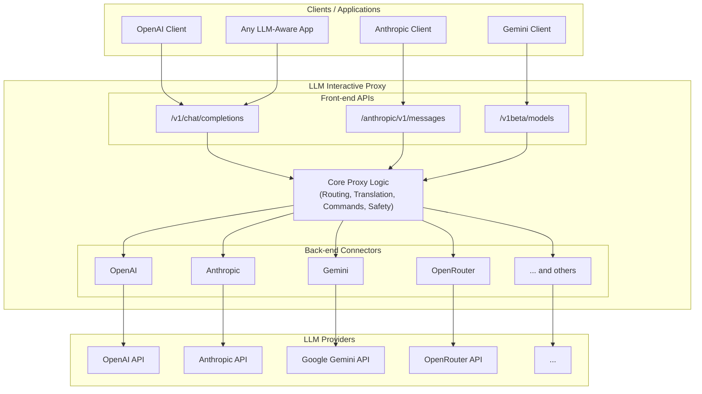
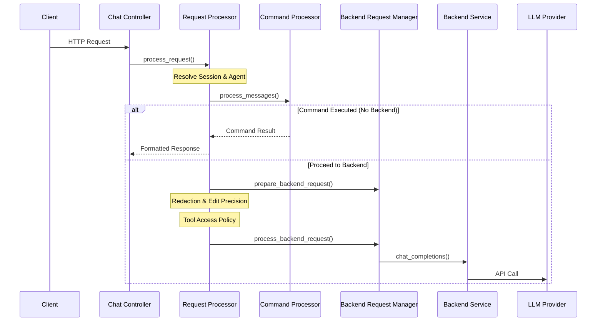

# Architecture

The LLM Interactive Proxy is a sophisticated middleware system that sits between LLM-aware clients and LLM providers, enabling protocol translation, request augmentation, and advanced safety features.

## Overview

The proxy acts as a universal adapter, exposing multiple front-end APIs (OpenAI, Anthropic, Gemini) while routing requests to any configured backend provider. This architecture enables seamless integration with existing tools while providing powerful features like model overrides, safety controls, and debugging capabilities.

## High-Level Architecture



## Core Components

### 1. Front-End API Layer

The front-end layer exposes multiple API surfaces to accommodate different client types:

- **[OpenAI Chat Completions](../user_guide/frontends/openai-chat-completions.md)** (`/v1/chat/completions`): The primary interface, compatible with most OpenAI SDKs and coding agents
- **[OpenAI Responses](../user_guide/frontends/openai-responses.md)** (`/v1/responses`): Structured JSON output with schema validation
- **[Anthropic Messages](../user_guide/frontends/anthropic.md)** (`/anthropic/v1/messages`): Claude-compatible API for Anthropic clients
- **[Gemini v1beta](../user_guide/frontends/gemini.md)** (`/v1beta/models`): Google Gemini-compatible endpoints

Each front-end API handles protocol-specific request parsing and response formatting while delegating core logic to the proxy layer. For detailed documentation on each frontend API, see the [Frontend Overview](../user_guide/frontends/overview.md).

### 2. Core Proxy Logic

The core proxy orchestrates all request processing through a pipeline of middleware and services:

#### Request Processing Pipeline

1. **Authentication & Security**: Validates API keys, enforces rate limits, and tracks [brute-force attempts](../user_guide/security/brute-force-protection.md)
2. **Command Detection**: Parses in-chat commands (e.g., `!/backend(...)`, `!/model(...)`)
3. **Request Translation**: Converts requests to a normalized internal format
4. **Model Resolution**: Resolves model names, applies [rewrites](../user_guide/features/model-name-rewrites.md), and handles [overrides](../user_guide/features/identity-override.md)
5. **Safety Checks**: Validates [tool calls](../user_guide/features/tool-access-control.md), detects [dangerous commands](../user_guide/features/dangerous-command-protection.md), enforces [sandboxing](../user_guide/features/file-access-sandboxing.md)
6. **Backend Routing**: Selects appropriate backend connector based on configuration
7. **Request Augmentation**: Adds reasoning context, applies [parameter overrides](../user_guide/features/uri-model-parameters.md)
8. **Backend Invocation**: Calls the selected backend connector

#### Response Processing Pipeline

1. **VTC Pre-Processing**: For [Virtual Tool Calling](./vtc-architecture.md) clients, extracts XML tool calls to internal format
2. **Response Translation**: Converts backend responses to client-expected format
3. **Content Filtering**: Removes [think tags](../user_guide/features/think-tags-fix.md), applies content transformations
4. **Tool Call Validation**: Validates and repairs tool calls
5. **Loop Detection**: Monitors for repetitive patterns
6. **Assessment**: Optionally evaluates [conversation quality](../user_guide/features/llm-assessment.md)
7. **Quality Verifier**: Optionally [verifies response quality](../user_guide/features/quality-verifier.md)
8. **VTC Post-Processing**: For [VTC clients](./vtc-architecture.md), converts tool calls back to XML format
9. **Response Formatting**: Formats response for client protocol
10. **Wire Capture**: Optionally [records request/response](../user_guide/debugging/wire-capture.md) for debugging

### 3. Backend Connector Layer

Backend connectors implement provider-specific communication logic:

- **Base Connector**: Abstract base class defining the connector interface
- **Provider Connectors**: Concrete implementations for each provider ([OpenAI](../user_guide/backends/openai.md), [Anthropic](../user_guide/backends/anthropic.md), [Gemini](../user_guide/backends/gemini.md), etc.)
- **OAuth Connectors**: Specialized connectors handling [OAuth authentication flows](../user_guide/backends/qwen.md)
- **Hybrid Connector**: Virtual connector orchestrating [multiple models](../user_guide/features/hybrid-backend.md)

Each connector handles:

- Authentication (API keys, OAuth tokens, service accounts)
- Request formatting for the provider's API
- Response parsing and normalization
- Streaming support
- Error handling and retries

### 4. Service Layer

The service layer provides cross-cutting functionality:

- **LLM Assessment Service**: Monitors [conversation quality and detects unproductive patterns](../user_guide/features/llm-assessment.md)
- **Quality Verifier Service**: Verifies [individual responses for errors and issues](../user_guide/features/quality-verifier.md)
- **Loop Detection Service**: Identifies repetitive tool calls and cognitive loops
- **Tool Call Reactor**: Manages [tool call lifecycle, validation, and access control](../user_guide/features/tool-access-control.md)
- **VTC Processing**: Handles [Virtual Tool Calling](./vtc-architecture.md) for Cline-like clients using XML-based tool calls
- **Session Management**: Tracks [conversation state and metadata](../user_guide/features/session-management.md)
- **Performance Tracking**: Monitors latency, token usage, and costs

### 5. Domain Layer

The domain layer defines core business entities and logic:

- **Models**: Request/response data structures
- **Commands**: In-chat command definitions and handlers
- **Policies**: Access control and safety policies
- **Configuration**: System and feature configuration

### 6. Database Layer

The database layer provides a unified, dialect-agnostic persistence mechanism:

- **SQLModel Integration**: Combines SQLAlchemy ORM with Pydantic validation
- **Async Engine**: Fully async database operations using `aiosqlite` (SQLite) or `asyncpg` (PostgreSQL)
- **Repository Pattern**: Clean separation between domain models and database tables
- **Alembic Migrations**: Version-controlled schema migrations with auto-migration support

The database stores:

- **Session Summaries**: ProxyMem cross-session memory data
- **SSO Tokens**: Agent authentication tokens and pending authorizations
- **Rate Limits**: Per-identifier rate limiting state
- **Project Mappings**: User-to-project associations for memory isolation

For configuration details, see the [Database Configuration Guide](../user_guide/database-configuration.md).

## Key Design Patterns

### 1. Adapter Pattern

The proxy uses the Adapter pattern extensively to translate between different API protocols:

- **Request Adapters**: Convert client requests to internal format
- **Response Adapters**: Convert internal responses to client-expected format
- **Backend Adapters**: Adapt internal requests to provider-specific formats

### 2. Strategy Pattern

The Strategy pattern enables runtime selection of behaviors:

- **Backend Selection**: Choose backend based on configuration or commands
- **Model Resolution**: Apply different model resolution strategies
- **Authentication**: Support multiple authentication methods

### 3. Chain of Responsibility

Request and response processing uses chains of handlers:

- **Middleware Chain**: Sequential processing of requests/responses
- **Command Chain**: Ordered command detection and execution
- **Validation Chain**: Layered validation of tool calls and content

### 4. Observer Pattern

The Observer pattern enables event-driven features:

- **Assessment Triggers**: Monitor turn counts and trigger assessments
- **Loop Detection**: Observe tool call patterns and detect loops
- **Performance Tracking**: Track metrics across request lifecycle

### 5. Factory Pattern

Factories create complex objects with proper initialization:

- **Backend Factory**: Creates backend connectors based on configuration
- **Command Factory**: Creates command handlers
- **Policy Factory**: Creates access control policies

## Data Flow

### Request Flow



### Response Flow

```mermaid
sequenceDiagram
    participant Provider as LLM Provider
    participant Backend as Backend Service
    participant BackMgr as Backend Request Manager
    participant RespProc as Response Processor
    participant Loop as Loop Detector
    participant Angel as Angel Service
    participant API as Chat Controller
    participant Client

    Provider-->>Backend: API Response
    Backend-->>BackMgr: ResponseEnvelope
    
    BackMgr->>RespProc: process_response()
    
    rect rgb(240, 248, 255)
        note right of RespProc: Processing Pipeline
        RespProc->>Loop: Check for Loops
        
        opt Angel Enabled
            RespProc->>Angel: Verify Response
            alt Intervention Needed
                Angel-->>RespProc: Corrected Response
            end
        end
        
        RespProc-->>BackMgr: Processed Response
    end
    
    opt Empty Response
        BackMgr->>BackMgr: Retry Logic
    end
    
    BackMgr-->>API: Final Response
    API-->>Client: HTTP Response
```

## Module Organization

The codebase follows a layered architecture with clear separation of concerns:

```
src/
├── core/                    # Core business logic
│   ├── app/                # Application layer (FastAPI app)
│   ├── commands/           # Command definitions and handlers
│   ├── common/             # Shared utilities and exceptions
│   ├── config/             # Configuration management
│   ├── database/           # Database abstraction layer (SQLModel/Alembic)
│   │   ├── config.py      # Database configuration
│   │   ├── engine.py      # Async engine and session management
│   │   ├── models/        # SQLModel table definitions
│   │   ├── repositories/  # Repository implementations
│   │   └── migrations/    # Alembic migration scripts
│   ├── domain/             # Domain entities and logic
│   ├── interfaces/         # Abstract interfaces
│   ├── models/             # Data models
│   ├── ports/              # Port interfaces (hexagonal architecture)
│   ├── repositories/       # Data access layer
│   ├── security/           # Security features
│   ├── services/           # Business services
│   ├── simulation/         # Wire capture and simulation
│   ├── transport/          # HTTP transport layer
│   └── utils/              # Utility functions
├── connectors/             # Backend connector implementations
│   ├── base.py            # Base connector interface
│   ├── openai.py          # OpenAI connector
│   ├── anthropic.py       # Anthropic connector
│   ├── gemini*.py         # Gemini connectors (multiple variants)
│   ├── hybrid.py          # Hybrid backend connector
│   └── ...                # Other provider connectors
├── services/               # Top-level services
├── loop_detection/         # Loop detection subsystem
├── tool_call_loop/         # Tool call lifecycle management
└── *.py                    # Legacy modules (being migrated)
```

## Concurrency Model

The proxy uses an asynchronous architecture built on FastAPI and asyncio:

- **Async Request Handling**: All request handlers are async for non-blocking I/O
- **Streaming Support**: Async generators for streaming responses
- **Connection Pooling**: Reuses HTTP connections to backend providers
- **Rate Limiting**: Async-safe rate limiting with per-IP tracking
- **Session Management**: Thread-safe session state management

## Security Architecture

Security is implemented through multiple layers:

1. **Authentication Layer**: API key validation with brute-force protection
2. **Authorization Layer**: Tool access control with policy-based enforcement
3. **Sandboxing Layer**: File access restrictions to project directory
4. **Command Protection**: Detection and blocking of dangerous commands
5. **Content Filtering**: API key redaction in prompts and logs
6. **Rate Limiting**: Per-IP rate limiting to prevent abuse

## Extensibility Points

The architecture provides several extension points:

- **Custom Backends**: Implement `BaseConnector` to add new providers
- **Custom Commands**: Register new command handlers
- **Custom Middleware**: Add request/response processing logic
- **Custom Policies**: Define new access control policies
- **Custom Validators**: Add validation logic for tool calls or content

## Performance Considerations

- **Connection Pooling**: Reuses HTTP connections to reduce latency
- **Async I/O**: Non-blocking operations for high concurrency
- **Streaming**: Supports streaming for reduced time-to-first-token
- **Caching**: Caches compiled regex patterns and configuration
- **Lazy Loading**: Defers initialization of unused components

## Observability

The proxy provides comprehensive observability:

- **Logging**: Structured logging with configurable levels
- **Wire Capture**: Optional request/response recording (JSON and CBOR formats)
- **Performance Tracking**: Latency and token usage metrics
- **Error Tracking**: Detailed error messages with context
- **Telemetry**: Metadata tracking for policy evaluation and feature usage

## Related Documentation

For detailed information on specific aspects of the architecture:

- **Code Organization**: See [code-organization.md](code-organization.md) for detailed module structure
- **VTC Architecture**: See [vtc-architecture.md](vtc-architecture.md) for Virtual Tool Calling subsystem
- **Building**: See [building.md](building.md) for build and dependency management
- **Testing**: See [testing.md](testing.md) for testing architecture and strategies
- **Adding Features**: See [adding-features.md](adding-features.md) for feature development guidelines
- **Adding Backends**: See [adding-backends.md](adding-backends.md) for backend connector development
- **Coding Standards**: See [AGENTS.md](../../dev/AGENTS.md) for coding standards and best practices
