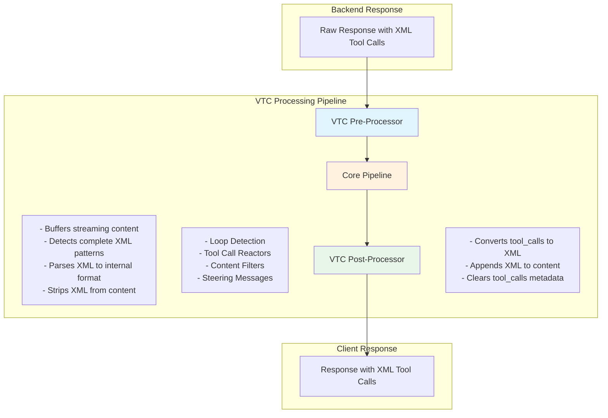

# Virtual Tool Calling (VTC) Architecture

This document describes the Virtual Tool Calling (VTC) subsystem, which provides transparent support for Cline-like clients that embed tool calls as XML within message content rather than using native structured tool calls.

## Overview

Virtual Tool Calling (VTC) is a mode used by popular coding agents like Cline, KiloCode, and RooCode. These clients embed tool invocations as XML within the regular message content:

```xml
<function_calls>
<invoke name="execute_command">
<parameter name="command">ls -la</parameter>
</invoke>
</function_calls>
```

The VTC subsystem enables the proxy to:

1. **Detect VTC clients** based on User-Agent patterns
2. **Extract XML tool calls** from message content into structured format
3. **Process tool calls uniformly** through the core pipeline (reactors, filters, loop detection)
4. **Serialize back to XML** before sending responses to VTC clients

This architecture ensures that advanced proxy features work consistently regardless of whether clients use native or virtual tool calling.

## Architecture Diagram



## Key Design Principles

### 1. Session-Aware Processing

VTC processing is only enabled for sessions flagged as `vtc_enabled=True`. This flag is set based on User-Agent detection during session initialization.

```python
# Detection happens in RequestProcessorService
if detect_vtc_client(agent, vtc_client_patterns):
    session.state = session.state.with_vtc_enabled(True)
```

### 2. Transparent for Non-VTC Sessions

When `vtc_enabled=False`, both VTC processors pass content through unchanged:

```python
async def process(self, content: StreamingContent) -> StreamingContent:
    vtc_enabled = content.metadata.get("vtc_enabled", False)
    if not vtc_enabled:
        return content  # Pass through unchanged
    # ... VTC processing
```

### 3. Unified Internal Format

Internally, all tool calls use the OpenAI-compatible format:

```python
{
    "id": "vtc_abc123def456",
    "type": "function",
    "function": {
        "name": "execute_command",
        "arguments": "{\"command\": \"ls -la\"}"
    }
}
```

This allows the core pipeline to process tool calls uniformly regardless of their origin.

### 4. Streaming-Safe Buffering

The pre-processor buffers streaming content until complete XML patterns are detected, preventing partial XML from being emitted prematurely.

## Components

### VTC Detection (`src/core/services/vtc_detection.py`)

Detects VTC clients based on User-Agent string matching:

```python
def detect_vtc_client(agent: str | None, patterns: list[str]) -> bool:
    """Detect if agent matches any VTC client pattern (case-insensitive)."""
```

**Configuration** (`app_config.py`):

```python
vtc_client_patterns: list[str] = Field(
    default_factory=lambda: ["cline", "kilo", "roo"]
)
```

### VTC XML Parser (`src/core/services/vtc_xml_parser.py`)

Provides utilities for parsing and serializing XML tool calls:

| Function | Description |
|----------|-------------|
| `parse_vtc_xml(content, allowed_tools)` | Extract tool calls from XML content |
| `serialize_tool_calls_to_xml(tool_calls)` | Convert tool calls to XML format |
| `has_partial_xml_pattern(text)` | Check for incomplete XML patterns |
| `detect_complete_tool_call(text)` | Check for complete tool call patterns |

**Supported XML Formats**:

1. **Cline format** (with wrapper):
   ```xml
   <function_calls>
   <invoke name="tool_name">
   <parameter name="param1">value1</parameter>
   </invoke>
   </function_calls>
   ```

2. **Bare invoke format**:
   ```xml
   <invoke name="tool_name">
   <parameter name="param1">value1</parameter>
   </invoke>
   ```

3. **Namespaced format** (namespace prefix is stripped):
   ```xml
   <invoke name="antml:tool:read_file">
   <parameter name="path">/tmp/file.txt</parameter>
   </invoke>
   ```

### VTC Pre-Processor (`src/core/services/streaming/vtc_preprocessor.py`)

Converts XML tool calls to internal format at the start of the streaming pipeline.

**Responsibilities**:

1. Buffer streaming content until complete XML patterns are detected
2. Parse XML using `parse_vtc_xml()`
3. Add extracted tool calls to `metadata["tool_calls"]`
4. Strip XML from content
5. Handle buffer overflow (configurable max size)

**Configuration**:

```python
@dataclass
class VTCPreProcessorConfig:
    max_buffer_bytes: int = 64 * 1024  # 64KB max buffer
    min_buffer_check: int = 10         # Minimum bytes before pattern check
```

### VTC Post-Processor (`src/core/services/streaming/vtc_postprocessor.py`)

Converts internal tool calls back to XML format at the end of the streaming pipeline.

**Responsibilities**:

1. Check for `tool_calls` in metadata
2. Serialize to XML using `serialize_tool_calls_to_xml()`
3. Append XML to content
4. Remove `tool_calls` from metadata (prevents duplicate delivery)

**Configuration**:

```python
@dataclass
class VTCPostProcessorConfig:
    prepend_newlines: bool = True  # Add newlines before XML
    newline_count: int = 2         # Number of newlines
```

### VTC Buffer State (`src/core/services/streaming/stream_context_registry.py`)

Per-stream state for VTC processing:

```python
@dataclass
class VTCBufferState:
    pending_text: str = ""                              # Buffered content
    extracted_tool_calls: list[dict[str, Any]] = field(default_factory=list)
    allowed_tools: list[str] | None = None              # Tool whitelist
    vtc_enabled: bool = False
    last_accessed: float = field(default_factory=time.time)
```

### Session State (`src/core/domain/session.py`)

VTC flag in session state:

```python
@dataclass
class SessionState:
    vtc_enabled: bool = False
    # ... other fields

    def with_vtc_enabled(self, enabled: bool) -> SessionState:
        """Create new state with vtc_enabled flag updated."""
```

## Pipeline Integration

VTC processors are integrated into the streaming pipeline in `streaming_integration.py`:

```python
async def integrate_streaming_pipeline(
    raw_stream: AsyncIterator[Any],
    provider: str,
    vtc_enabled: bool = False,  # VTC flag from session
    # ... other parameters
) -> StreamingResponseEnvelope:
    
    processors: list[IStreamProcessor] = []
    
    # VTC Pre-processor: FIRST in pipeline
    if vtc_enabled:
        processors.append(VTCPreProcessor(registry=registry))
    
    # Core processors (loop detection, think tags, etc.)
    if enable_loop_detection:
        processors.append(LoopDetectionProcessor())
    # ... other processors
    
    # VTC Post-processor: LAST in pipeline
    if vtc_enabled:
        processors.append(VTCPostProcessor(registry=registry))
```

## Data Flow Example

### Input (VTC Client to Proxy)

```
I will check the files now.

<function_calls>
<invoke name="list_files">
<parameter name="path">/project</parameter>
</invoke>
</function_calls>
```

### After VTC Pre-Processor

**Content**: `"I will check the files now."`

**Metadata**:
```python
{
    "vtc_enabled": True,
    "tool_calls": [
        {
            "id": "vtc_abc123def456",
            "type": "function",
            "function": {
                "name": "list_files",
                "arguments": "{\"path\": \"/project\"}"
            }
        }
    ]
}
```

### After Core Pipeline (unchanged)

Same as above (core processors work with normalized format)

### After VTC Post-Processor

**Content**:
```
I will check the files now.

<function_calls>
<invoke name="list_files">
<parameter name="path">/project</parameter>
</invoke>
</function_calls>
```

**Metadata**: `{"vtc_enabled": True}` (tool_calls removed)

## Configuration

### Application Configuration

In `app_config.yaml` or environment:

```yaml
vtc_client_patterns:
  - cline
  - kilo
  - roo
  - mycustomclient  # Add custom patterns
```

### Disabling VTC

To disable VTC detection entirely:

```yaml
vtc_client_patterns: []
```

## Testing

### Unit Tests

| Test File | Coverage |
|-----------|----------|
| `tests/unit/core/services/test_vtc_xml_parser.py` | XML parsing and serialization |
| `tests/unit/core/services/test_vtc_detection.py` | Client detection logic |
| `tests/unit/core/services/streaming/test_vtc_preprocessor.py` | Pre-processor behavior |
| `tests/unit/core/services/streaming/test_vtc_postprocessor.py` | Post-processor behavior |

### Integration Tests

| Test File | Coverage |
|-----------|----------|
| `tests/integration/test_vtc_roundtrip.py` | End-to-end VTC processing |

### Running VTC Tests

```bash
# Run all VTC tests
./.venv/Scripts/python.exe -m pytest tests/unit/core/services/test_vtc_*.py tests/unit/core/services/streaming/test_vtc_*.py tests/integration/test_vtc_*.py -v

# Run with coverage
./.venv/Scripts/python.exe -m pytest tests/unit/core/services/test_vtc_*.py --cov=src/core/services/vtc --cov-report=term-missing
```

## Troubleshooting

### VTC Not Detected

**Symptoms**: XML tool calls pass through unchanged

**Checks**:
1. Verify User-Agent header contains a matching pattern
2. Check `vtc_client_patterns` configuration
3. Enable debug logging to see detection results

```python
logger.debug("VTC client detected: agent=%r matches pattern=%r", agent, pattern)
```

### Partial XML Being Emitted

**Symptoms**: Incomplete XML tags appear in client output

**Checks**:
1. Verify buffer size is sufficient (`max_buffer_bytes`)
2. Check for malformed XML in backend response
3. Inspect VTC buffer state for the stream

### Tool Calls Not Extracted

**Symptoms**: XML remains in content, no `tool_calls` in metadata

**Checks**:
1. Verify XML format matches supported patterns
2. Check `allowed_tools` whitelist if set
3. Ensure `vtc_enabled=True` in metadata

## Related Documentation

- [Architecture Overview](./architecture.md) - System architecture and design patterns
- [Adding Features](./adding-features.md) - Guide for implementing new features
- [Streaming Pipeline](./architecture.md#response-processing-pipeline) - Response processing architecture
- [Tool Access Control](../user_guide/features/tool-access-control.md) - Tool call security features
- [Session Management](../user_guide/features/session-management.md) - Session state handling

## Source Files

| File | Purpose |
|------|---------|
| `src/core/services/vtc_detection.py` | VTC client detection |
| `src/core/services/vtc_xml_parser.py` | XML parsing/serialization |
| `src/core/services/streaming/vtc_preprocessor.py` | VTC pre-processor |
| `src/core/services/streaming/vtc_postprocessor.py` | VTC post-processor |
| `src/core/services/streaming/stream_context_registry.py` | VTC buffer state |
| `src/core/domain/session.py` | Session state with VTC flag |
| `src/core/ports/streaming_integration.py` | Pipeline integration |
| `src/core/config/app_config.py` | VTC configuration |

