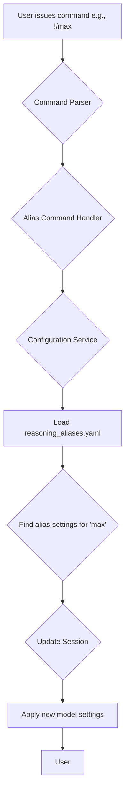

# Product Requirements Document: Reasoning Aliases

## 1. Introduction

This document outlines the requirements for a new feature that allows users to define and switch between predefined sets of model reasoning settings using simple, interactive commands. This will provide users with greater control over the model's behavior during a session, without needing to restart the proxy or modify the main configuration.

**Related GitHub Issue:** [#106](https://github.com/matdev83/llm-interactive-proxy/issues/106)

## 2. Feature Description

The core of this feature is a new set of interactive commands that allow users to switch between different "reasoning modes" (e.g., `!/max`, `!/medium`, `!/low`, `!/no-think`). These modes are defined in a new configuration file, `reasoning_aliases.yaml`, which allows users to specify detailed model settings for each mode, including:

*   **Model-specific settings:** `temperature`, `top_p`, `max_reasoning_tokens`.
*   **Prompt engineering:** `user_prompt_prefix` and `user_prompt_suffix` to prepend or append text to the user's prompt.
*   **Effort level:** A `reasoning_effort` string to categorize the mode.

The settings are applied session-wide and remain active until another reasoning command is issued.

## 3. Requirements

### 3.1. Configuration

*   A new configuration file, `reasoning_aliases.yaml`, will be introduced in the `config/` directory.
*   The configuration will be loaded at startup and validated against a strict schema.
*   The schema will support defining reasoning modes for specific models, including wildcard support (e.g., `claude-sonnet-4*`).
*   Errors in the configuration file (both syntactic and semantic) will prevent the server from starting and will be reported with detailed, helpful error messages.

### 3.2. YAML Schema

The `reasoning_aliases.yaml` file will have the following structure:

```yaml
reasoning_alias_settings:
  - model: "gemini-2.5-pro"
    modes:
      high:
        max_reasoning_tokens: 32000
        reasoning_effort: "high"
        user_prompt_prefix: "Think even harder about the following problem. "
        user_prompt_suffix: ""
        temperature: 1.0
        top_p: 1.0
      medium:
        max_reasoning_tokens: 16000
        reasoning_effort: "medium"
        user_prompt_prefix: "Think hard about the following problem. "
        user_prompt_suffix: ""
        temperature: 0.7
        top_p: 0.9
      low:
        max_reasoning_tokens: 4000
        reasoning_effort: "low"
        user_prompt_prefix: "Think about the following problem. "
        user_prompt_suffix: ""
        temperature: 0.3
        top_p: 0.5
      none:
        max_reasoning_tokens: 100
        reasoning_effort: ""
        user_prompt_prefix: ""
        user_prompt_suffix: ""
        temperature: 0.0
        top_p: 0.1
  - model: "claude-sonnet-4*"
    modes:
      high:
        max_reasoning_tokens: 20000
        reasoning_effort: "high"
        user_prompt_prefix: "Think even harder about the following problem. "
        user_prompt_suffix: ""
        temperature: 1.0
        top_p: 1.0
      medium:
        max_reasoning_tokens: 10000
        reasoning_effort: "medium"
        user_prompt_prefix: "Think hard about the following problem. "
        user_prompt_suffix: ""
        temperature: 0.7
        top_p: 0.9
      low:
        max_reasoning_tokens: 2000
        reasoning_effort: "low"
        user_prompt_prefix: "Think about the following problem. "
        user_prompt_suffix: ""
        temperature: 0.3
        top_p: 0.5
      none:
        max_reasoning_tokens: 0
        reasoning_effort: ""
        user_prompt_prefix: ""
        user_prompt_suffix: ""
        temperature: 0.0
        top_p: 0.1
```

### 3.3. Interactive Commands

The following interactive commands will be supported:

*   `!/max`: Activates the "high" reasoning mode.
*   `!/medium`: Activates the "medium" reasoning mode.
*   `!/low`: Activates the "low" reasoning mode.
*   `!/no-think`: Activates the "none" reasoning mode.
*   Aliases for `!/no-think`: `!/no-thinking`, `!/no-reasoning`, `!/disable-thinking`, `!/disable-reasoning`.

### 3.4. Error Handling

*   If a user attempts to use a reasoning command for a model that has no settings defined in `reasoning_aliases.yaml`, the proxy will return a clear error message (e.g., `Command ignored. You have not configured reasoning settings for this model in config file <filename>`).

## 4. High-Level Workflow



## 5. Out of Scope

*   This feature will not support dynamic reloading of the `reasoning_aliases.yaml` file. A server restart will be required to apply changes.
*   The UI for managing these settings is not part of this feature.
