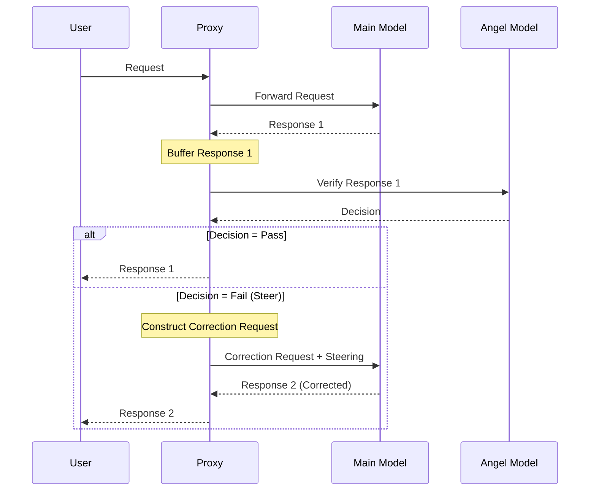

# Angel Verification System

The Angel verification system is a proxy-level quality control feature that uses a secondary LLM to review and verify assistant responses before they reach the user.

## Overview

Unlike the LLM Assessment System which monitors conversation patterns over time, Angel performs immediate verification of individual responses, acting as a safety net to catch errors, logical mistakes, and problematic tool calls in real-time.

## Key Features

- **Real-Time Response Verification**: Reviews each assistant response before forwarding it to the user
- **Error Detection**: Identifies logical errors, wrong tool calls, and misbehaviors
- **Automatic Correction**: Prompts the main model to fix detected issues transparently
- **Configurable Frequency**: Control how often verification runs (every N user turns)
- **Context Window Protection**: Truncate conversation history sent to Angel (opt-in)
- **Memory Safety**: 1MB buffer limit for streaming verification to prevent OOM
- **Model Flexibility**: Use any supported backend/model for verification
- **User-Configurable Prompts**: Customize verification behavior by editing markdown files
- **Fail-Open Design**: Automatically falls back to original response if Angel backend fails

## How It Works



1. Main model generates a response
2. Angel (secondary LLM) reviews the response for issues
3. If issues found, Angel provides steering feedback to the main model
4. Main model regenerates a corrected response
5. Corrected response is sent to the user (original error never seen)

## Configuration

### CLI Arguments

```bash
--use-angel-model "backend:model"  # Enable Angel with specified model
--angel-frequency 10               # Verify every N eligible turns (default: 10)
--angel-max-history 10             # Truncate history to last N messages (optional)
```

### Environment Variables

```bash
export ANGEL_MODEL="openai:gpt-4o-mini"
export ANGEL_FREQUENCY=10
export ANGEL_MAX_HISTORY=10
```

### YAML Configuration

```yaml
session:
  angel_model: "anthropic:claude-3-5-haiku-20241022"
  angel_frequency: 10   # Verify every 10 eligible turns (default)
  angel_max_history: 10 # Optional truncation
```

## Usage Examples

### Basic Setup with OpenAI

```bash
python -m src.core.cli \
  --use-angel-model "openai:gpt-4o-mini" \
  --angel-frequency 1
```

### Sophisticated Verification with Claude

```bash
# Use Claude for more sophisticated verification, check every 2 turns
python -m src.core.cli \
  --use-angel-model "anthropic:claude-3-5-haiku-20241022" \
  --angel-frequency 2
```

### With Model Parameters

```bash
python -m src.core.cli \
  --use-angel-model "openai:gpt-4o-mini?temperature=0.3"
```

## Customizing Angel Prompts

Angel prompts are stored as markdown files in `config/prompts/angel_prompts/` and can be customized to change verification behavior:

- **`angel_prompt.md`**: The main instruction prompt that defines Angel's role, output format, and what problems to look for
- **`steering_template.md`**: The template used when Angel detects an issue and needs to guide the main model to correct it

### Example Customization

To add a new problem pattern to detect, edit `config/prompts/angel_prompts/angel_prompt.md` and add under "Problems you should look for:":

```markdown
- assistant is making promises about future work instead of implementing now
```

After editing the prompts, restart the proxy to load the updated configuration.

## Use Cases

- **Prevent Tool Call Errors**: Catch incorrect tool usage before it causes issues
- **Detect Logic Errors**: Identify flawed reasoning or incorrect conclusions
- **Stop Dangerous Commands**: Block potentially destructive operations
- **Maintain Focus**: Detect when the assistant loses track of the main goal
- **Quality Control**: Ensure outputs meet quality standards before reaching users

## Robustness & Security

The Angel system is designed for high reliability and safety:

- **Fail-Open**: If the Angel model errors, times out, or the proxy hits a 1MB buffer limit, the original assistant response is released immediately. Verification never breaks the user session.
- **Atomic Loading**: Prompts are loaded once at startup with thread-safe mechanisms to prevent race conditions.
- **Secure Steering**: Steering instructions are injected as `user` role messages with distinct markers, ensuring compatibility with all backends (like Claude/Gemini) and preventing internal prompt leakage.
- **No Bypass**: The previous "Override" mechanism has been removed to prevent malfunctioning models from vetoing safety checks.

## When to Use Angel vs LLM Assessment

- **Angel**: Use for immediate, per-response quality control and error prevention. Best for critical applications where you need a safety net for every response.
- **LLM Assessment**: Use for detecting conversation-level patterns and loops over multiple turns. Best for long-running sessions where the assistant might get stuck.
- **Both**: Can be used together for comprehensive quality assurance at both response and conversation levels.

## Related Features

- [LLM Assessment System](llm-assessment.md) - Conversation-level pattern detection
- [Tool Access Control](tool-access-control.md) - Control which tools can be executed
- [Dangerous Command Protection](dangerous-command-protection.md) - Block destructive operations
