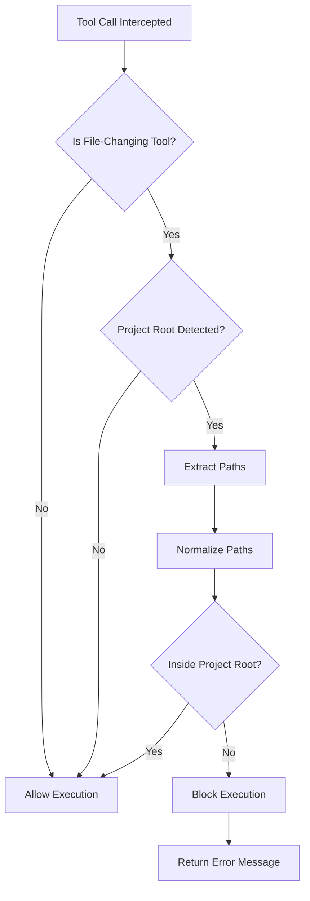

# File Access Sandboxing

The proxy includes file access sandboxing to prevent LLM agents from modifying files outside your project directory.

## Overview

This security feature protects system files and other sensitive directories while allowing normal development work within your project workspace. It automatically restricts file operations to the detected project root directory.

## Key Features

- **Project-Aware Protection**: Automatically restricts file operations to the detected project root directory
- **Path Normalization**: Handles relative paths, symlinks, `~` expansion, and cross-platform path formats (Windows/Unix)
- **Comprehensive Tool Coverage**: Monitors common file-changing tools including `write_file`, `fsWrite`, `str_replace`, `strReplace`, `edit_file`, `delete_file`, `create_file`, and more
- **Real-Time Blocking**: Intercepts file operations at the tool call level before they can execute
- **Transparent Operation**: Works seamlessly with existing project directory detection
- **Clear Error Messages**: Returns descriptive errors explaining the allowed directory
- **Audit Logging**: Logs all blocked operations with session ID, tool name, and attempted path

## Configuration

Configuration follows precedence: CLI > Environment > Config File

### CLI Flags

```bash
--enable-sandboxing  # Enable file access sandboxing
```

### Environment Variables

```bash
export ENABLE_SANDBOXING=true  # or false (default: false)
```

### Config File

```yaml
# config.yaml
sandboxing:
  enabled: true
```

## Usage Examples

### Enable Sandboxing via CLI

```bash
python -m src.core.cli --enable-sandboxing --default-backend openai
```

### Enable via Environment Variable

```bash
export ENABLE_SANDBOXING=true
python -m src.core.cli
```

### Enable in Config File

```yaml
# config.yaml
sandboxing:
  enabled: true
```

## Behavior

When sandboxing is enabled and a project root is detected:



1. **Path Validation**: All file operation paths are normalized and validated against the project root
2. **Boundary Enforcement**: Operations outside the project directory are blocked
3. **Clear Error Messages**: Returns descriptive error explaining the allowed directory
4. **Audit Logging**: Logs all blocked operations with session ID, tool name, and attempted path

### Example Blocked Operation

```
Tool: write_file
Path: /etc/hosts
Result: BLOCKED
Message: "File operation outside project root detected. Allowed folder: /home/user/my-project"
```

## Path Handling

The sandboxing system correctly handles:

- **Relative paths**: `../../../etc/passwd` → Normalized to absolute path and validated
- **Home directory**: `~/sensitive-file` → Expanded and validated
- **Symlinks**: Resolved to actual paths before validation
- **Cross-platform**: Works on both Windows (`C:\`, `\`) and Unix (`/`) systems

## Requirements

- **Project Root Detection**: Sandboxing only activates when a project root is detected for the session
- **No Project Root**: If no project root is detected, all file operations are allowed (with a warning logged)
- **Automatic Detection**: Works with the proxy's automatic project directory detection feature

## Advanced Configuration

Customize which tools and path parameters are monitored:

```yaml
sandboxing:
  enabled: true
  tool_patterns:
    - "write_file"
    - "fsWrite"
    - "str_replace"
    - "strReplace"
    - "edit_file"
    - "delete_file"
    - "deleteFile"
    - "create_file"
    - "move_file"
    - "rename_file"
    - "copy_file"
  path_params:
    - "path"
    - "file_path"
    - "filepath"
    - "file"
    - "target"
    - "destination"
    - "source"
    - "paths"
    - "files"
```

## Use Cases

- **System Protection**: Prevent accidental or malicious modifications to system files (`/etc`, `/usr`, `C:\Windows`)
- **Multi-Project Safety**: Ensure agents working on one project don't accidentally modify files in other projects
- **Shared Environments**: Protect other users' files in shared development environments
- **CI/CD Safety**: Add an extra layer of protection in automated environments

## When to Enable

Enable sandboxing when:

- Working with untrusted prompts or experimental agents
- Running in production or shared environments
- File access control is critical for security
- You want an extra layer of protection against accidental file modifications

**Note**: Sandboxing is disabled by default to maintain backward compatibility. Enable it when working with untrusted prompts or in production environments where file access control is critical.

## Related Features

- [Dangerous Command Protection](dangerous-command-protection.md) - Block destructive git commands
- [Tool Access Control](tool-access-control.md) - Fine-grained control over tool execution
- [Angel Verification System](angel-verification.md) - Real-time response verification
