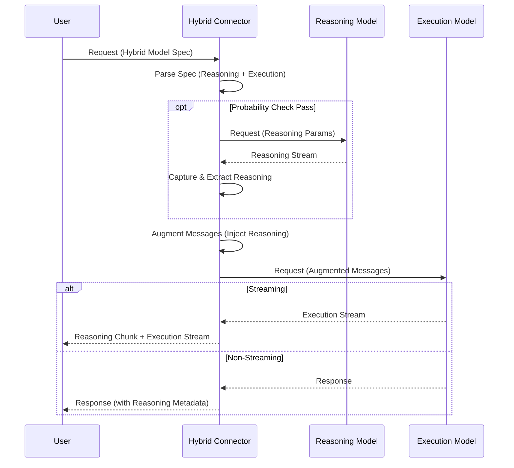

# Hybrid Backend

⚠️ **WARNING: This feature is experimental and not yet production-grade. Results may vary.**

The hybrid backend is a powerful virtual backend that orchestrates two sequential LLM API calls to enhance response quality.

## Overview

The hybrid backend captures reasoning output from a "reasoning model" and uses that output to augment the prompt sent to an "execution model". This enables leveraging the reasoning capabilities of one model (e.g., a model with strong chain-of-thought abilities) to improve the output of another model (e.g., a faster or more specialized model).

## Testing Status

The hybrid backend has been tested with several model combinations with varying degrees of success:

**✅ Tested and Promising:**

- **Reasoning**: MiniMax-M2
- **Execution**: Qwen3-Coder-Plus
- **Model String**: `hybrid:[minimax:MiniMax-M2,qwen-oauth:qwen3-coder-plus]`
- **Status**: Results are promising but not yet production-grade

**⚠️ Tested with Limited Success:**

- Other model combinations have been tested but did not show great success

**Recommendation**: If you're interested in testing this experimental feature, use the model string `hybrid:[minimax:MiniMax-M2,qwen-oauth:qwen3-coder-plus]` as it has shown the most promise in testing.

## Key Benefits

- **Cost/Performance Optimization**: Use expensive reasoning models (o1-preview, DeepSeek-R1, MiniMax-M2) only for reasoning capture, then leverage faster/cheaper execution models for final output generation
- **Specialization Leverage**: Combine the reasoning strength of one model with the execution capabilities of another (e.g., o1's reasoning + GPT-4's code generation)
- **Enhanced Context**: Execution models receive high-quality chain-of-thought reasoning as context, improving output quality similar to few-shot prompting but more dynamic
- **Transparency**: Reasoning output provides insight into problem-solving approach, which can guide execution models toward better solutions
- **Flexibility**: Per-request execution model selection allows experimentation with different model combinations for different use cases

## How It Works



The hybrid backend follows a two-phase approach:

1. **Reasoning Phase**: Calls the reasoning model with maximum reasoning effort to capture high-quality chain-of-thought output. The proxy detects when reasoning is complete (via explicit tags like `</think>`, `</thinking>`, or finish_reason) and cancels the request to save costs.

2. **Execution Phase**: Augments the original prompt with the captured reasoning and calls the execution model with reasoning disabled. The execution model receives the reasoning as context (via system message or user message prefix, depending on model capabilities) and generates the final response.

## Model Specification Format

Specify both reasoning and execution models in a single request using the format:

```
hybrid:[reasoning-backend:reasoning-model,execution-backend:execution-model]
```

## Configuration

The hybrid backend is enabled by default. To disable it:

### CLI Flag

```bash
python -m src.core.cli --disable-hybrid-backend
```

### Environment Variable

```bash
export DISABLE_HYBRID_BACKEND=true
python -m src.core.cli
```

### Config File

```yaml
# config.yaml
disable_hybrid_backend: true
```

## Advanced Configuration

### Probabilistic Reasoning

Control how often the reasoning model is used:

```bash
# CLI Flag
--reasoning-injection-probability 0.5

# Environment Variable
export REASONING_INJECTION_PROBABILITY=0.5

# YAML Configuration
backends:
  reasoning_injection_probability: 0.5
```

- **0.0**: The reasoning model will never be used
- **1.0**: The reasoning model will always be used (default)
- **0.5**: The reasoning model will be used for approximately 50% of requests

### Message Repetition Control

Repeat messages in the execution phase for better context preservation:

```bash
# CLI Flag
--hybrid-backend-repeat-messages

# Environment Variable
export HYBRID_BACKEND_REPEAT_MESSAGES=true

# YAML Configuration
backends:
  hybrid_backend_repeat_messages: true
```

### Hybrid Reasoning Parameters

**Force Initial Turns** (Default: 4):

Controls the number of initial conversation turns where the reasoning model probability is overridden to 1.0:

```bash
# CLI
--hybrid-reasoning-force-initial-turns 4

# Environment Variable
export HYBRID_REASONING_FORCE_INITIAL_TURNS=4

# YAML
backends:
  hybrid_reasoning_force_initial_turns: 4
```

**Reasoning Model Timeout** (Default: 60 seconds):

Sets the timeout duration for reasoning model API calls:

```bash
# CLI
--hybrid-reasoning-model-timeout 60

# Environment Variable
export HYBRID_REASONING_MODEL_TIMEOUT=60

# YAML
backends:
  hybrid_reasoning_model_timeout: 60
```

## Usage Examples

### Recommended Starting Point

```bash
curl -X POST http://localhost:8000/v1/chat/completions \
  -H "Content-Type: application/json" \
  -d '{
    "model": "hybrid:[minimax:MiniMax-M2,qwen-oauth:qwen3-coder-plus]",
    "messages": [{"role": "user", "content": "Write a Python function to parse JSON"}],
    "stream": true
  }'
```

### Basic Hybrid Request (Same Backend)

```bash
curl -X POST http://localhost:8000/v1/chat/completions \
  -H "Content-Type: application/json" \
  -d '{
    "model": "hybrid:[openai:o1-preview,openai:gpt-4]",
    "messages": [{"role": "user", "content": "Explain quantum computing"}],
    "stream": true
  }'
```

### With URI Parameters

```bash
curl -X POST http://localhost:8000/v1/chat/completions \
  -H "Content-Type: application/json" \
  -d '{
    "model": "hybrid:[openai:gpt-4?temperature=0.9,anthropic:claude-3?temperature=0.1]",
    "messages": [{"role": "user", "content": "Write a creative story"}]
  }'
```

## Troubleshooting

If you encounter issues with the hybrid backend, try these settings:

### Recommended Starting Point for Experimentation

```bash
# Start with 50% reasoning probability and message repetition enabled
python -m src.core.cli \
  --reasoning-injection-probability 0.5 \
  --hybrid-backend-repeat-messages
```

### Common Issues and Solutions

- **Execution model ignores reasoning**: Try enabling `--hybrid-backend-repeat-messages`
- **High costs/latency**: Reduce `--reasoning-injection-probability` to 0.3-0.5
- **Inconsistent quality**: Start with `--reasoning-injection-probability 0.5` and adjust based on results
- **Context loss**: Enable `--hybrid-backend-repeat-messages` to preserve original request context

## Use Cases

- **Complex Problem Solving**: Use o1-preview for deep reasoning, then GPT-4 for clear explanation
- **Code Generation**: Use DeepSeek-R1 for algorithm design, then specialized coding model for implementation
- **Creative Writing**: Use high-temperature reasoning model for ideation, then low-temperature execution model for polished output
- **Cost Optimization**: Use expensive reasoning models sparingly, then cheaper execution models for bulk generation
- **Multi-Language**: Use reasoning model in one language, execution model in another for translation tasks

## Related Features

- [URI Model Parameters](uri-model-parameters.md) - Specify model parameters in model strings
- [Model Name Rewrites](model-name-rewrites.md) - Transform model names dynamically
- [Planning Phase Overrides](planning-phase.md) - Use strong models for planning phase
