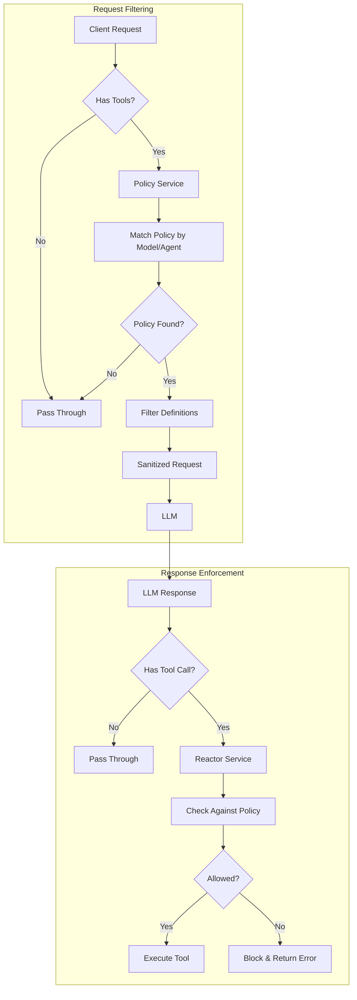

# Tool Access Control

The proxy provides comprehensive tool access control, allowing you to define which tools LLMs can access and execute.

## Overview

Tool Access Control operates at two levels: filtering tool definitions from requests before they reach the LLM (preventing wasted turns), and blocking disallowed tool calls in responses (hard stop enforcement). This feature provides fine-grained control over tool usage with flexible pattern matching and policy-based rules.

## Key Features

- **Flexible Pattern Matching**: Use regex patterns to match tool names, supporting both specific tools and pattern-based rules
- **Whitelist and Blacklist Modes**: Choose between "allow by default with exceptions" or "deny by default with exceptions"
- **Per-Model and Per-Agent Policies**: Define different tool access rules for different models or agents
- **Two-Layer Protection**: Filters tool definitions from requests AND blocks disallowed tool calls in responses
- **Precedence Rules**: Allowed patterns override blocked patterns; global policies override per-model policies
- **Observability**: Comprehensive logging and telemetry for policy evaluation and enforcement

## Configuration

Tool access policies are configured in `tool_call_reactor_config.yaml` file under the `access_policies` section. This file is validated against `config/schemas/tool_call_reactor_config.schema.yaml`.

### CLI Arguments

```bash
--allowed-tools "read_.*,list_.*"      # Global allowed tool patterns
--blocked-tools "delete_.*,rm_.*"      # Global blocked tool patterns
--default-policy allow                 # Global default policy (allow or deny)
```

Example usage:

```bash
python -m src.core.cli \
  --allowed-tools "read_.*,list_.*,search_.*" \
  --blocked-tools "delete_.*,rm_.*" \
  --default-policy allow
```

### YAML Configuration

```yaml
enabled: true
access_policies:
      # Example 1: Block dangerous file operations for all models
      - name: block_dangerous_file_ops
        model_pattern: ".*"
        default_policy: allow
        blocked_patterns:
          - "delete_file"
          - "rm_.*"
          - "remove_directory"
        block_message: "File deletion operations are not allowed by policy."
        priority: 100

      # Example 2: Whitelist specific tools for a particular model
      - name: claude_limited_toolset
        model_pattern: "anthropic:claude-.*"
        agent_pattern: "production-agent"
        default_policy: deny
        allowed_patterns:
          - "read_file"
          - "list_directory"
          - "search_.*"
        block_message: "Only read-only tools are allowed for this model."
        priority: 50

      # Example 3: Block all tools for a specific model
      - name: no_tools_for_gpt4
        model_pattern: "openai:gpt-4-.*"
        default_policy: deny
        allowed_patterns: []
        blocked_patterns: []
        block_message: "Tool calling is disabled for this model."
        priority: 75
```

Example usage:

```bash
python -m src.core.cli \
  --allowed-tools "read_.*,list_.*,search_.*" \
  --blocked-tools "delete_.*,rm_.*" \
  --default-policy allow
```

### YAML Configuration

```yaml
session:
  tool_call_reactor:
    enabled: true
    access_policies:
      # Example 1: Block dangerous file operations for all models
      - name: block_dangerous_file_ops
        model_pattern: ".*"
        default_policy: allow
        blocked_patterns:
          - "delete_file"
          - "rm_.*"
          - "remove_directory"
        block_message: "File deletion operations are not allowed by policy."
        priority: 100
      
      # Example 2: Whitelist specific tools for a particular model
      - name: claude_limited_toolset
        model_pattern: "anthropic:claude-.*"
        agent_pattern: "production-agent"
        default_policy: deny
        allowed_patterns:
          - "read_file"
          - "list_directory"
          - "search_.*"
        block_message: "Only read-only tools are allowed for this model."
        priority: 50
      
      # Example 3: Block all tools for a specific model
      - name: no_tools_for_gpt4
        model_pattern: "openai:gpt-4-.*"
        default_policy: deny
        allowed_patterns: []
        blocked_patterns: []
        block_message: "Tool calling is disabled for this model."
        priority: 75
```

## Policy Configuration Fields

- **name**: Unique identifier for the policy
- **model_pattern**: Regex pattern for matching model names (required)
- **agent_pattern**: Optional regex pattern for matching agent identifiers
- **allowed_patterns**: List of regex patterns for allowed tools
- **blocked_patterns**: List of regex patterns for blocked tools
- **default_policy**: Default behavior when no patterns match - either "allow" or "deny" (required)
- **block_message**: Message returned when a tool is blocked (optional, has default)
- **priority**: Policy priority when multiple policies match (higher values take precedence, default: 0)

## Precedence Rules

1. **Pattern Precedence**: Allowed patterns override blocked patterns
2. **Policy Priority**: Higher priority policies take precedence when multiple policies match
3. **Global Override**: Global CLI/environment policies override per-model configuration policies (when implemented)
4. **Specificity**: More specific model patterns are preferred over generic patterns

## Usage Examples

### Security and Safety

```yaml
# Prevent destructive file operations
- name: prevent_destructive_ops
  model_pattern: ".*"
  default_policy: allow
  blocked_patterns:
    - "delete_.*"
    - "rm_.*"
    - "remove_.*"
    - "drop_.*"
  block_message: "Destructive operations are not allowed."
```

### Read-Only Mode for Production

```yaml
# Allow only read operations in production
- name: production_readonly
  model_pattern: ".*"
  agent_pattern: "prod-.*"
  default_policy: deny
  allowed_patterns:
    - "read_.*"
    - "list_.*"
    - "get_.*"
    - "search_.*"
  block_message: "Only read operations are allowed in production."
```

### Model-Specific Restrictions

```yaml
# Restrict specific models to safe tools only
- name: restrict_experimental_model
  model_pattern: "experimental-.*"
  default_policy: deny
  allowed_patterns:
    - "read_file"
    - "list_directory"
  block_message: "Experimental models have limited tool access."
```

### Agent-Based Access Control

```yaml
# Different tools for different agents
- name: junior_agent_restrictions
  model_pattern: ".*"
  agent_pattern: "junior-.*"
  default_policy: allow
  blocked_patterns:
    - "execute_.*"
    - "deploy_.*"
    - "delete_.*"
  block_message: "Junior agents cannot execute, deploy, or delete."
```

## How It Works



1. **Request Filtering**: When a request with tool definitions arrives, the proxy evaluates each tool against applicable policies and removes disallowed tools before sending to the LLM
2. **Tool Choice Handling**: If `tool_choice` references a filtered tool, it's automatically adjusted to prevent errors
3. **Response Blocking**: When the LLM attempts to call a tool in its response, the proxy evaluates the tool call and blocks it if disallowed
4. **Metadata Tracking**: Policy evaluation metadata is stored in requests and responses for observability

## Observability

The proxy provides comprehensive logging and telemetry for tool access control:

```
# Request filtering logs
INFO: Filtered 2 tool definitions for model anthropic:claude-3-5-sonnet
DEBUG: Removed tools: delete_file, remove_directory

# Tool call blocking logs
INFO: Blocked tool call 'delete_file' by policy 'block_dangerous_file_ops' in session abc123
DEBUG: Block reason: Tool matches blocked pattern 'delete_.*'
```

Metadata is also included in `request.extra_body["tool_access"]` and response metadata for downstream consumers.

## Performance Considerations

- **Regex Compilation**: All regex patterns are compiled once during initialization and cached
- **Policy Selection**: Policies are pre-sorted by priority for efficient matching
- **Minimal Overhead**: Policy evaluation adds <1ms per request in typical configurations
- **Fail-Open**: If policy evaluation fails, the proxy defaults to allowing the tool to maintain availability

## Troubleshooting

### Tool definitions not being filtered

- Verify `tool_call_reactor.enabled: true` in configuration
- Check that your `model_pattern` matches the actual model name (use `.*` for all models)
- Review logs for policy loading errors during startup

### Tool calls not being blocked

- Ensure the Tool Access Control Handler is registered (check startup logs)
- Verify your patterns match the tool names exactly (patterns are case-insensitive)
- Check policy priority - higher priority policies override lower ones

### Regex pattern errors

- Test your regex patterns with a regex validator
- Escape special characters: `\.`, `\(`, `\)`, `\[`, `\]`, etc.
- Use `.*` for wildcard matching, not just `*`

### Performance issues

- Limit the number of policies (recommend <20 for optimal performance)
- Use specific patterns instead of complex regex when possible
- Monitor policy evaluation time in debug logs

## Best Practices

1. **Start with Blacklist Mode**: Use `default_policy: allow` with specific `blocked_patterns` for easier initial setup
2. **Use Specific Patterns**: Prefer specific tool names over broad wildcards when possible
3. **Test Policies**: Test new policies in a development environment before production
4. **Monitor Logs**: Review filtered tools and blocked calls regularly to refine policies
5. **Document Policies**: Add comments in your configuration explaining each policy's purpose
6. **Layer Security**: Combine tool access control with other safety features ([dangerous-command prevention](dangerous-command-protection.md), [loop detection](llm-assessment.md))

## Virtual Tool Calling (VTC) Support

Tool access control works seamlessly with clients that use Virtual Tool Calling (XML-based tool calls), such as Cline, KiloCode, and RooCode. The VTC subsystem converts XML tool calls to internal format before policy evaluation, ensuring consistent enforcement regardless of the client type.

For details on VTC architecture, see the [VTC Architecture Guide](../../development_guide/vtc-architecture.md).

## Related Features

- [Dangerous Command Protection](dangerous-command-protection.md) - Block destructive git commands
- [File Access Sandboxing](file-access-sandboxing.md) - Restrict file operations to project directory
- [Angel Verification System](angel-verification.md) - Real-time response verification
