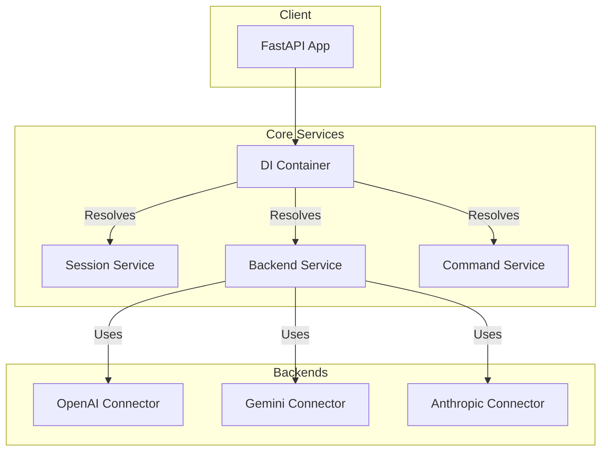

# Technical Debt Analysis Report

## 1. Introduction

This report provides a comprehensive analysis of the technical debt within the LLM Interactive Proxy codebase. The analysis focuses on identifying legacy code, unused code, and areas that do not align with modern software design principles such as SOLID and Dependency Injection.

## 2. Executive Summary

The codebase shows clear signs of a recent, major architectural refactoring. A significant amount of legacy code and compatibility layers are still present, indicating that the migration to a new, likely Dependency Injection-based, architecture is not yet complete. The key areas of technical debt include:

*   **Widespread deprecation warnings:** Numerous service modules have been replaced, but the old import paths remain.
*   **Legacy compatibility layers:** Many components contain code specifically to support old patterns, particularly for testing.
*   **Incomplete DI migration:** While the new architecture is in place, remnants of the old, non-DI approach are still visible.

A detailed resolution plan is proposed to address these issues, which will improve maintainability, reduce complexity, and align the codebase with best practices.

## 3. Detailed Findings

Based on the automated codebase scan, the technical debt can be categorized into the following areas:

### 3.1. Widespread Deprecation Warnings

A significant number of service modules are marked as deprecated. This is a clear indicator of a major architectural shift, likely from a singleton or module-based approach to a Dependency Injection (DI) container.

**Examples:**
- `src/core/services/session_service.py` is deprecated in favor of `src/core/services/session_service_impl.py`.
- Numerous `..._service.py` files are deprecated, pointing to their non-suffixed counterparts (e.g., `src/core/services/failover_service_service.py` -> `src/core/services/failover_service.py`).
- `src/core/commands/handler_factory.py` is explicitly marked as deprecated and replaced by the `CommandRegistry` and DI container.

### 3.2. Legacy Compatibility Layers

The codebase contains a substantial amount of code intended to maintain backward compatibility, primarily for the test suite. This slows down development and increases cognitive load.

**Examples:**
- `src/core/services/sync_session_manager.py`: Exists solely to provide a synchronous interface for "legacy test code."
- `src/core/domain/session.py`: Contains methods that are "expected by legacy tests."
- `src/core/app/test_builder.py`: Includes multiple "Legacy compatibility method for tests."
- `src/core/commands/handlers/base_handler.py`: Has code to "Convert the result to the format expected by the legacy command system."

### 3.3. Incomplete Refactoring and Placeholders

The presence of `NOTE`, `TODO`, and `FIXME` comments indicates that the refactoring process is not yet complete.

**Examples:**
- `src/core/persistence.py`: A `NOTE` indicates that a configuration option is "not in the interface yet."
- `src/gemini_converters.py`: A `NOTE` mentions that system messages are not used but could be in the future, suggesting an incomplete implementation.
- `src/core/services/tool_call_reactor_initializer.py`: A `NOTE` points out that task references are not being stored for proper cleanup in production.

### 3.4. Redundant and Unused Code

The migration has left behind unused legacy code and comments that add clutter.

**Examples:**
- `src/core/config/config_loader.py`: A comment states "Legacy wrapper function removed," but the comment itself is now noise.
- `src/core/app/controllers/__init__.py`: A comment mentions that "Legacy models are only used by the compatibility endpoints," which implies they could be removed if the compatibility layer is removed.

## 4. Resolution Plan

The following plan outlines the steps to address the identified technical debt. The plan is designed to be executed in phases to minimize disruption and risk.

### Phase 1: Eliminate Deprecated Imports

1.  **Identify all usages of deprecated modules:** Use static analysis to find all import statements that reference deprecated files. Analyze each case individually, as some code is being left due to practical reasons.
2.  **Update import paths:** Refactor the code to import from the new, non-deprecated modules.
3.  **Remove deprecated files:** Once all references are removed, delete the deprecated "shim" files.

### Phase 2: Refactor the Test Suite

1.  **Identify tests using legacy patterns:** Systematically review the test suite to find tests that rely on the legacy compatibility layers.
2.  **Update tests to use the DI container:** Refactor the identified tests to use the modern, DI-based approach for setting up services and dependencies. This will likely involve using the `TestBuilder` or similar testing utilities.
3.  **Remove legacy test helpers:** Once the tests are migrated, remove the legacy helper methods from the application code (e.g., in `src/core/domain/session.py` and `src/core/app/test_builder.py`).

### Phase 3: Address Incomplete Refactoring

1.  **Review all `NOTE`, `TODO`, and `FIXME` comments:** Triage each comment to determine if it represents a required change, a potential improvement, or an obsolete note.
2.  **Implement necessary changes:** Create and prioritize tasks for any required changes, such as completing the implementation of features or fixing identified issues.
3.  **Remove obsolete comments:** Delete any comments that are no longer relevant.

### Phase 4: Final Cleanup and Verification

1.  **Perform a final code review:** Conduct a thorough review of the codebase to identify any remaining dead code, redundant comments, or other artifacts of the old architecture.
2.  **Run all tests:** Execute the entire test suite to ensure that no regressions were introduced during the refactoring process.
3.  **Update documentation:** Ensure that the project's documentation (`README.md`, `AGENTS.md`, etc.) reflects the new, cleaned-up architecture.

### Architectural Diagram (Mermaid)

The following diagram illustrates the target architecture, where all components are resolved through a central DI container, eliminating the legacy service locators and direct imports.

